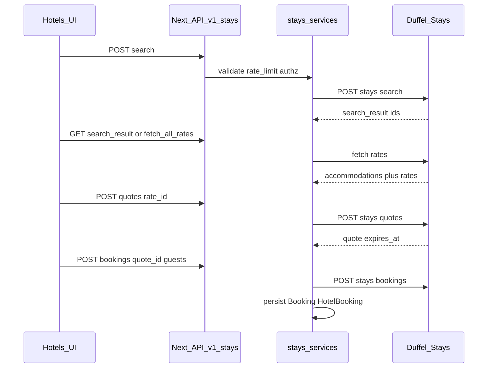

# Duffel Stays — phased implementation (product-aligned)

## Product positioning (“where it fits”)

- **Primary goal:** Add **real hotel supply** without derailing the flight MVP: Stays is a **parallel vertical** using the same architectural rules as flights (server-only Duffel, BFF under [`app/api/v1/`](app/api/v1/), Zod validation, services, optional auth/rate limits, no secrets in the client).
- **Scope v1:** Search → list results → **accommodation detail with rates (room products)** → **quote** → **book** → persist on `Booking` + enriched `HotelBooking`. **Packages / Trip linking** stay roadmap-sized (see [z-docs/DUFFEL_INTEGRATION/DUFFEL_IMPLEMENTATION_ROADMAP.md](z-docs/DUFFEL_INTEGRATION/DUFFEL_IMPLEMENTATION_ROADMAP.md) P6); document hooks only where cheap.
- **UX reuse:** Keep [`src/components/hotels/FeaturedHotels.tsx`](src/components/hotels/FeaturedHotels.tsx) as the **presentation shell**; feed it from **API-shaped DTOs** (same idea as [`src/components/flights/FeaturedFlightsWithFetch.tsx`](src/components/flights/FeaturedFlightsWithFetch.tsx) + [`app/api/v1/flights/featured/route.ts`](app/api/v1/flights/featured/route.ts)). Replace static arrays in [`src/views/Home.tsx`](src/views/Home.tsx) and [`src/views/Hotels.tsx`](src/views/Hotels.tsx) with fetch-or-fallback.

## Current state (baseline)

| Area | Today |
|------|--------|
| Duffel Stays HTTP | [`src/lib/duffel/stays-http.ts`](src/lib/duffel/stays-http.ts): `staysSearch`, `staysFetchAllRates`, `staysCreateQuote`, `staysCreateBooking` (thin wrappers). |
| Stays helper | [`src/lib/duffel/stays.ts`](src/lib/duffel/stays.ts): geo-radius search only — may need **Duffel-supported location shapes** (e.g. `google_place_id`, address) per [Getting started with Stays](https://duffel.com/docs/guides/getting-started-with-stays). |
| DB | [`HotelBooking`](prisma/schema.prisma) is **only** `booking_id` + `payload` — unlike [`FlightBooking`](prisma/schema.prisma) which stores Duffel IDs, snapshots, `order_raw`. |
| UI | [`app/(booking)/hotels/page.tsx`](app/(booking)/hotels/page.tsx) → [`Hotels.tsx`](src/views/Hotels.tsx); detail [`app/(booking)/hotels/[id]/page.tsx`](app/(booking)/hotels/[id]/page.tsx) uses [`MOCK_HOTELS`](src/data/mock-hotels); payment [`app/(booking)/hotels/payment/page.tsx`](app/(booking)/hotels/payment/page.tsx) → generic [`Payment`](src/views/Payment). |
| Room UI | [`AvailableRooms.tsx`](src/components/hotels/AvailableRooms.tsx) supports **multi-quantity per mock room**; Duffel models **discrete rates** — plan maps **one or more rate lines** (and guest/room counts from search) instead of cloning arbitrary SKUs. |

## Target flow (mirror flights)

Parity checkpoints with flights: [`app/api/v1/flights/search/route.ts`](app/api/v1/flights/search/route.ts) (config gate, rate limit, Zod, `successResponse` / `handleApiError`), [`app/api/v1/flights/bookings/route.ts`](app/api/v1/flights/bookings/route.ts) (auth, idempotency header pattern).

---

## Phase 0 — Discovery and contracts (short, blocking)

- Confirm **Duffel Stays** capabilities for your markets (Payments geography, cancellation rules, webhook event types for stays if any).
- Freeze **search input contract**: dates, rooms, guest ages/types, location type (lat/lng radius vs place id). Extend [`src/lib/duffel/stays.ts`](src/lib/duffel/stays.ts) to match official request shape; keep a single internal `runStaysSearch` entry point.
- Define **stable JSON DTOs** for the UI (accommodation card, rate row, quote summary) in something like `src/lib/api/stays-dto.ts` (or next to serializers) so [`FeaturedHotels`](src/components/hotels/FeaturedHotels.tsx) and [`HotelsList`](src/components/hotels/HotelsList.tsx) do not parse raw Duffel.

**Exit:** Written API request/response schemas (Zod) and a one-page “Stays vs Flights” parity table (auth, rate limits, errors).

---

## Phase 1 — Backend: search and rates (no booking yet)

- Add routes under **`app/api/v1/stays/`** (parallel to `flights`):
  - `POST .../search` — create search; return `search_result_id` / status handling (async polling pattern as per Duffel docs).
  - `GET .../search_results/:id` or dedicated **fetch-all-rates** endpoint wrapping [`staysFetchAllRates`](src/lib/duffel/stays-http.ts).
- Implement [`src/lib/services/stays/stays-search.service.ts`](src/lib/services/stays/) (new): orchestration, timeouts, mapping to DTOs.
- Reuse patterns: [`isDuffelConfigured`](src/lib/duffel/config.ts), [`handleApiError`](src/lib/api/error-handler.ts), IP/user rate limits like flight search.
- Optional: **`GET /api/v1/stays/featured`** — cached “deal” cards (mirror [`getCachedFeaturedFlightCards`](src/lib/services/flights/featured-flights.service.ts)) using a curated query (city + default dates) or config-driven list; **503/empty** when Stays not configured.

**Exit:** Postman or Vitest contract tests for search + rates; no UI dependency.

---

## Phase 2 — List and detail pages (replace mock source)

- **`HotelsTab` / `HotelsList`:** Wire search form to `POST /api/v1/stays/search`, then display results from rates payload; link to detail using **Duffel accommodation identifier** (or internal slug that resolves server-side — avoid exposing raw API quirks in URLs if unstable).
- **`app/(booking)/hotels/[id]/page.tsx`:** Stop depending solely on [`MOCK_HOTELS`](src/data/mock-hotels); use server fetch to BFF or pass `search_result_id` + `accommodation_id` via query string where Duffel requires context (document the chosen pattern).
- **`HotelDetailContent.tsx`:** Bind hero, map, amenities from DTO; keep layout.

**Exit:** User can run a real search and open a real accommodation detail for a fixed test city.

---

## Phase 3 — Room selection = rate selection + quote

- Map [`AvailableRooms.tsx`](src/components/hotels/AvailableRooms.tsx) props from **rates** (rate id, board type, cancellation label, total/ night price, photo from accommodation). If multi-room is required, support **multiple distinct rate selections** only when the Stays API contract allows (otherwise enforce “rooms” at search time and single rate line for v1).
- Add **`POST /api/v1/stays/quotes`** (or under `rates/:rateId/quote`) calling [`staysCreateQuote`](src/lib/duffel/stays-http.ts); return `quote_id`, `expires_at`, priced breakdown for checkout UI.
- Client: store minimal state in **URL + session** (same spirit as flight checkout), not large blobs.

**Exit:** User selects a rate, receives a quote with expiry, sees summary before pay.

---

## Phase 4 — Booking and payment (flight-aligned)

- Add **`POST /api/v1/stays/bookings`** calling [`staysCreateBooking`](src/lib/duffel/stays-http.ts): guest collection schema aligned with Duffel; **`Idempotency-Key`** header like [`app/api/v1/flights/bookings/route.ts`](app/api/v1/flights/bookings/route.ts).
- **Payment:** Follow the same commercial path as flights (Duffel Payments vs your PSP) as documented in [z-docs/DUFFEL_INTEGRATION/DUFFEL_KEYS_AND_CHECKOUT.md](z-docs/DUFFEL_INTEGRATION/DUFFEL_KEYS_AND_CHECKOUT.md). If Stays uses a different payment object, add `stays`-specific routes mirroring `payment-intents` only where needed.
- **Repository:** Create/update [`Booking`](prisma/schema.prisma) (`type: hotel`, statuses), and **extend `HotelBooking`** with columns analogous to flight: e.g. `duffel_booking_id`, `duffel_quote_id`, `duffel_search_result_id`, `accommodation_snapshot`, `booking_reference`, `order_raw` (or rename to `stays_raw`), `quote_expires_at`. Keep migration reversible.

**Exit:** End-to-end test booking in Duffel test mode; row visible in DB.

---

## Phase 5 — Post-booking and webhooks (fit-for-purpose)

- Subscribe to **Duffel webhook events** that apply to Stays (confirm in docs); extend [`src/lib/services/duffel/duffel-webhook-handlers.ts`](src/lib/services/duffel/duffel-webhook-handlers.ts) with idempotent handlers mirroring the flight fix pattern.
- Admin/support: link `booking_ref_no` to Duffel ids in serialized API for profile/history (extend [`src/lib/api/serialize.ts`](src/lib/api/serialize.ts) pattern for hotel).

**Exit:** Booking status updates without manual poll where webhooks exist; runbook note for failures.

---

## Phase 6 — Featured strip and home integration

- Add **`FeaturedHotelsWithFetch`** (client) or async server variant like flights, calling `GET /api/v1/stays/featured`.
- Update [`src/views/Home.tsx`](src/views/Home.tsx) to use it; keep static fallback if API empty (graceful degradation).
- [`FeaturedHotels.tsx`](src/components/hotels/FeaturedHotels.tsx): optionally extend `FeaturedHotel` type with `href` or `duffelAccommodationId` for deep links into Phase 2 routes.

**Exit:** Home and `/hotels` show real featured stays when configured.

---

## Phase 7 — Hardening

- Structured logging + request id (match flight middleware if present).
- Rate limits tuned for search vs anonymous home featured calls.
- E2E smoke: search → quote → book; document env vars in [`.env.example`](.env.example) (same `DUFFEL_API_KEY` unless split keys later).

---

## Definition of done (Stays v1)

- Configured environment: search, rate list, quote, book, persist, show in account API.
- [`app/(booking)/hotels`](app/(booking)/hotels) and [`src/components/hotels`](src/components/hotels) use **BFF + DTOs**; mocks only as fallback or Storybook.
- Room selection UX reflects **Duffel rates** with correct expiry and error handling.

---

## Deliverable file (after you approve this plan)

Save this content as a single doc under the repo, e.g. **[`z-docs/DUFFEL_INTEGRATION/DUFFEL_STAYS_PHASED_IMPLEMENTATION.md`](z-docs/DUFFEL_INTEGRATION/DUFFEL_STAYS_PHASED_IMPLEMENTATION.md)**, and add a one-line pointer from [`z-docs/DUFFEL_INTEGRATION/DUFFEL_IMPLEMENTATION_ROADMAP.md`](z-docs/DUFFEL_INTEGRATION/DUFFEL_IMPLEMENTATION_ROADMAP.md) P6 to that file.
