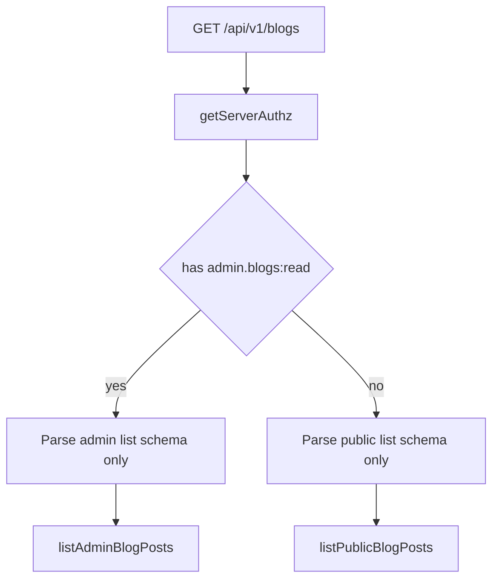

# Unified blog API and blueprint-ready structure

## Current state (what you have today)

| Layer      | Admin                                                                                                                                              | Public                                                                                                          |
| ---------- | -------------------------------------------------------------------------------------------------------------------------------------------------- | --------------------------------------------------------------------------------------------------------------- |
| Routes     | `[app/api/v1/admin/blogs/route.ts](app/api/v1/admin/blogs/route.ts)`, `[[id]/route.ts](app/api/v1/admin/blogs/[id]/route.ts)`, upload/delete-image | `[app/api/v1/blogs/route.ts](app/api/v1/blogs/route.ts)`, `[[slug]/route.ts](app/api/v1/blogs/[slug]/route.ts)` |
| Auth       | `[withPermissionRoute](src/lib/api/with-route-auth.ts)` (`admin.blogs:*`)                                                                          | No auth; repository enforces published-only                                                                     |
| Service    | `[src/lib/services/admin/blog.service.ts](src/lib/services/admin/blog.service.ts)`                                                                 | `[src/lib/services/blog-public.service.ts](src/lib/services/blog-public.service.ts)`                            |
| Validation | `[admin-blog.schema.ts](src/lib/validations/admin-blog.schema.ts)`                                                                                 | `[blog-public.schema.ts](src/lib/validations/blog-public.schema.ts)`                                            |
| Data       | Shared `[blog.repository.ts](src/lib/db/repositories/blog.repository.ts)` + `[PublicBlogPost](src/lib/blog/types.ts)`                              | Same                                                                                                            |

Admin list UI is **server-driven** (`[app/(admin)/admin/blogs/page.tsx](app/(admin)`/admin/blogs/page.tsx) calls `listAdminBlogPosts` directly). Client `fetch` to the API is only used for **delete** (`[admin-blogs-client.tsx](src/components/admin/blogs/admin-blogs-client.tsx)`), **create/update** (`[blog-post-editor.tsx](src/components/admin/blogs/blog-post-editor.tsx)`), and **image upload/delete** (`[blog-image-upload-client.ts](src/lib/admin/blog-image-upload-client.ts)`). Marketing uses **self-HTTP** `[fetch-public-blogs.ts](src/lib/blog/fetch-public-blogs.ts)` → `GET /api/v1/blogs`.

Your confusion is justified: **admin vs public is split across folder names (`admin/` vs root), filenames (`blog-public` vs `admin/blog`), and two overlapping validation files**, even though the DB layer is already unified.

---

## Target conventions (use as blueprint for cars, hotels, …)

**URLs (one resource per entity)**

- Collection: `GET/POST /api/v1/{resources}` — `GET` is **mode-split** (see below); `POST` always privileged.
- Item: `GET/PATCH/DELETE /api/v1/{resources}/[key]` — privileged writes use **internal id only**; public read uses **slug** (or whatever stable public identifier is).
- Side effects (uploads, etc.): `POST /api/v1/{resources}/upload-image` (or `.../assets`) with the same permission as `write`.

**Code layout (feature module under `src/lib`)**

- `src/lib/validations/{resource}.schema.ts` — all Zod for that resource (public query + admin query + create/update + params). Share building blocks via `extend`/`pick` from `[pagination.schema.ts](src/lib/validations/pagination.schema.ts)`, not copy-paste.
- `src/lib/services/{resource}/{resource}.service.ts` — **server-only** orchestration (call repository, map DTOs). Subfolders only when multiple services are unavoidable (e.g. `blog-image-upload.service.ts` colocated or `blog/` folder).
- `src/lib/{resource}/` — domain types, mappers, API response parsers (what you already do in `[src/lib/blog/](src/lib/blog/)`).
- `src/lib/api/{resource}/` (optional) — **pure functions** `handleListX`, `handleGetX`, … used by thin `route.ts` files so you never duplicate try/catch and auth branching across segments.

**Route files stay thin**

- Parse request → call handler → `paginatedResponse` / `successResponse` / `handleApiError`.
- Permission checks: reuse `[withPermissionRoute](src/lib/api/with-route-auth.ts)` for **mutations**. For **GET list** you need a new small helper, e.g. `withDualAccessRoute({ public: handler, permission: 'admin.blogs:read', admin: handler })`, or inline: `getServerAuthz()` + `[hasPermission](src/lib/authz/guards.ts)` **before** choosing which Zod schema to parse (critical for security).

---

## Security rules for unified `GET /api/v1/blogs`

- **Never** parse admin-only query fields (e.g. `status`, `category_id`, admin `sort`) until you know the caller has `admin.blogs:read`. That prevents leaking drafts via crafted query strings.

`**GET/PATCH/DELETE /api/v1/blogs/[key]`**

- **PATCH/DELETE**: require `admin.blogs:write` / `admin.blogs:delete`; parse `key` with `z.string().cuid()` (matches Prisma `[BlogPost.id](prisma/schema.prisma)`). Reject non-cuid keys so slugs cannot be used for destructive operations.
- **GET**: if `admin.blogs:read` and `key` is valid **cuid** → `getAdminBlogPost(id)` (any status). Otherwise → `getPublicBlogPostBySlug(slug)` (published only). CUIDs are alphanumeric **without** hyphens; admin slugs use hyphens (`[^[a-z0-9]+(?:-[a-z0-9]+)*$](src/lib/validations/admin-blog.schema.ts)`), so practical ambiguity is minimal; cuid check still disambiguates.

`**POST /api/v1/blogs`**: same as today’s admin POST — `withPermissionRoute('admin.blogs:write', ...)`, body validated with existing create schema.

**Image routes**: move to e.g. `[app/api/v1/blogs/upload-image/route.ts](app/api/v1/admin/blogs/upload-image/route.ts)` and `delete-image` beside them, same permission as now.

**Categories**: relocate `[app/api/v1/admin/blog-categories/route.ts](app/api/v1/admin/blog-categories/route.ts)` to `app/api/v1/blog-categories/route.ts` with `admin.blogs:read` (or a dedicated `admin.blog_categories:read` later if you split permissions). Nothing in the repo currently calls this HTTP route (categories are loaded server-side via `[listBlogCategoriesForAdmin](src/lib/services/admin/blog-category.service.ts)`); the move is for consistency and future client use.

---

## Consolidation steps (implementation order)

1. **Merge validations** into `[src/lib/validations/blog.schema.ts](src/lib/validations/blog.schema.ts)` (or keep filename `blog` + re-export old names briefly during migration): shared `blogImageInputSchema`, `blogSlugParamSchema`, `blogPostIdParamSchema` (`cuid`), `blogListQueryPublicSchema`, `blogListQueryAdminSchema`, `createBlogPostSchema`, `updateBlogPostSchema`. Delete or thin `[admin-blog.schema.ts](src/lib/validations/admin-blog.schema.ts)` / `[blog-public.schema.ts](src/lib/validations/blog-public.schema.ts)` to re-exports only, then remove.
2. **Merge services** into e.g. `[src/lib/services/blog/blog.service.ts](src/lib/services/admin/blog.service.ts)` (absorbing list/get/create/update/delete from admin + public). Keep one import surface for pages: either re-export from `blog.service.ts` or update imports once. Move `[blog-image-upload.service.ts](src/lib/services/admin/blog-image-upload.service.ts)` to `services/blog/` if you want the folder to own all blog server logic.
3. **Introduce route handlers** in `src/lib/api/blog/handlers.ts` (name as you prefer): `handleBlogListGET`, `handleBlogPostGET`, `handleBlogPostPATCH`, etc., each returning `Response` and using `handleApiError` consistently (today admin routes rely on wrapper catch; public routes use manual try/catch — unify).
4. **Replace route files**: extend `[app/api/v1/blogs/route.ts](app/api/v1/blogs/route.ts)` to add `**POST`**; replace `[app/api/v1/blogs/[slug]/route.ts](app/api/v1/blogs/[slug]/route.ts)` with `[key]` segment implementing GET + PATCH + DELETE. Remove `[app/api/v1/admin/blogs/](app/api/v1/admin/blogs/)` tree after callers are updated (your choice: **no legacy redirects**).
5. **Update in-repo callers only** (per your preference):
  - `[blog-post-editor.tsx](src/components/admin/blogs/blog-post-editor.tsx)`: `POST /api/v1/blogs`, `PATCH /api/v1/blogs/{id}`.
  - `[admin-blogs-client.tsx](src/components/admin/blogs/admin-blogs-client.tsx)`: `DELETE /api/v1/blogs/{id}`.
  - `[blog-image-upload-client.ts](src/lib/admin/blog-image-upload-client.ts)`: new upload/delete paths under `/api/v1/blogs/...`.
6. **Server pages**: switch imports from `@/lib/services/admin/blog.service` and `@/lib/validations/admin-blog.schema` to the merged module paths (no UI changes).
7. **Optional optimization** (non-breaking for UI): change `[fetch-public-blogs.ts](src/lib/blog/fetch-public-blogs.ts)` to call `listPublicBlogPosts` / `getPublicBlogPostBySlug` directly (same validation/mapping as today) to avoid an internal HTTP round-trip; keep `api-response` schemas for any remaining HTTP consumers.
8. **Blueprint doc**: update or replace `[z-docs/GENERIC_CRUD_FRONTEND_BLUEPRINT_BLOGS.md](z-docs/GENERIC_CRUD_FRONTEND_BLUEPRINT_BLOGS.md)` with the table above + permission IDs from `[registry.ts](src/lib/authz/registry.ts)` so the next CRUD copies the pattern.

---

## What stays visually the same

- All components under `[src/components/admin/blogs/](src/components/admin/blogs/)` keep the same props and layout; only API paths and possibly import paths change.
- Marketing `[Blog.tsx](src/views/Blog.tsx)` / `[blog/page.tsx](app/(marketing)`/blog/page.tsx) unchanged if you keep `fetch-public-blogs` HTTP contract; if you switch to direct service calls, the page still receives `PublicBlogPost[]`.

---

## Risks and mitigations

- **Breaking external callers** of `/api/v1/admin/blogs/`*: you accepted in-repo-only updates; document the new contract if any external tools exist.
- **GET list duality**: must gate admin query parsing on permission every time — centralize in one handler to avoid future mistakes.
- **E2E/tests**: grep for `/api/v1/admin/blogs` after migration and update.

