# Blog Module — Complete Implementation Guide

> **Purpose:** This document walks through the blog module as a real, working reference implementation. Follow this exact structure and flow when building any new module (promotions, destinations, packages, tours, etc.). Every file path, function name, and code snippet below is from the live codebase.

---

## 1. Module at a Glance

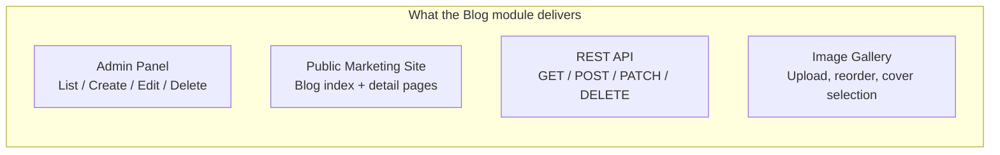

| Metric | Value |
|--------|-------|
| Total module-specific files | **21** |
| Prisma models | `BlogPost`, `BlogPostImage`, `BlogCategory` |
| Permissions | `admin.blogs:read`, `admin.blogs:write`, `admin.blogs:delete` |
| API base | `GET/POST /api/v1/blogs` — `GET/PATCH/DELETE /api/v1/blogs/[key]` |
| Admin URLs | `/admin/blogs`, `/admin/blogs/new`, `/admin/blogs/[id]/edit` |
| Public URLs | `/blog`, `/blog/[slug]` |

---

## 1.1 Unified Module Pattern

The blog module demonstrates the **unified module pattern** — one set of backend files handles both admin CRUD and public reads with permission checks inside each function.

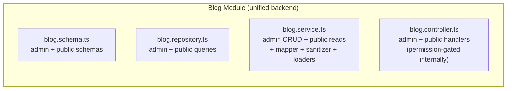

**How the blog controller branches admin vs public on the same `GET /api/v1/blogs` endpoint:**

1. Load auth context via `getServerAuthz()` (works with both cookies and Bearer tokens)
2. Check `hasPermission(authz, "admin.blogs:read")`
3. If admin → parse with `blogAdminListQuerySchema`, call `listAdminBlogPosts()` (all statuses)
4. If public → parse with `blogPublicListQuerySchema`, call `listPublicBlogPosts()` (published only)

This same approach is used in the **user module** where admin CRUD, self-service (`/me`), and role management all live in one service + one controller.

### Authentication: Cookie + Bearer Token

`getServerAuthz()` supports dual auth:
- **Cookie-based session** (web browsers) — tried first
- **`Authorization: Bearer <token>`** (mobile / external clients) — fallback

Once a `userId` is resolved, the RBAC pipeline is identical. Every module's API routes automatically work for both web and mobile with zero additional code.

---

## 2. Architecture — How It All Connects

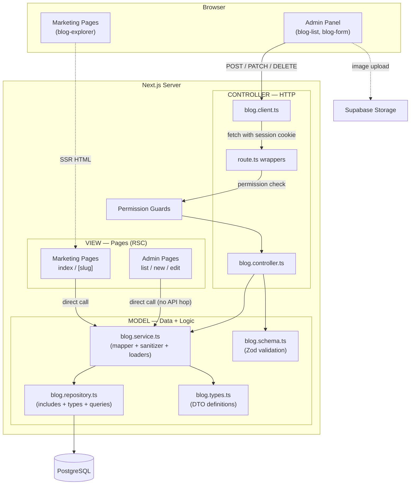

---

## 3. Complete File Map

Every file in the blog module, grouped by MVC layer, with the exact path and line count.

### Model Layer (data access, business logic, validation, types)

| # | File | Lines | Responsibility |
|---|------|-------|----------------|
| 1 | `src/lib/validations/blog.schema.ts` | 92 | All Zod schemas — admin list query, public list query, create body, update body, route params |
| 2 | `src/lib/db/repositories/blog.repository.ts` | 133 | Prisma include config, inferred types, CRUD queries, category lookup |
| 3 | `src/lib/services/blog/blog.service.ts` | 363 | Business logic, row-to-DTO mapper, HTML sanitizer, RSC loaders, category helper |
| 4 | `src/lib/blog/blog.types.ts` | 45 | `BlogPostDto` and `BlogPostImageDto` type definitions (pure TS, safe for client) |

### Controller Layer (HTTP request/response)

| # | File | Lines | Responsibility |
|---|------|-------|----------------|
| 5 | `src/lib/api/blog/blog.controller.ts` | 128 | Parse requests, call service, format responses, handle errors |
| 6 | `src/lib/http/blog.client.ts` | 22 | Browser-side fetch: `createBlogPost`, `updateBlogPost`, `deleteBlogPost` |
| 7 | `app/api/v1/blogs/route.ts` | 17 | Collection route — delegates GET/POST to controller |
| 8 | `app/api/v1/blogs/[key]/route.ts` | 24 | Item route — delegates GET/PATCH/DELETE to controller |

### View Layer (pages + components)

| # | File | Lines | Responsibility |
|---|------|-------|----------------|
| 9 | `app/(admin)/admin/blogs/page.tsx` | 46 | Admin list page (RSC) — calls service directly |
| 10 | `app/(admin)/admin/blogs/new/page.tsx` | 17 | Admin create page (RSC) |
| 11 | `app/(admin)/admin/blogs/[id]/edit/page.tsx` | 34 | Admin edit page (RSC) |
| 12 | `src/components/admin/blogs/blog-list.tsx` | 308 | Admin table, filters, search, delete dialog |
| 13 | `src/components/admin/blogs/blog-form.tsx` | 283 | Admin create/edit form with React Hook Form |
| 14 | `src/components/admin/blogs/blog-images-field.tsx` | 389 | Image gallery: upload, reorder, cover selection |
| 15 | `app/(marketing)/blog/page.tsx` | 18 | Public blog index page (RSC) |
| 16 | `app/(marketing)/blog/[slug]/page.tsx` | 117 | Public blog detail page (RSC) + `generateMetadata` |
| 17 | `app/(marketing)/blog/loading.tsx` | 5 | Index loading skeleton |
| 18 | `app/(marketing)/blog/[slug]/loading.tsx` | 5 | Detail loading skeleton |
| 19 | `src/components/blog/blog-explorer.tsx` | 255 | Marketing grid — client-side filtering, search, pagination |
| 20 | `src/components/blog/blog-skeleton.tsx` | 63 | Skeleton components for loading states |

### Storage + Config (modified, not new)

| # | File | Responsibility |
|---|------|----------------|
| 21 | `src/lib/storage/public-asset/variants/blog-images.variant.ts` | Supabase bucket config, path validation, MIME types |
| — | `prisma/schema.prisma` | BlogPost, BlogPostImage, BlogCategory models (MODIFY) |
| — | `src/lib/authz/registry.ts` | Permission entries (MODIFY) |
| — | `src/components/admin_ui/layout/sidebar.tsx` | Navigation items (MODIFY) |

---

## 4. Data Flow — Every CRUD Operation Explained

### 4.1 Admin List (GET /admin/blogs)

The admin list page is a **Server Component**. It calls the service directly — no API route involved.

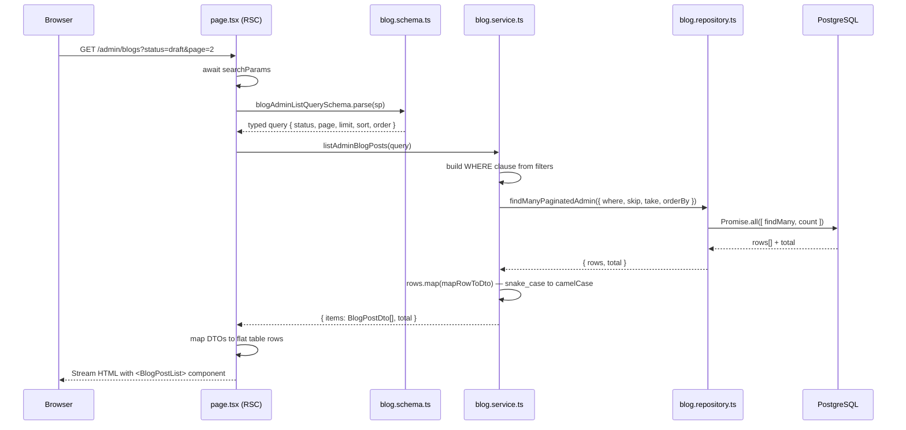

**Actual code — admin list page:**

```typescript
// app/(admin)/admin/blogs/page.tsx
const [{ items, total }, categories] = await Promise.all([
  listAdminBlogPosts(query),      // service call — no API hop
  listBlogCategoriesForAdmin(),   // category dropdown data
]);

const rows = items.map((p) => ({
  id: p.id,
  title: p.title,
  slug: p.slug,
  status: p.status,
  category: p.category.name,
  updated: p.updatedAt.toLocaleDateString("en-US", { year: "numeric", month: "short", day: "numeric" }),
}));

return <BlogPostList rows={rows} total={total} query={query} categories={categories} />;
```

**Key insight:** The page is an RSC — it runs on the server. Calling the service directly avoids an unnecessary HTTP roundtrip that would happen if we used `fetch("/api/v1/blogs")`.

---

### 4.2 Admin Create (POST /api/v1/blogs)

Creating a blog post flows through the **full MVC chain** because the form submit happens in the browser.

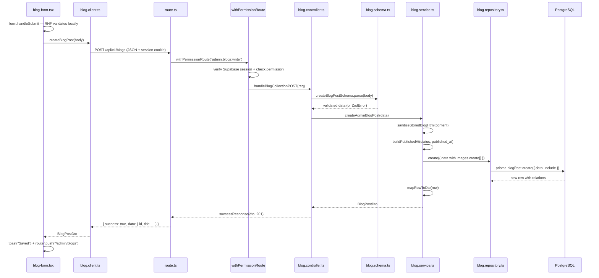

**Actual code — the chain step by step:**

**Step 1 — Browser form submits via HTTP client:**

```typescript
// src/lib/http/blog.client.ts
export async function createBlogPost(body: unknown): Promise<BlogPostDto> {
  return adminApiJson<BlogPostDto>("/api/v1/blogs", { method: "POST", body });
}
```

**Step 2 — Route delegates to controller with permission check:**

```typescript
// app/api/v1/blogs/route.ts
export async function POST(req: NextRequest) {
  return withPermissionRoute("admin.blogs:write", () => handleBlogCollectionPOST(req));
}
```

**Step 3 — Controller validates and calls service:**

```typescript
// src/lib/api/blog/blog.controller.ts
export async function handleBlogCollectionPOST(req: NextRequest): Promise<Response> {
  try {
    const body = await req.json();
    const data = createBlogPostSchema.parse(body);
    const post = await createAdminBlogPost(data);
    return successResponse(post, 201);
  } catch (error) {
    return handleApiError(error);
  }
}
```

**Step 4 — Service executes business logic:**

```typescript
// src/lib/services/blog/blog.service.ts
export async function createAdminBlogPost(body: CreateBody): Promise<BlogPostDto> {
  const published_at = buildPublishedAt(body.status, body.published_at, null);
  const row = await blogRepository.create({
    title: body.title,
    slug: body.slug,
    content: sanitizeStoredBlogHtml(body.content),   // HTML safety
    // ... all fields ...
    images: {
      create: body.images.map((img, i) => ({         // nested create
        url: img.url, alt: img.alt,
        sort_order: img.sort_order ?? i,
        is_featured: img.is_featured,
        storage_path: img.storage_path ?? null,
      })),
    },
  });
  return mapRowToDto(row);
}
```

---

### 4.3 Admin Update (PATCH /api/v1/blogs/{id})

Same MVC chain as create, but with partial update semantics.

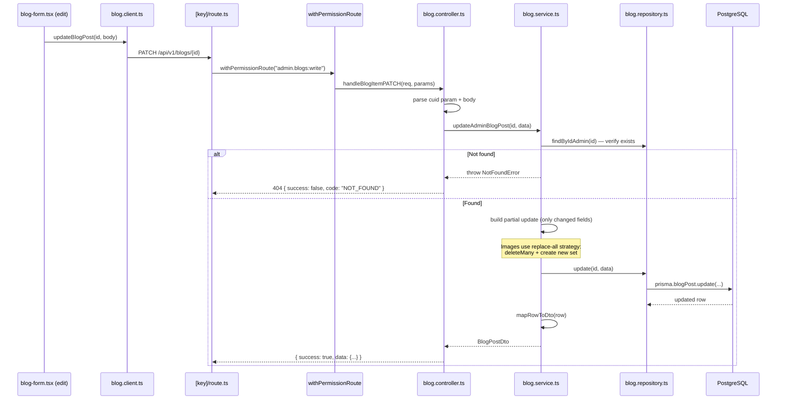

**Key pattern — partial updates:** The service only sets fields that are present in the request body. This allows PATCH semantics where the client sends only changed fields:

```typescript
const data: BlogPostUpdateInput = {};
if (body.title !== undefined) data.title = body.title;
if (body.slug !== undefined) data.slug = body.slug;
if (body.content !== undefined) data.content = sanitizeStoredBlogHtml(body.content);
// ... only changed fields are set
```

**Key pattern — image replace-all:** When images are updated, the service deletes all existing images and creates the new set. This avoids complex diffing:

```typescript
if (body.images !== undefined) {
  data.images = {
    deleteMany: {},         // remove all existing
    create: body.images.map(...)  // insert new set
  };
}
```

---

### 4.4 Admin Delete (DELETE /api/v1/blogs/{id})

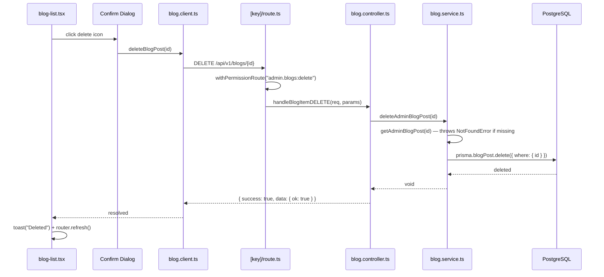

---

### 4.5 Public Blog Index (/blog)

Marketing pages also call the service directly — no API route needed.

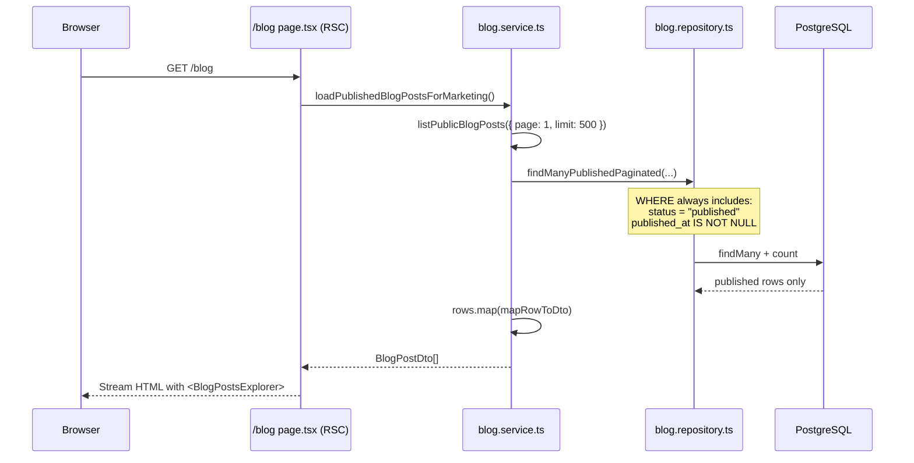

**Actual code:**

```typescript
// app/(marketing)/blog/page.tsx
export default async function BlogIndexPage() {
  const posts = await loadPublishedBlogPostsForMarketing();
  return (
    <main>
      <BlogPostsExplorer posts={posts} />
    </main>
  );
}
```

---

### 4.6 Public Blog Detail (/blog/[slug]) — with React cache()

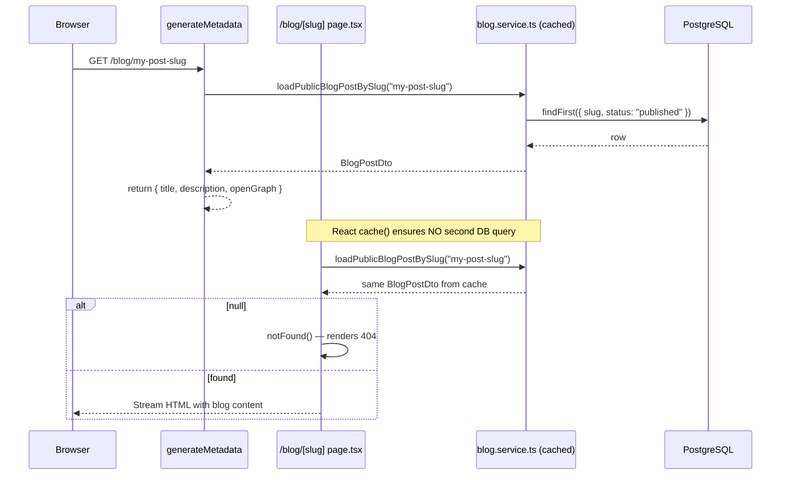

**Why `cache()`?** Next.js calls `generateMetadata` and the page body separately. Without `cache()`, the same slug query would hit the database twice per request. React `cache()` deduplicates within a single request.

---

### 4.7 Dual GET — Admin vs Public on Same Endpoint

The collection GET endpoint serves both admin and public consumers using **permission-first branching**:

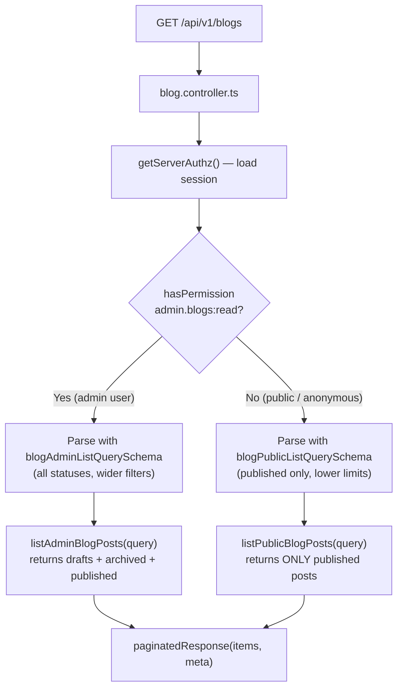

**Why different schemas per branch?** The public schema enforces stricter limits (max 500 vs 100) and different filter fields (`category_slug` vs `category_id`). The admin schema allows filtering by `status`, which should never be exposed to public callers.

---

## 5. Data Transformation Pipeline

Data transforms at each layer boundary. This prevents leaking database conventions into the API.

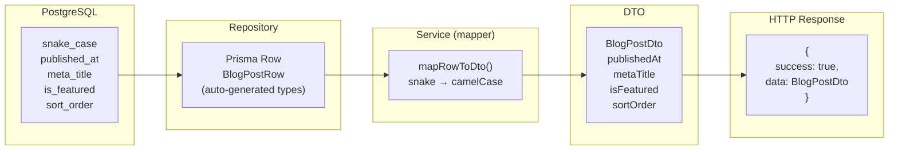

---

## 6. The Service File — Heart of the Module

The service (`blog.service.ts`) is the **single most important file** in the module. It contains everything that defines the module's behavior:

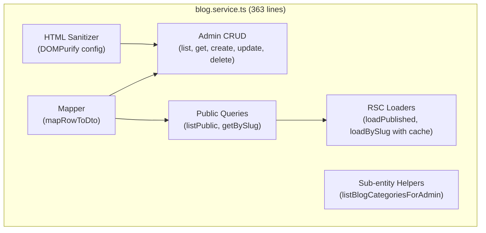

**Structure pattern — follow this order in every service file:**

| Section | What it contains | Blog example |
|---------|-----------------|--------------|
| 1. Imports | `"server-only"`, `cache`, domain types | Lines 1–26 |
| 2. Sanitizer | HTML/content sanitization (if module has rich text) | Lines 28–56 |
| 3. Mapper | `mapRowToDto()` and helper functions | Lines 58–124 |
| 4. Admin CRUD | `listAdmin*`, `getAdmin*`, `create*`, `update*`, `delete*` | Lines 126–289 |
| 5. Public queries | `listPublic*`, `getPublic*BySlug` | Lines 291–336 |
| 6. RSC loaders | `loadPublished*`, `load*BySlug` with `cache()` | Lines 338–354 |
| 7. Sub-entity helpers | Category/tag dropdowns | Lines 356–362 |

---

## 7. Error Handling — Consistent Across All Operations

Every error follows a predictable path:

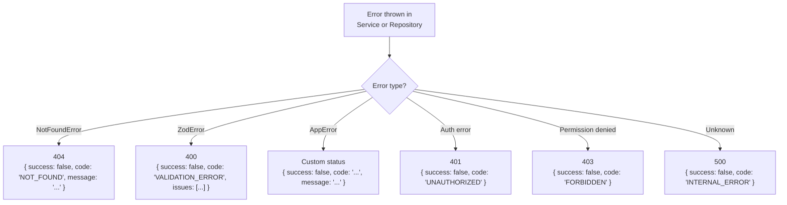

The controller's `try/catch` calls `handleApiError(error)` which maps every error type to the correct HTTP response. **You never need to write custom error handling per module.**

---

## 8. Permission Model — Three Layers of Defense

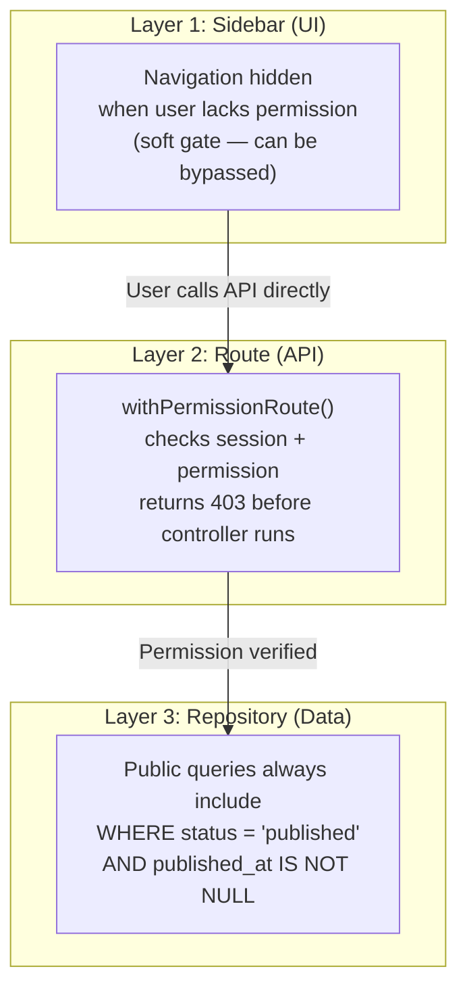

| Permission | Protects | Used in |
|-----------|---------|---------|
| `admin.blogs:read` | Viewing blog posts in admin panel | Controller GET (admin branch), sidebar visibility |
| `admin.blogs:write` | Creating and updating blog posts | Route POST/PATCH `withPermissionRoute` |
| `admin.blogs:delete` | Deleting blog posts | Route DELETE `withPermissionRoute` |

---

## 9. How to Create a New Module Using This Pattern

Replace `blog` with your module name (e.g., `hotel`, `promotion`, `destination`) and follow these steps in order.

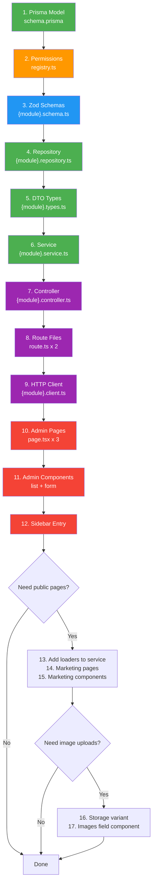

### Step-by-step checklist

| Step | File to create/modify | Copy from blog |
|------|-----------------------|----------------|
| 1 | `prisma/schema.prisma` — add your models | `BlogPost`, `BlogPostImage`, `BlogCategory` |
| 2 | `src/lib/authz/registry.ts` — add 3 permissions | `admin.blogs:read/write/delete` |
| 3 | `src/lib/validations/{module}.schema.ts` | `blog.schema.ts` |
| 4 | `src/lib/db/repositories/{module}.repository.ts` | `blog.repository.ts` |
| 5 | `src/lib/{module}/{module}.types.ts` | `blog.types.ts` |
| 6 | `src/lib/services/{module}/{module}.service.ts` | `blog.service.ts` |
| 7 | `src/lib/api/{module}/{module}.controller.ts` | `blog.controller.ts` |
| 8 | `app/api/v1/{modules}/route.ts` + `[key]/route.ts` | `app/api/v1/blogs/route.ts` |
| 9 | `src/lib/http/{module}.client.ts` | `blog.client.ts` |
| 10 | `app/(admin)/admin/{modules}/page.tsx` + `new/` + `[id]/edit/` | `app/(admin)/admin/blogs/` |
| 11 | `src/components/admin/{modules}/{module}-list.tsx` + `{module}-form.tsx` | `blog-list.tsx`, `blog-form.tsx` |
| 12 | `src/components/admin_ui/layout/sidebar.tsx` — add nav group | Blog section |

---

## 10. Naming Conventions — Mandatory Rules

| Rule | Example |
|------|---------|
| **One prefix per module** — all files use singular domain noun | `blog-*`, `hotel-*`, `promotion-*` (never `blog-post-*`) |
| **Dot-separated suffixes** for lib files | `blog.service.ts`, `blog.schema.ts`, `blog.repository.ts` |
| **Hyphen-separated names** for components | `blog-list.tsx`, `blog-form.tsx`, `blog-explorer.tsx` |
| **PascalCase exports** match the file | `blog-list.tsx` exports `BlogPostList` |
| **API segments** are plural, kebab-case | `/api/v1/blogs`, `/api/v1/hotels` |
| **Permission resource** uses `admin.{plural}` | `admin.blogs:read`, `admin.hotels:write` |
| **Admin URLs** use plural | `/admin/blogs`, `/admin/hotels` |
| **Marketing URLs** use singular | `/blog`, `/hotel` |

---

## 11. HTTP Response Contract

Every API response follows this exact shape. **Never deviate per module.**

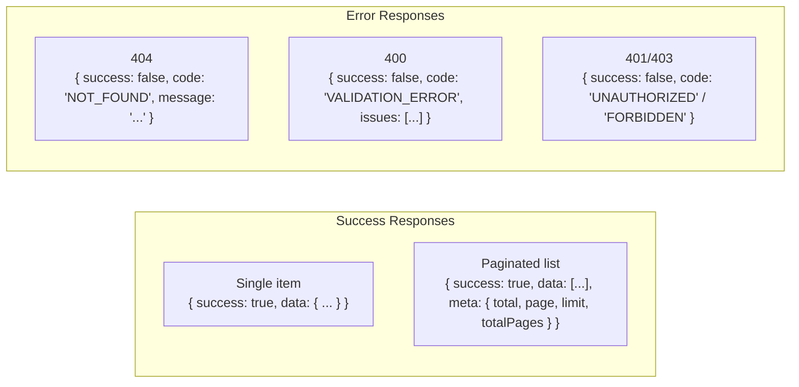

---

## 12. Key Design Decisions — Why We Do It This Way

| Decision | Why |
|----------|-----|
| **Unified backend per module** | One service, one controller, one schema, one repository handles admin + public + self-service. Prevents file explosion and keeps all module logic discoverable |
| **Permission-first branching in controller** | Same endpoint serves different data based on auth. Simplifies API surface for both web and mobile clients |
| **Cookie + Bearer token dual auth** | `getServerAuthz()` tries cookies first (web), then `Authorization: Bearer` (mobile). Every module works for both platforms with no additional code |
| **RSC pages call service directly** | Pages run on the server — calling your own API creates an unnecessary HTTP roundtrip |
| **Browser mutations go through API routes** | Form submissions happen in the browser, so they must go through HTTP with permission checks |
| **Service contains mapper, sanitizer, loaders** | These are tightly coupled to the service logic. Separate files add navigation overhead without real separation of concerns |
| **Repository contains Prisma types** | Include configs and inferred types are implementation details of data access — they belong together |
| **Sub-entity queries live in main repository** | A 4-line category lookup doesn't need its own file |
| **No module-specific upload/delete routes** | Generic `/api/v1/storage/upload` and `/api/v1/storage/delete` handle all modules via variant ID |
| **Image replace-all on update** | Simpler than diffing — deleteMany + create avoids stale image state |
| **React cache() for detail page loaders** | Deduplicates DB queries between `generateMetadata` and page body |
| **`import "server-only"` on all server files** | Prevents Next.js from accidentally bundling server code for the browser |

---

## 13. Common Mistakes to Avoid

| Mistake | What happens | Do this instead |
|---------|-------------|-----------------|
| Calling API from RSC pages | Unnecessary HTTP roundtrip, slower page loads | Call service functions directly |
| Separate 7-line service files for sub-entities | File explosion, import chain noise | Inline in main service |
| Separate mapper/sanitizer files | More files to navigate for tightly coupled logic | Keep in service until it exceeds ~500 lines |
| Module-specific upload routes | Duplicates generic storage infrastructure | Use `/api/v1/storage/upload` with variant ID |
| Business logic in route.ts | Untestable, bloated route files | Keep routes thin — delegate to controller |
| Custom JSON response shapes | Breaks `adminApiJson` expectations on the client | Always use `successResponse` / `paginatedResponse` |
| Permission checks only in UI | UI can be bypassed via direct API calls | Enforce in route (withPermissionRoute) + repository (WHERE status) |
| Using `getValues()` instead of `handleSubmit` | `isSubmitting` stays false — user can double-submit | Always use `form.handleSubmit(onSubmit)` |
| Exposing draft posts to public API | Data leak | Public queries always filter `status: "published"` |

---

## 14. Related Documents

| Document | What it covers |
|----------|---------------|
| `MODULE_DEVELOPMENT_GUIDE.md` | **Start here** — comprehensive, up-to-date guide for creating new modules with unified pattern, User module as second reference |
| `PROFESSIONAL_MODULE_CRUD_BLUEPRINT_BLOG_REFERENCE.md` | Generic blueprint with placeholder templates for creating any new module |
| `MOBILE_API_COMPATIBILITY_REQUIREMENTS.md` | Bearer token auth, CORS, mobile client integration |
| `GENERIC_STORAGE_UPLOAD_PLANNING.md` | Public variant uploads and session uploads |
| `PRISMA_MIGRATION_WORKFLOW.md` | Schema-first migrations and drift checks |
| `GENERIC_CRUD_FRONTEND_BLUEPRINT_BLOGS.md` | Admin UI composition with GenericForm / DataTable |
