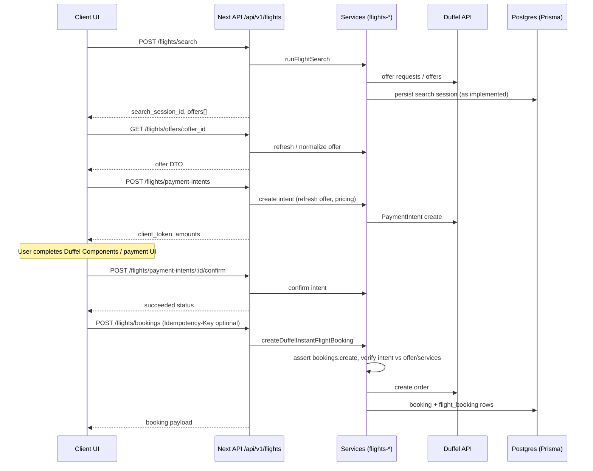

# Developer onboarding — architecture, flows, and module patterns

**Audience:** Engineers joining the project cold, or AI assistants (for example Cursor) that must follow the same structure when adding modules such as cars.

**Scope:** This document describes the **current** `traveltourup_next` codebase: Next.js (App Router), Prisma on PostgreSQL (Supabase-hosted), Supabase Auth, RBAC in the app database, Duffel-backed flights, and admin CRUD patterns (blog, users).

---

## 1. What this application is

- **Customer site:** Marketing pages, blog, flight/hotel/car discovery and booking flows, profile and “my bookings”.
- **Admin site:** Role-gated dashboard for users, roles/permissions, blogs, catalog modules (hotels, cars), bookings overview.
- **API:** First-party REST-style handlers under `app/api/v1/**` (not a separate server repo). Same deployment serves pages and JSON.

**Identity split (important):**

- **Supabase `auth.users`** — credentials and OAuth; not modeled in Prisma.
- **`public.users` (Prisma `User`)** — one app row per auth user; `User.id` equals `auth.users.id` (UUID). Bookings, blog authorship, roles attach here.

---

## 2. Technology stack (concise)

| Layer | Choice |
|--------|--------|
| Framework | Next.js (App Router), React 19 |
| Database | PostgreSQL via Prisma ORM |
| Auth | Supabase Auth (cookies for browser; optional `Authorization: Bearer` for API clients) |
| Storage | Supabase Storage (generic upload helpers + “variants” per resource) |
| External travel API | Duffel (flights; payment intents; webhooks) |
| Validation | Zod (`src/lib/validations/*.schema.ts`) |
| UI (admin) | Shared primitives under `src/components/admin_ui/` |

---

## 3. Repository map — where to look first

```
app/                          # Routes: pages + Route Handlers (API)
  (marketing)/               # Public marketing + blog + profile shell
  (admin)/admin/              # Admin pages (layout enforces login + admin roles)
  (booking)/                  # Flights, hotels, cars, payment flows
  api/v1/                     # JSON API (thin files → controllers/services)

src/
  lib/
    api/                      # Controllers, response helpers, route wrappers, errors
    authz/                    # RBAC registry, guards, server session resolution
    auth/                     # Redirects, server actions related to auth UX
    services/                 # Business logic (call repositories + Duffel + rules)
    db/repositories/          # Prisma-heavy data access
    validations/            # Zod schemas shared by API + optional reuse elsewhere
    http/                     # Browser `fetch` clients for `/api/v1` (credentials: include)
    duffel/, flights/, payments/  # Flight-specific integration and orchestration
    supabase/                 # Server/browser Supabase clients; session refresh helper
  components/
    admin/                    # Feature admin UIs (blogs, users, roles…)
    admin_ui/shared/          # **Generic** admin building blocks (DataTable, filters, forms)
    flights/, blog/, …       # Customer-facing feature UI

prisma/                       # schema, migrations, seeds (RBAC catalog from registry)
```

**Convention:** Keep **`app/api/v1/.../route.ts`** thin: parse → call **`src/lib/api/**`** controller → **`src/lib/services/**`** → repository / external API.

---

## 4. End-to-end request lifecycle

### 4.1 Browser navigation (any page)

1. Next receives the request.
2. **Session:** Supabase session cookies should be refreshed on navigations. The project centralizes this in `src/lib/supabase/middleware.ts` (`updateSupabaseSession`); wiring may be via root middleware or the provided `proxy.ts` — confirm in your branch that non-API requests run through that refresh so Server Components see a valid user.
3. **Server Component** for the route may call `getServerAuthz()` to get `userId` + `authz` (RBAC) without exposing secrets to the client.
4. **Client components** that call the API use `src/lib/http/api-client.ts` (`credentials: "include"`) so cookies flow to `/api/v1/**`.

### 4.2 JSON API (`/api/v1/...`)

1. Route Handler in `app/api/v1/.../route.ts` runs on the server.
2. **`getServerAuthz()`** (`src/lib/authz/session.ts`): resolves user from **`Authorization: Bearer <jwt>`** *or* Supabase cookies (Bearer preferred when both could apply, to avoid double `getUser` work — see comment in file).
3. Authorization:
   - **`withAuthedRoute` / `withPermissionRoute`** (`src/lib/api/with-route-auth.ts`) for consistent 401/403 + error envelope, **or**
   - Manual `assertPermission(authz, ...)` inside controllers (user/blog patterns).
4. Input: query/body validated with **Zod** in the controller or route.
5. **`src/lib/services/**`** performs work; **repositories** isolate Prisma.
6. Output: **`successResponse` / `paginatedResponse`** (`src/lib/api/response.ts`) → `{ success, data, meta? }`.

### 4.3 Admin UI list page (pattern: blogs, users)

1. **Server page** (`app/(admin)/admin/.../page.tsx`): parses `searchParams` with the same Zod list schema as the API, calls **service** directly (fast, SEO-friendly, no extra HTTP hop).
2. Passes rows + `total` + `query` into a **client list component** (`BlogPostList`, `UserList`).
3. List component: **`PageHeader`** + **`GenericFilter`** + **`DataTable`**; mutations (delete, etc.) call **`src/lib/http/*.client.ts`** → API → permission checks on server.

**Why both server service and API?** Admin lists load data on the server for performance; the API stays the **contract** for refresh, other clients, and AI/mobile later.

### 4.4 Customer marketing blog (read-only public)

- **`app/(marketing)/blog/page.tsx`** calls **`loadPublishedBlogPostsForMarketing()`** from `blog.service` directly — **no** client fetch required for first paint.
- Optional: public could also use `GET /api/v1/blogs` without admin permission; the controller returns the public slice.

---

## 5. Permissions (RBAC) — how they are set and enforced

### 5.1 Concepts

- **Permission** = stable string id (example: `admin.blogs:write`, `bookings:create`). Stored in DB table `permissions`, seeded from code.
- **Role** = grouping of permissions (`role_permissions`).
- **User** gets permissions via **`user_roles`** ∪ optional **`user_permission_grants`** (exceptions).
- Effective permissions are resolved in SQL/Prisma in **`getAuthzContextForUserId`** (`src/lib/authz/server.ts`) and exposed as **`authz.permissions`** (`Set`).

### 5.2 Catalog and seed

- **Source of truth for the catalog list:** `PERMISSION_REGISTRY` and `ROLE_BOOTSTRAP` in `src/lib/authz/registry.ts`.
- **After adding a new permission id:** add it to `PERMISSION_REGISTRY`, run migrations if needed, **`npm run db:seed`** (or your seed path) so rows exist and roles get assignments.
- **Runtime checks** use the **string id** from the database, not TypeScript-only constants (though `PermissionId` types the catalog).

### 5.3 Where to enforce

| Layer | Responsibility |
|--------|----------------|
| **Route Handler** | Use `withPermissionRoute("permission:id", handler)` for mutations or strictly gated reads. |
| **Controller** | `getServerAuthz()` then `assertPermission(authz, ...)` or branch on `hasPermission(authz, ...)` for **dual-mode** endpoints (public vs admin same URL). |
| **Service** | Extra rules (example: `bookings:create` inside `flights-booking.service.ts`). Keeps reuse safe if multiple controllers call the service. |
| **Admin layout** | `app/(admin)/admin/layout.tsx`: requires login + **`hasAnyRole(authz, ADMIN_PANEL_ROLE_IDS)`** — coarse gate; **not** a substitute for per-permission API checks. |
| **Page** | Can hide UI, but **never** rely on UI alone; API must always re-check. |

### 5.4 Discovering “what permission protects what”

- Grep `assertPermission`, `withPermissionRoute`, `hasPermission`, `admin.*:` in `src/lib/api` and `src/lib/services`.
- Inspect `app/api/v1/**/route.ts` for wrappers.

### 5.5 Client-side permission UX

- **`GET /api/v1/me/authz`** returns permission slugs for the signed-in user (for toggling UI).
- **`DataTable`** supports permission-driven actions (`enablePermissionChecking`, `requiredPermission` on custom actions, etc.). **Blog list currently sets `enablePermissionChecking={false}`** — delete is still **blocked** by the API for callers without `admin.blogs:delete`; the UI should ideally align to avoid confusing errors. For new modules, prefer **explicit** checks or server-driven “can” flags in page props.

---

## 6. Admin module pattern — generic components + Blog + Users

### 6.1 Shared building blocks (`src/components/admin_ui/shared/`)

| Component | Role |
|-----------|------|
| **`page-header.tsx`** | Title, subtitle, add button, filter toggle, refresh, optional export slot. |
| **`generic-filter.tsx`** | Declarative `FilterConfig` (text, select, …); emits `onFilterChange` → list pages typically **`router.push`** with updated query string. |
| **`data-table.tsx`** | Sortable columns, pagination, row actions, card/grid toggle; wire `onPageChange` / `onSort` back to URL query. |
| **`generic-form.tsx`** | Large configurable form (sections, subforms); used by **blog-form** and **user-form**. |
| **`GenericReportExporter.tsx`** | Optional export helpers. |

**Pattern:** Server page owns **filter/sort/pagination state** (URL `searchParams`); client table is **controlled** by props from the server.

### 6.2 Blog (reference CRUD + dual API)

| Concern | Location |
|---------|----------|
| Zod | `src/lib/validations/blog.schema.ts` |
| Service | `src/lib/services/blog/blog.service.ts` |
| Repository | `src/lib/db/repositories/blog.repository.ts` |
| Controller | `src/lib/api/blog/blog.controller.ts` |
| Routes | `app/api/v1/blogs/route.ts`, `app/api/v1/blogs/[key]/route.ts` |
| HTTP client | `src/lib/http/blog.client.ts` |
| Admin UI | `src/components/admin/blogs/*`, pages under `app/(admin)/admin/blogs/` |
| Public UI | `app/(marketing)/blog/*`, `src/components/blog/*` |
| Image uploads | Storage variant `src/lib/storage/variants/blog-images.variant.ts` + generic upload zone |

**Dual read model (`GET` collection and item):**

- Same URL works for **public** and **admin**: if `authz` has `admin.blogs:read`, list/detail return **admin** fields and identifiers (e.g. CUID for edit); otherwise **published/public** projection.
- **Writes:** `POST/PATCH/DELETE` wrapped with `withPermissionRoute("admin.blogs:write" | "admin.blogs:delete", ...)`.

### 6.3 Users (reference strict admin API)

| Concern | Location |
|---------|----------|
| Zod | `src/lib/validations/user.schema.ts` |
| Service | `src/lib/services/user/user.service.ts` |
| Controller | `src/lib/api/user/user.controller.ts` |
| Routes | `app/api/v1/users/...` |
| Client | `src/lib/http/user.client.ts` |
| Admin UI | `src/components/admin/users/*` |

**Contrast with blog:** user list **does not** expose a public mode on the same collection route; **`assertPermission`** for `admin.users:read` / `write` on every admin operation.

---

## 7. Customer module pattern — “follow the blog”

Use the **blog** when the feature is **CMS-like** (entities stored fully in your DB, public read, admin write).

**Recommended split:**

1. **Public pages (marketing)**  
   - Prefer **Server Components** + direct **service** calls for reads (fast, cache-friendly).  
   - Match: `app/(marketing)/blog/page.tsx` → `loadPublishedBlogPostsForMarketing()`.

2. **Public API**  
   - Add **`GET`** handlers that either require no auth or branch on `getServerAuthz()` like blogs if the same route serves two audiences.

3. **Admin**  
   - Mirror blog: `app/(admin)/admin/<module>/page.tsx` + list component with **GenericFilter** + **DataTable** + **GenericForm** for create/edit.

4. **Validation**  
   - One Zod module per domain under `src/lib/validations/<module>.schema.ts`; import from controllers **and** optionally from server pages for `searchParams` parsing.

5. **HTTP client**  
   - `src/lib/http/<module>.client.ts` using `apiJson` / `apiPaginatedJson` for browser mutations and any client-side reads.

**UI may differ** from blog (layout, cards, typography); **keep the same layers**: validations → service → repository → route → optional client.

---

## 8. Flight module — end-to-end flow (template for cars)

Flights combine **short-lived Duffel offers**, **search sessions** in your DB, **payment intents**, and **bookings** persisted after success.

### 8.1 Customer journey (happy path, instant pay)



### 8.2 Key routes (reference map)

| Step | Route / client |
|------|----------------|
| Search | `POST app/api/v1/flights/search/route.ts` → `runFlightSearch` — rate-limited by IP or user; requires Duffel env configured. |
| List / session | Client may use `getFlightSearchSessionOffers` — `src/lib/http/flights.client.ts`. |
| Detail | Page `app/(booking)/flights/[id]/page.tsx` (client) loads offer via **`getFlightOffer`**. |
| Seat maps | `GET .../offers/[offer_id]/seat-maps` |
| Payment | `app/(booking)/flights/payment/page.tsx` — server **`getServerAuthz()`**; unauthenticated → **`redirect` to login** with `next` preserved. View: `src/views/Payment.tsx` + Duffel payment pieces. |
| Payment intent | `POST .../payment-intents`, `POST .../payment-intents/[id]/confirm` |
| Booking | `POST .../flights/bookings` — **`requireUserId`** + service checks **`bookings:create`**. |
| Cancel | `POST .../flights/bookings/[id]/cancel` (plus service rules for manage vs own). |

### 8.3 Permissions involved

- **`bookings:create`** — creating flight orders (see `flights-booking.service.ts`).
- **`bookings:cancel_own`** / **`bookings:manage`** — cancellation path (`flight-cancel.service.ts`).
- Search is generally **public** with rate limits; payment and booking require **signed-in** user.

### 8.4 Data stored locally

- **`Booking`** + **`FlightBooking`** (+ ancillaries, payment intent records) — see `prisma/schema.prisma`.  
- Not everything from Duffel is stored; snapshots and references (`duffel_order_id`, offer ids, itinerary snapshot JSON) support **“My bookings”** and support tooling.

### 8.5 Applying the same idea to **cars**

Cars today include admin catalog APIs (`app/api/v1/admin/cars/...`) and customer pages under `app/(booking)/cars/`. For a **Duffel-like** or supplier **search → quote → pay → book** vertical, reuse the **flight-shaped** layering:

1. **Zod** request/response shapes in `src/lib/validations/`.
2. **`src/lib/services/<vertical>/`** orchestration (supplier API + DB).
3. **`app/api/v1/<vertical>/...`** thin routes + rate limits where anonymous search exists.
4. **Client `src/lib/http/<vertical>.client.ts`** mirroring flights.client.
5. **Checkout page** that requires auth the same way as `flights/payment/page.tsx`.
6. **Booking service** that ties **payment state** to **final supplier order** and persists **`Booking`** + domain extension table (like `FlightBooking` → e.g. `CarBooking` already exists in schema — extend services to match flight maturity).

---

## 9. API errors, typing, and testing

- **Errors:** Throw **`AppError`**, **`ValidationError`**, or authz **`ForbiddenError` / `UnauthorizedError`**; **`handleApiError`** maps them to HTTP + JSON body (`src/lib/api/error-handler.ts`).
- **Tests:** Co-located `*.test.ts` (Vitest) for critical schemas and pricing helpers — follow the same for new modules.

---

## 10. Environment and operations (minimal checklist)

- **Supabase:** `NEXT_PUBLIC_SUPABASE_URL`, `NEXT_PUBLIC_SUPABASE_ANON_KEY`, service role where required for server operations.
- **Database:** `DATABASE_URL` / Prisma 7 config in `prisma.config.ts` as documented in repo.
- **Duffel:** keys and webhook secret as used in `src/lib/duffel/config.ts` and webhook route `app/api/v1/webhooks/duffel/route.ts`.
- **CORS:** `next.config.ts` headers + `proxy.ts` OPTIONS for API; align **`CORS_ALLOWED_ORIGIN`** with deployed frontends and mobile apps.

---

## 11. “New module” checklist (printable)

**Database**

- [ ] Add/adjust models in `prisma/schema.prisma`, migrate.
- [ ] Add repository in `src/lib/db/repositories/`.

**Permissions**

- [ ] Add ids to `PERMISSION_REGISTRY`; seed DB; assign to roles as needed.

**API**

- [ ] Zod schemas in `src/lib/validations/<module>.schema.ts`.
- [ ] Service in `src/lib/services/<module>/`.
- [ ] Controller in `src/lib/api/<module>/`.
- [ ] Routes under `app/api/v1/<module>/.../route.ts` using wrappers where appropriate.

**Admin UI**

- [ ] Pages under `app/(admin)/admin/<module>/`.
- [ ] List: server page + client `*List` with **PageHeader**, **GenericFilter**, **DataTable**.
- [ ] Forms: **GenericForm** or dedicated form when the generic config becomes unwieldy.

**Customer UI**

- [ ] Pages under `app/(marketing)/` or `app/(booking)/` depending on surface.
- [ ] Optional `src/lib/http/<module>.client.ts` for mutations / client reads.

**Docs / AI**

- [ ] Paste the **Cursor brief** below into a rule or chat when implementing.

---

## 12. Cursor AI — brief to enforce project conventions

Use this block as a system or user instruction when generating code for this repository:

> You are working in the **traveltourup_next** monolithic Next.js App Router project.  
> **Stack:** Prisma (PostgreSQL / Supabase), Supabase Auth, Zod validation, RBAC via `getServerAuthz()` + `assertPermission` / `withPermissionRoute`, services under `src/lib/services`, repositories under `src/lib/db/repositories`, API controllers under `src/lib/api`, HTTP clients under `src/lib/http` using `credentials: "include"`.  
> **Do not** put business logic in `route.ts` files — keep them thin.  
> **Permissions:** add new ids only to `PERMISSION_REGISTRY` conceptually and enforce in controllers/services; never trust the client.  
> **Admin lists:** server page loads data via services + Zod-parsed `searchParams`; client uses **PageHeader**, **GenericFilter**, **DataTable**; URL query is the source of truth for filters/sort/pages.  
> **Dual-audience reads:** follow `blog.controller` pattern (`hasPermission` branch) only when the same route must serve public and admin; otherwise use strict `assertPermission` like `user.controller`.  
> **Booking-style verticals:** follow **flights**: validate body → rate limit if needed → service checks authz + payment/order consistency → persist `Booking` + extension table → return `successResponse`.  
> Reuse existing error types and `handleApiError`. Match naming and file placement of **blog** (CMS) or **flights** (external supplier + payment) depending on the feature.

---

## 13. Suggested reading order for a new developer

1. `prisma/schema.prisma` — `User`, `Booking`, RBAC tables, domain extensions.  
2. `src/lib/authz/registry.ts` + `src/lib/authz/server.ts` + `src/lib/authz/session.ts`.  
3. `src/lib/api/with-route-auth.ts` + `src/lib/api/response.ts` + `src/lib/api/error-handler.ts`.  
4. Blog pipeline: `blog.controller.ts` → `blog.service.ts` → admin `blog-list.tsx` / `blog-form.tsx`.  
5. Users pipeline: `user.controller.ts` → `user-list.tsx`.  
6. Flights: `app/api/v1/flights/search/route.ts`, `.../payment-intents/route.ts`, `.../bookings/route.ts`, plus `flights-booking.service.ts` and `src/lib/http/flights.client.ts`.

This document is the **onboarding companion** to historical planning notes in `MAIN_PLANNING.md` / `MAIN_DOCS.md`; when they conflict with the **code**, treat the **code** as authoritative and update the docs.
