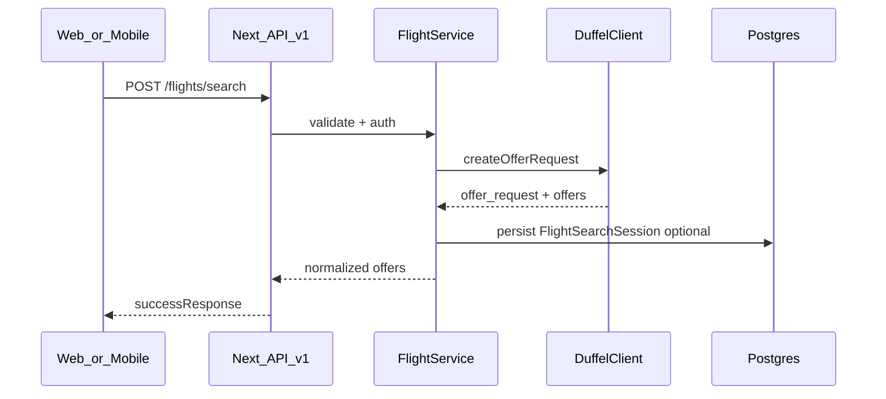
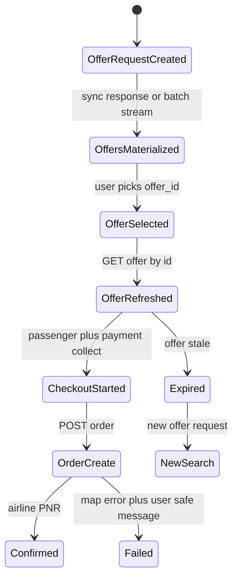
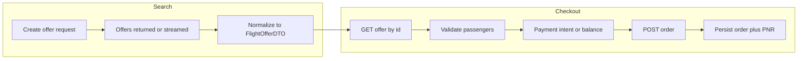

# Duffel Enterprise Integration — Implementation Plan

**Project:** TravelTourUp (`traveltourup_next`)  
**Document version:** 1.1  
**Last updated:** April 2026  

**Stack:** Next.js (App Router), API routes under `/api/v1`, Prisma ORM, Supabase (PostgreSQL), shared HTTP API for **web (Next.js)** and **mobile (React Native)**.

**Companion document:** [DUFFEL_IMPLEMENTATION_ROADMAP.md](./DUFFEL_IMPLEMENTATION_ROADMAP.md) (timeline and milestones).

---

## Executive summary

This plan defines an enterprise-grade, backend-first integration of **Duffel Flights** into TravelTourUp. The frontend already exposes much of the UX with mock data; this document specifies how to replace mocks with real flows while preserving the project’s patterns: thin routes, **Zod** validation, **service + repository** layers, `handleApiError`, and reusable client modules per [GENERIC_CRUD_FRONTEND_BLUEPRINT_BLOGS.md](../GENERIC_CRUD_FRONTEND_BLUEPRINT_BLOGS.md). File uploads for booking documents (e-tickets, receipts) can follow [GENERIC_STORAGE_UPLOAD_PLANNING.md](../GENERIC_STORAGE_UPLOAD_PLANNING.md) in a later phase.

**Booking UI:** Keep the existing **[`app/(booking)`](../../app/(booking))** routes and visual design; swap the **data layer** (loaders, mutations) to `/api/v1/flights/*` and shared HTTP/query-key modules so web and React Native stay aligned (see §1.6).

A **foundation phase** (Duffel client, errors, webhooks idempotency, core Prisma models, DTO mappers) must complete first so all later features (search, book, pay, cancel, ancillaries) share the same integration layer.

### Security: API keys

- Store `DUFFEL_API_KEY` only in **server** environment variables (e.g. Vercel/hosting secrets, local `.env.local`).
- **Never** embed keys in the browser, React Native binaries, or committed Markdown. Use placeholders such as `duffel_test_***` in documentation.
- If a key has ever appeared in chat, tickets, or commits, **rotate it** in [Duffel Dashboard → Access tokens](https://app.duffel.com/).

### Official Duffel references (keep open during build)

| Resource | URL |
|----------|-----|
| Docs home | https://duffel.com/docs |
| Getting started — Flights | https://duffel.com/docs/guides/getting-started-with-flights |
| Getting started — Stays | https://duffel.com/docs/guides/getting-started-with-stays |
| Collecting customer card payments | https://duffel.com/docs/guides/collecting-customer-card-payments |
| Cancelling an order | https://duffel.com/docs/guides/cancelling-an-order |
| Adding extra bags | https://duffel.com/docs/guides/adding-extra-bags |
| Ancillaries component | https://duffel.com/docs/guides/ancillaries-component |
| Offer requests (create) | https://duffel.com/docs/api/v2/offer-requests/create-offer-request |
| Batch offer requests | https://duffel.com/docs/api/v2/batch-offer-requests/create-batch-offer-request |
| Offers | https://duffel.com/docs/api/offers |
| Orders (create) | https://duffel.com/docs/api/orders/create-order |
| Holding orders / pay later | https://duffel.com/docs/guides/holding-orders-and-paying-later |
| Order changes | https://duffel.com/docs/api/order-changes |
| Payment Intents API | https://duffel.com/docs/api/payment-intents/create-payment-intent |

### Related internal docs (enterprise meeting line-up)

Use these together with this plan when talking to Duffel and when locking commercial/ops policy:

| Document | Purpose |
|----------|---------|
| [DUFFEL_ENTERPRISE_MEETING_BRIEF.md](./DUFFEL_ENTERPRISE_MEETING_BRIEF.md) | Commercial blocks, prerequisites (IATA/KYB, MOR, agents), search/booking questions for Duffel |
| [DUFFEL_MEETING_AGENDA_AND_QUESTIONS.md](./DUFFEL_MEETING_AGENDA_AND_QUESTIONS.md) | Condensed agenda: payments flow, refunds, combined trips, agent settlement |

---

## 0. Enterprise product decisions (Duffel-aligned)

This section answers the **planning questions** that also appear in the meeting agenda, grounded in **Duffel’s documented** flows. Final **merchant-of-record**, **settlement**, and **enterprise contract** terms must still be confirmed with Duffel (see meeting brief Block A / C).

### 0.1 Payment model — “customer pays us → we pay Duffel” vs “direct payment to Duffel”

**How Duffel documents the primary card flow (Managed Content + Duffel Payments)**

[Collecting customer card payments](https://duffel.com/docs/guides/collecting-customer-card-payments) describes this sequence:

1. **Create Payment Intent** on your **backend** (amount = customer charge, including **markup** and FX — see §0.2).
2. **Collect** card details via **Duffel’s** client component (`@duffel/components`) — card data does not touch your servers (PCI scope reduction).
3. **Confirm** the Payment Intent on your backend — Duffel tops up **your Duffel Balance** (net of Duffel Payments fees).
4. **Create order** with `payments: [{ type: "balance", amount, currency }]` matching the offer — still in **your** integration, using your API key.

So in industry terms:

| Colloquial label | What it maps to on Duffel |
|------------------|---------------------------|
| **Integrated / “direct” card checkout** | Customer pays with card **through Duffel Payments** (Stripe under the hood per docs); funds credit **your Balance**; you **settle the airline** via the order `balance` payment. This is **not** “customer wires cash to our unrelated bank account and we manually pay Duffel” in the documented flow — the **payment rails** are Duffel’s Payments product. |
| **Merchant-of-record to the traveler (product)** | TravelTourUp still **contracts and supports** the customer for the **trip**; **ticketing settlement** runs via Duffel per your agreement. Confirm **MOR**, **invoicing**, and **chargebacks** on the enterprise call ([DUFFEL_ENTERPRISE_MEETING_BRIEF.md](./DUFFEL_ENTERPRISE_MEETING_BRIEF.md) Block A). |
| **Pure prefunding / agency** | You maintain a **Duffel Balance** without per-booking card collection (or use `arc_bsp_cash` where eligible). Customer might pay you via a **separate** invoicing/PSP — then you book with `balance`; reconciliation is **your** ledger. |

**Recommendation for TravelTourUp (B2C + future agents):** Implement the **documented Duffel Payments** path for consumer web first (Payment Intent → confirm → order with `balance`). Mobile: Duffel states **browser-focused** Payments today with **mobile support coming** — plan an interim (e.g. web checkout / hosted flow) or confirm roadmap on the call ([same guide — Requirements](https://duffel.com/docs/guides/collecting-customer-card-payments#requirements)).

**Ideal vs literal “merchant model”:** The **commercial ideal** (you set final price, you earn margin, you own CS) is compatible with Duffel Payments because **you set PaymentIntent amount** (fare + services + **markup**) and **inspect markup** in the Duffel Balance UI per the guide. Align exact **legal MOR** wording with Duffel support.

### 0.2 Revenue strategy — markup, service fees, dynamic pricing

Duffel’s **Payment Intent** documentation defines amount as (paraphrased): **`((offer and services total_amount + markup) × FX) / (1 − Duffel Payments fee)`**, with explicit **markup** for your margin and ops cost ([Create PaymentIntent](https://duffel.com/docs/guides/collecting-customer-card-payments#create-payment-intent)).

| Strategy | Implementation |
|----------|----------------|
| **Markup only** | Fold all margin into `markup` used in that formula; show one total to customer. |
| **Service fee** | Either include in `markup` **or** show as separate **line items in your UI** while still rolling into the **single** PaymentIntent total (Duffel’s formula is amount-based). |
| **Both** | e.g. transparent booking fee + hidden dynamic markup — still one intent amount; store breakdown in **your** DB (`fare_component`, `markup_component`, `fee_component`) for agents and reporting ([meeting brief — agents](./DUFFEL_ENTERPRISE_MEETING_BRIEF.md)). |
| **Dynamic markup** (airline / cabin / route) | **Entirely in your service layer** — apply rules to Duffel’s `total_amount` after **GET offer** refresh; recalculate intent before collect; never cache stale totals for payment. |

**Constraints:** Duffel Payments is available only in **certain countries** per the guide — verify your markets. For **combined trips** (flight + hotel), markup rules per component are **your** packaging logic; Duffel recommends understanding **separate orders** under one checkout UX where products differ (ask on call — [agenda §4](./DUFFEL_MEETING_AGENDA_AND_QUESTIONS.md)).

### 0.3 Integration scope — “basic” vs “full enterprise”

| Track | Scope | When |
|-------|--------|------|
| **MVP** | Search → select → refresh offer → passengers → pay → create instant order → confirmation | First customer-visible release |
| **Production enterprise (recommended baseline)** | MVP + **webhooks** (order/payment truth) + **cancellation quote/confirm** + reconciliation runbooks | Before **live** traffic at scale |
| **Full enterprise UX** | + **Ancillaries** (seats, bags, meals), **order changes** ([order changes API](https://duffel.com/docs/api/order-changes)), **hold** flows ([hold guide](https://duffel.com/docs/guides/holding-orders-and-paying-later)) | Phased after baseline ([roadmap](./DUFFEL_IMPLEMENTATION_ROADMAP.md) P3–P4) |

**Meeting alignment:** [DUFFEL_MEETING_AGENDA_AND_QUESTIONS.md](./DUFFEL_MEETING_AGENDA_AND_QUESTIONS.md) Block 2–3 (rate limits, hold vs instant, webhooks, cancellations).

### 0.4 Payment succeeded but booking (order) failed — handling

This is a **critical** failure mode once Payment Intents are confirmed: the guide states confirming tops up **Balance**, then you **Create Order**. If **`POST /air/orders` fails** after a successful confirm, the customer must not be left in an ambiguous state.

**Policies to implement (engineering + ops)**

| Step | Action |
|------|--------|
| 1. **State** | Persist `payment_intent_id`, status `payment_succeeded`, `order_create_status` = `pending` / `failed`. Never mark `Booking.status = confirmed` without `duffel_order_id` + PNR (or equivalent). |
| 2. **Reconcile** | On timeout, **`GET /air/orders`** is not enough without an id — use stored intent + Duffel dashboard; **retry `POST /air/orders`** only when idempotent-safe (no partial order created). Follow Duffel error: if offer expired, **new search** + refund path. |
| 3. **Auto-retry** | Limited window: safe when failure is **transient** (5xx) and offer **still valid** after refresh; backoff; max attempts in config. |
| 4. **Auto-refund** | If order cannot be completed and customer must not be charged for a non-ticket, initiate refund per Duffel **Payment Intent refund** process ([help center link from guide](https://help.duffel.com/hc/en-gb/articles/4408837948946)). Automate where possible; log `refund_id`. |
| 5. **Manual** | Queue for support when airline rejects, fare conflict, or refund edge case — **admin** view: intent id, balance movement, error payload. |

**API surface:** Expose a machine-readable code e.g. `BOOKING_FAILED_AFTER_PAYMENT` (HTTP 503 or 409 with `support_reference`) and document in runbook §14.

**Note:** funds may remain **on your Duffel Balance** after a failed order attempt; finance must reconcile Balance vs customer refunds — confirm with Duffel in **Block C** of the meeting brief.

### 0.5 Cancellation and refund — automatic vs manual, full vs partial

**Per Duffel API:** [Cancelling an order](https://duffel.com/docs/guides/cancelling-an-order) uses **quote → confirm**; refundability and **amount** are **fare/rule dependent** (airline), not a universal guarantee.

| Aspect | TravelTourUp handling |
|--------|------------------------|
| **Who “handles” refund** | **System** performs quote + confirm API calls; **airline rules** determine outcome; **customer support** for exceptions. |
| **Full vs partial** | Display **quote** totals and conditions before confirm; persist in `OrderCancellation`. |
| **Manual** | Disputes, chargebacks, schedule-change chaos — admin tools + runbook. |
| **Duffel fees** | Commercial question for enterprise call — not all pass-through to traveler ([agenda §3](./DUFFEL_MEETING_AGENDA_AND_QUESTIONS.md)). |

### 0.6 Agent channel and payouts

Duffel **settlement to one** integrating partner account is the default; **agent commissions** are **your** ledger (see [meeting brief](./DUFFEL_ENTERPRISE_MEETING_BRIEF.md) “Agents” and agenda §5). No code change in Duffel for split payouts unless Duffel offers a specific program — confirm on call.

---

## 1. System architecture

### 1.1 Principles

1. **Backend-first:** All calls to `api.duffel.com` run on the server. Clients authenticate only to **your** `/api/v1` (session/JWT per existing auth).
2. **Separation of concerns:** API routes do not call Duffel directly; they delegate to **services**. Services delegate HTTP to a **Duffel integration layer**.
3. **One API contract for web and mobile:** Same JSON shapes, query keys, and error `code` values for Next.js and React Native.

### 1.2 Alignment with this repository

| Layer | Existing pattern | Apply to Duffel |
|-------|------------------|-----------------|
| HTTP | Thin `app/api/v1/*/route.ts`, `handleApiError` (`src/lib/api/error-handler.ts`), `successResponse` / `paginatedResponse` (`src/lib/api/response.ts`) | `app/api/v1/flights/*`, extended `bookings`, `app/api/v1/webhooks/duffel/route.ts` |
| Service | `src/lib/services/booking.service.ts` + `src/lib/authz/*` | `flights.search.service`, `flights.booking.service`, `duffel.webhook.service` |
| Repository | `src/lib/db/repositories/*` | Extend `booking.repository`; add `flight_search_session`, `duffel_webhook_event`, etc. |
| Validation | `src/lib/validations/*.schema.ts` (Zod) | `flights.schema.ts`, `flight_checkout.schema.ts` — platform DTOs; map to Duffel in integration layer |
| Handlers | Centralized handlers (e.g. `src/lib/api/blog/handlers.ts`) | `src/lib/api/flights/handlers.ts` |
| Client (web/RN) | `src/lib/http/{resource}.ts`, `src/lib/query-keys/*` | `src/lib/http/flights.ts`, `src/lib/query-keys/flights.ts` |
| Duffel HTTP | `src/lib/duffel/client.ts`, `src/lib/duffel/flights.ts` | Expand with orders, payments (beta), seat maps, cancellations, batch search |

### 1.3 High-level architecture (text)

```text
[Next.js Web] ──┐
[React Native]──┼── HTTPS + session/JWT ──► [API layer: app/api/v1/*]
                │                              │
                │                              ▼
                │                    [Service layer: authz, orchestration]
                │                              │
                │                    ┌─────────┴─────────┐
                │                    ▼                   ▼
                │            [Repository / Prisma]   [Duffel integration layer]
                │                    │                   │  Bearer + Duffel-Version
                │                    ▼                   ▼
                │              [PostgreSQL]        [api.duffel.com]
                │                                        │
                └──────────────────────────────── [POST /api/v1/webhooks/duffel]
```

### 1.4 Request path (Mermaid)



### 1.5 Layer responsibilities

**API layer**

- Parse auth (`getServerAuthz`, `requireUserId` where required).
- Zod validate body/query; return 400 with `VALIDATION_ERROR` + `issues`.
- Map service errors to HTTP via `handleApiError`.
- Use consistent envelopes: `successResponse`, `paginatedResponse` ([`src/lib/api/response.ts`](../../src/lib/api/response.ts)).

**Service layer**

- Authorization (who may search anonymously vs logged-in; who may book).
- Checkout **state machine** (offer selected → refreshed → payment → order created).
- Persist bookings, passengers, payments; **no raw `fetch` to Duffel**.

**Duffel integration layer** (`src/lib/duffel/`)

- Small modules: `client.ts` (fetch + headers), `offer-requests.ts`, `offers.ts`, `orders.ts`, `payments.ts`, `seat_maps.ts`, `order_cancellations.ts`, `webhooks.ts`.
- **Duffel-Version:** `v2` for flights core; **`beta`** for payment intents when following Duffel’s card collection guide.
- Normalized **`DuffelApiError`**: HTTP status, Duffel `errors[]` codes/messages, retryable flag.
- Retries: idempotent GETs safe to retry; POSTs use Duffel-supported idempotency where documented + application-level idempotency keys stored in DB.

### 1.6 Existing booking UI (`app/(booking)`) — keep layout, replace data

Flight (and parallel hotel/car) flows already live under the **App Router** group **`app/(booking)`**. **Do not throw away this UX** — evolve it to consume real APIs.

| Route (examples) | Role |
|------------------|------|
| [`app/(booking)/flights/page.tsx`](../../app/(booking)/flights/page.tsx) | Flight search / listing — wire to `POST /api/v1/flights/search` + query keys |
| [`app/(booking)/flights/[id]/page.tsx`](../../app/(booking)/flights/[id]/page.tsx) | Offer / itinerary detail — `GET /api/v1/flights/offers/:id` |
| [`app/(booking)/flights/payment/page.tsx`](../../app/(booking)/flights/payment/page.tsx) | Checkout: passenger summary + **Duffel Card Payment** component + call backend to **confirm** Payment Intent, then **create order** |
| [`app/(booking)/layout.tsx`](../../app/(booking)/layout.tsx) | Shared shell — keep |
| `hotels/*`, `cars/*` | Same pattern later; mocks replaced incrementally |

**Implementation pattern**

1. **Keep components and page structure** where they match product UX; adjust props to accept **DTOs** (normalized offer → `FlightOfferDTO`; see §2.3 and §3.2) instead of mock types.
2. Add **`src/lib/http/flights.ts`** and **`src/lib/query-keys/flights.ts`** per [GENERIC_CRUD_FRONTEND_BLUEPRINT_BLOGS.md](../GENERIC_CRUD_FRONTEND_BLUEPRINT_BLOGS.md); RSC pages may call services directly; client islands use TanStack Query + the same DTOs **React Native** will call via HTTP.
3. **Payment page:** embed Duffel’s component only after backend creates Payment Intent; **never** expose `DUFFEL_API_KEY` client-side — match [Duffel Payments guide](https://duffel.com/docs/guides/collecting-customer-card-payments).
4. Remove imports from `@/data/*` or local flight mocks as each screen is wired; track in roadmap P1–P2.

---

## 2. Duffel integration architecture

### 2.1 Module map

| Concern | REST (typical) | Duffel-Version / notes |
|--------|----------------|----------------------|
| Search | `POST /air/offer_requests` | v2 |
| Streaming search | `POST /air/batch_offer_requests` | v2 — progressive results |
| Fresh offer | `GET /air/offers/:id` | v2 — **always before commit** |
| Orders | `POST /air/orders`, `GET /air/orders/:id`, `PATCH /air/orders/:id` | v2 — instant vs `hold` per product policy |
| Card payments | Payment Intents + client SDK/component | **beta** per [card payments guide](https://duffel.com/docs/guides/collecting-customer-card-payments) |
| Balance / agency | `payments` on order with `balance` or `arc_bsp_cash` | Per account setup |
| Seat maps | `GET /air/seat_maps?offer_id=` | v2 |
| Baggage / services | Per [extra bags](https://duffel.com/docs/guides/adding-extra-bags) and orders API | v2 |
| Cancellations | `POST /air/order_cancellations` (quote → confirm) | v2 |
| Stays (secondary) | `/stays/*` | Same layering; separate service |

### 2.2 Offer lifecycle (state machine)

Duffel offers **expire**; pricing must be refreshed before booking.



**Rules**

1. Never treat list/search JSON as authoritative for payment amount — use **`GET /air/offers/:id`** immediately before `POST /air/orders`.
2. Persist `last_offer_total_amount`, `last_offer_total_currency`, and `offer_expires_at` (when available) after refresh.
3. If refresh fails with offer unavailable → return `OFFER_UNAVAILABLE` (HTTP 409).
4. If `total_amount` differs from last client-shown price beyond tolerance → `PRICE_CHANGED` (HTTP 409) with new totals in payload.

### 2.3 Data flow (search → book)



---

## 3. Flight search system (enterprise-level)

### 3.1 Slice model

- **One slice** = one directional journey on a given date (origin → destination).
- **Round trip** = 2 slices in one offer request.
- **Multi-city** = N slices in one offer request.
- Duffel returns **combined offers** for the whole itinerary. Outbound and return may use **different airlines** within a single `offer_id`; no extra “split PNR” logic at search time for standard NDC-style bundles (operational edge cases handled at order/webhook time).

### 3.2 Search algorithm (application)

1. **Normalize** origin/destination: IATA airport or multi-airport city codes per Duffel rules.
2. **Build** `passengers`: adults by `type`; children/infants with `age` where required.
3. **POST** `offer_requests` (or batch for faster time-to-first-result).
4. **Normalize** each offer to **`FlightOfferDTO`**: id, price, currency, slices → segments (carriers, flight numbers, times, stops, baggage summary).
5. **Filter/sort on server** (optional query params): max price, max duration, stops, carriers, departure time windows — reduces payload to mobile clients.
6. **Return** `search_session_id` (DB row) correlating `offer_request_id`, user/ip, TTL — for analytics and abuse control.

### 3.3 Caching

| What | TTL | Bookable? |
|------|-----|-----------|
| Search session metadata | 15–60 min | No |
| Denormalized offer list (optional) | Very short | **No** — refresh offer before book |
| `GET /air/offers/:id` | Do not cache for checkout | **Yes** only at instant of order |

### 3.4 Offer expiration UX

- Surface `expires_at` when Duffel provides it; show countdown in UI.
- Server: reject or force refresh if expiry within configurable threshold (e.g. 60s).
- On expiry: prompt new search; do not retry order with same `offer_id`.

---

## 4. Booking flow (production-ready)

### 4.1 Step-by-step

| Step | Actor | Action |
|------|-------|--------|
| 1 | Client | Submit `offer_id` (and optional `search_session_id`). |
| 2 | Server | `GET /air/offers/:id` — verify live price and availability. |
| 3 | Server | If price drift > tolerance → `PRICE_CHANGED`; client shows consent UI. |
| 4 | Client | Collect passenger details (must match Duffel requirements: names, DOB, gender, email, phone per passenger). |
| 5 | Server | Map each passenger to **`id` from offer request passenger list** (Duffel requirement). |
| 6 | Optional | Ancillaries: seats/bags per guides — include in order payload or PATCH flow per Duffel. |
| 7 | Server | **Payment:** create Payment Intent (card) or use `balance` per account; align currency/amount with refreshed offer. |
| 8 | Server | `POST /air/orders` with `selected_offers: [offer_id]` and payments array per Duffel. |
| 9 | Server | Persist `duffel_order_id`, `booking_reference`, itinerary snapshot; set `Booking.status`. |
| 10 | Async | Email/itinerary, webhook-driven updates. |

### 4.2 Idempotency

- Client sends `Idempotency-Key` header (UUID) on **book** requests.
- DB: unique constraint on `(user_id, idempotency_key)` or store keys in a small `booking_intent` table to prevent duplicate orders on double-tap.

### 4.3 Edge cases

| Case | Handling |
|------|----------|
| Network timeout after order POST | Reconcile with `GET /air/orders/:id`; do not create second order without check. |
| Duplicate client submits | Idempotency key + DB uniqueness. |
| Ancillary partial failure | Product policy: fail entire checkout **or** accept partial — map to `ANCILLARY_PARTIAL_FAILURE` if continuing. |
| Duffel 429 | Backoff + `UPSTREAM_RATE_LIMIT` to client. |
| Schedule change post-book | Webhooks + support workflow; out of scope for MVP logic but design DB for status transitions. |

### 4.4 Legal and compliance

Display required notices as per Duffel and airline terms (see Duffel help center references linked from [getting started](https://duffel.com/docs/guides/getting-started-with-flights)).

---

## 5. Payment, cancellation, and refund

**Commercial and flow decisions** (markup, MOR, payment-success / order-failure) are specified in **§0** and must align with [Collecting customer card payments](https://duffel.com/docs/guides/collecting-customer-card-payments) and your **Duffel enterprise** contract.

### 5.1 Payment strategies

| Strategy | When | Notes |
|----------|------|--------|
| **Duffel Payments (card)** | B2C default on **web** | Payment Intent **created on your server** with amount = fare + services + **markup** (and FX per guide) → Duffel component collects card → **confirm** intent → Balance credited → **Create order** with `type: "instant"` and `payments: [{ type: "balance", ... }]` ([guide flow](https://duffel.com/docs/guides/collecting-customer-card-payments)). |
| **`balance` without per-booking card** | Prefunded / invoicing | You fund Duffel Balance; order still uses `balance` payment; reconcile outside Duffel Payments. |
| **`arc_bsp_cash`** | IATA/agency | Requires eligible account. |
| **External PSP** | Only with legal + Duffel agreement | Avoid **double capture**; must map to an allowed order payment type; see §0.1. |

### 5.2 Cancellation flow

1. User requests cancel → server `POST /air/order_cancellations` with `order_id` (quote).
2. Persist quote id, refund amount, currency, conditions.
3. User confirms → confirm cancellation per [cancelling an order](https://duffel.com/docs/guides/cancelling-an-order).
4. Update `Booking.status`, `OrderCancellation` row, payment/refund records.

### 5.3 Refunds

- Map Duffel refund state to internal `payment_status` and admin-facing fields.
- Webhook + periodic `GET order` as fallback for final state.

### 5.4 Failure scenarios

| Scenario | Code / behavior |
|----------|-------------------|
| Card declined | `PAYMENT_FAILED` |
| 3DS abandonment | Same + UX to resume |
| **Payment confirmed, order create failed** | `BOOKING_FAILED_AFTER_PAYMENT` + runbook §0.4 (retry / refund / manual) |
| Order voided by airline | Webhook; `Booking.status` + notification |
| Chargeback (external) | Ops process; ledger |

---

## 6. Ancillaries system

### 6.1 Seat selection

- **Fetch:** `GET /air/seat_maps?offer_id=...` — map cabin/deck to UI grid.
- **State:** Per passenger × segment; validate against Duffel seat availability.
- **Submit:** According to order create vs change-order guides ([changing an order](https://duffel.com/docs/guides/changing-an-order)).

### 6.2 Baggage and extras

- Model each line as **`BookingAncillary`**: `type` (`seat` | `baggage` | `meal` | `other`), `duffel_service_id` or equivalent ref, `amount`, `currency`, `status`.
- Optional: Duffel Ancillaries UI component for faster integration ([guide](https://duffel.com/docs/guides/ancillaries-component)).

### 6.3 UI and API

- **Read path:** Enriched `GET /api/v1/flights/offers/:offerId` including flags for “supports seat map”, included baggage summary.
- **Write path:** Part of `POST /api/v1/flights/bookings` or dedicated `PATCH` session step — choose based on when Duffel requires selections relative to order creation.

---

## 7. Database design (Prisma)

Current models: [`Booking`](../../prisma/schema.prisma), [`FlightBooking`](../../prisma/schema.prisma) with generic `payload` JSON. Evolve toward explicit Duffel fields and normalized passengers/payments.

### 7.1 Enums (string columns or Prisma enums)

**`Booking.status` (flight)** — suggested values:

- `draft` — checkout started, no order yet  
 - `pending_payment` — order hold or payment in flight  
 - `confirmed` — PNR issued  
 - `cancelled`  
 - `failed`

**`Booking.payment_status`**

- `pending`, `authorized`, `captured`, `refunded`, `partially_refunded`, `failed`

### 7.2 `FlightBooking` (evolve from current)

Add (or migrate from `payload`):

| Column | Type | Purpose |
|--------|------|---------|
| `duffel_order_id` | String? @unique | `ord_*` |
| `duffel_offer_id` | String? | Last refreshed `off_*` |
| `duffel_offer_request_id` | String? | `orq_*` |
| `booking_reference` | String? | Airline PNR |
| `live_mode` | Boolean | Mirrors Duffel live vs test |
| `last_offer_total_amount` | Decimal? | After last GET offer |
| `last_offer_total_currency` | String? | ISO 4217 |
| `offer_expires_at` | DateTime? | If available |
| `itinerary_snapshot` | Json? | Immutable post-confirm snapshot |
| `order_raw` | Json? | Optional debug/support (truncate in prod) |

Keep `payload` temporarily for backward compatibility during migration; deprecate once all readers use columns.

### 7.3 New tables (recommended)

**`FlightSearchSession`**

| Column | Type |
|--------|------|
| `id` | cuid |
| `user_id` | UUID? |
| `offer_request_id` | String |
| `params_hash` | String (indexed) |
| `params_json` | Json (slices + passengers + cabin) |
| `expires_at` | DateTime |
| `created_at` | DateTime |

**`FlightPassenger`**

| Column | Type |
|--------|------|
| `id` | cuid |
| `booking_id` | FK → Booking |
| `duffel_passenger_id` | String (from offer request) |
| `title`, `given_name`, `family_name` | String |
| `gender` | String? |
| `born_on` | DateTime |
| `email`, `phone_number` | String |
| `passenger_type` | String (`adult`, `child`, etc.) |
| `infant_passenger_id` | String? (links to adult responsible infant) |

**`PaymentTransaction`**

| Column | Type |
|--------|------|
| `id` | cuid |
| `booking_id` | FK |
| `provider` | String (`duffel`, `stripe`, …) |
| `provider_intent_id` | String? |
| `amount` | Decimal |
| `currency` | String(3) |
| `status` | String |
| `raw` | Json? |

**`DuffelWebhookEvent`**

| Column | Type |
|--------|------|
| `id` | cuid |
| `event_id` | String @unique |
| `type` | String |
| `payload` | Json |
| `received_at` | DateTime |
| `processed_at` | DateTime? |
| `error` | Text? |

**`OrderCancellation`**

| Column | Type |
|--------|------|
| `id` | cuid |
| `booking_id` | FK |
| `duffel_cancellation_id` | String? |
| `status` | String (quoted, confirmed, failed) |
| `refund_amount` | Decimal? |
| `refund_currency` | String? |
| `raw` | Json? |

**`BookingAncillary`** (optional in MVP)

| Column | Type |
|--------|------|
| `id` | cuid |
| `booking_id` | FK |
| `kind` | String |
| `external_id` | String? |
| `amount` | Decimal |
| `currency` | String(3) |
| `status` | String |

### 7.4 Indexes and scalability

- Index: `FlightBooking(duffel_order_id)`, `Booking(booking_ref_no)`, `Booking(user_id, created_at)`, `DuffelWebhookEvent(event_id)` (unique).
- Large `payload`/`order_raw`: consider retention policy; archive old webhook payloads to cold storage if volume grows.

---

## 8. API design (critical — web + mobile)

Follow [API_ARCHITECTURE_PLAN.md](../API_ARCHITECTURE_PLAN.md): **snake_case** JSON fields, plural resources, consistent success/error envelopes.

### 8.1 Flight search and offers

| Method | Path | Auth | Description |
|--------|------|------|-------------|
| POST | `/api/v1/flights/search` | Optional or required per product | Body: `slices`, `passengers`, `cabin_class`, optional `max_connections`. Returns `search_session_id`, `offers[]` (normalized). |
| GET | `/api/v1/flights/offers/:offer_id` | Same | Refresh offer; returns full DTO + `expires_at`, pricing. |
| POST | `/api/v1/flights/checkout/sessions` | Required | Optional: server-stored checkout state machine id. |

### 8.2 Booking

| Method | Path | Auth | Description |
|--------|------|------|-------------|
| POST | `/api/v1/flights/bookings` | Required | Body: `offer_id`, passengers[], ancillary selections, `idempotency_key`. Creates Duffel order + local `Booking`. |
| POST | `/api/v1/flights/bookings/:booking_id/cancel` | Required | Quote/confirm flow; body: `confirm: boolean`. |

### 8.3 Existing bookings resource

| Method | Path | Description |
|--------|------|-------------|
| GET | `/api/v1/bookings` | Extend serializer to include `flight_booking` Duffel fields when `type === flight`. |
| GET | `/api/v1/bookings/:id` | Same. |

### 8.4 Webhooks

| Method | Path | Auth |
|--------|------|------|
| POST | `/api/v1/webhooks/duffel` | Verify `Duffel-Signature` (or current Duffel webhook auth); **no** user session. |

### 8.5 Response meta

- Add **`request_id`** (UUID) to responses where practical — middleware or helper — for support correlation.

### 8.6 Example error body (align with existing patterns)

```json
{
  "success": false,
  "code": "PRICE_CHANGED",
  "message": "The flight price changed since you selected this offer.",
  "meta": {
    "request_id": "req_…",
    "previous_total": "450.00",
    "current_total": "465.00",
    "currency": "USD"
  }
}
```

(`handleApiError` today supports `AppError`, `ValidationError` with `issues`; extend with structured `meta` on custom errors if needed.)

---

## 9. Error handling and edge cases

### 9.1 Application error codes

Use `AppError` / dedicated classes with stable **`code`** for clients:

| Code | HTTP | When |
|------|------|------|
| `OFFER_UNAVAILABLE` | 409 | Offer expired or removed before order |
| `PRICE_CHANGED` | 409 | Refreshed `total_amount` beyond tolerance |
| `PAYMENT_FAILED` | 402 or 400 | Declined / failed intent |
| `UPSTREAM_RATE_LIMIT` | 429 | Duffel 429 propagated |
| `UPSTREAM_ERROR` | 502 | Duffel 5xx / network |
| `ANCILLARY_PARTIAL_FAILURE` | 422 | Selected ancillaries could not all be applied |
| `BOOKING_CONFLICT` | 409 | Idempotency or state conflict |
| `BOOKING_FAILED_AFTER_PAYMENT` | 503 or 409 | Payment Intent succeeded but order not created — see §0.4; include `support_reference` |
| `VALIDATION_ERROR` | 400 | Zod / field validation |

Log full Duffel `errors[]` **server-side only**; never leak stack traces or PII to clients.

### 9.2 Partial booking failure

- If order succeeds but ancillary fails: document whether order is rolled back (usually not automatic) or ops fixes — prefer validating ancillaries before final order POST where possible.

---

## 10. Performance and optimization

- **Rate limiting:** Per IP for anonymous search; per `user_id` for book; sliding window in Redis or edge config.
- **Payload size:** Server-side filter/sort; pagination of offer lists if counts are huge.
- **Background jobs:** Queue for webhook processing, email, and optional document generation; dead-letter queue for failed webhooks.
- **Timeouts:** Short client timeouts + server-side Duffel timeout slightly longer; return `UPSTREAM_ERROR` on timeout and log correlation id.

---

## 11. Security best practices

- **Secrets:** `DUFFEL_API_KEY`, webhook signing secret — environment only.
- **Webhooks:** Verify signature header per Duffel docs; reject invalid signatures with 401.
- **RBAC:** Reuse `bookings:read_own`, `bookings:read_all`, `bookings:create`; add `flights:search_public` if anonymous search is allowed.
- **CORS:** Restrict to known origins for browser; mobile uses same API with tokens.
- **PII:** Minimize logging; encrypt at rest via Supabase defaults; define retention for cancelled bookings.

---

## 12. Future modules (overview)

| Module | Scope |
|--------|--------|
| **Flights + hotels** | `Trip` entity linking `FlightBooking` and `HotelBooking`; align dates; Duffel Stays for hotel supply where applicable. |
| **Packages** | Bundle pricing engine, marketing SKUs, tax display, refund rules across components. |
| **Agent system** | Agent RBAC, commission ledger, `arc_bsp_cash`, mid-office tools, GDS-style reporting (incremental). |
| **Pricing intelligence** | Historical fare warehouse, “cheapest date” suggestions — optional ML/rules layer; not blocking MVP. |

---

## 13. Foundation phase

Complete before feature sprints:

1. **Env validation** — `DUFFEL_API_KEY`, `DUFFEL_API_URL` (default `https://api.duffel.com`), optional `DUFFEL_WEBHOOK_SECRET`.
2. **Duffel client** — v2 + beta clients, timeouts, structured `DuffelApiError`.
3. **Webhook route** + `DuffelWebhookEvent` idempotent processing.
4. **Prisma migration** — `FlightBooking` columns + core new tables.
5. **`FlightOfferDTO` mapper** — single function from raw offer JSON to stable API shape.
6. **Contract tests** — smoke against test API; extend [`health`](../../app/api/v1/health/route.ts) `duffel: isDuffelConfigured()`.

---

## 14. Secondary documentation

- **ADR:** Instant book vs hold-then-pay; default payment type (`balance` vs card intents).
- **Runbook:** “order created locally but Duffel unclear” reconciliation steps.
- **Storage:** When storing PDF tickets, register a `booking-document` storage variant per [GENERIC_STORAGE_UPLOAD_PLANNING.md](../GENERIC_STORAGE_UPLOAD_PLANNING.md).

---

*End of implementation plan.*
