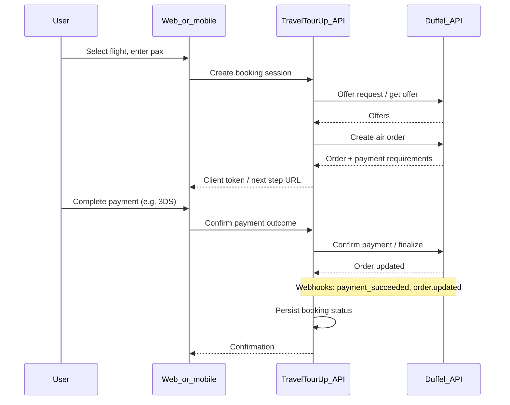
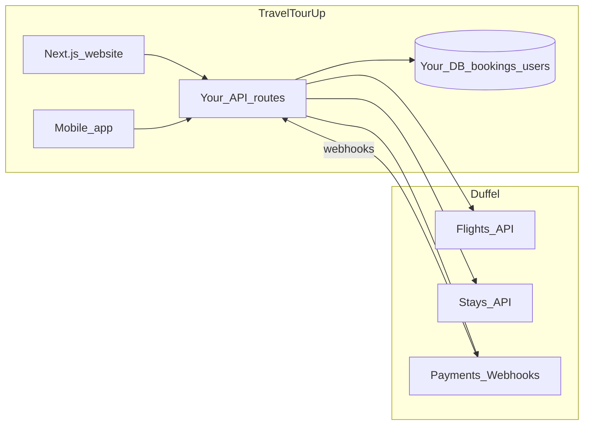

# Duffel enterprise meeting — agenda and brief

**Document version:** 1.3  
**Last updated:** 2 April 2026  

**Engineering companion:** [DUFFEL_ENTERPRISE_IMPLEMENTATION_PLAN.md](./DUFFEL_ENTERPRISE_IMPLEMENTATION_PLAN.md) **§0** translates agenda topics (payment model, markup, payment-without-ticket, cancellations) into build guidance aligned with [Duffel docs](https://duffel.com/docs); **§1.6** covers wiring **[`app/(booking)`](../../app/(booking))** without discarding existing UI.

---

## Meeting header (fill during / after scheduling)

| Field | Your notes |
|-------|------------|
| **Date / time** | |
| **Timezone confirmed** | |
| **Duration** | (suggest 45–60 minutes) |
| **Video / dial-in** | |
| **Duffel attendees** | Name — role — email |
| **TravelTourUp attendees** | Name — role |

---

## Executive summary (2–4 sentences — customize before the call)

TravelTourUp is a **planned, end-to-end** travel platform: a **professional Next.js website** and a **mobile app** for flights, hotels, and cars, with room to grow toward a Booking.com-style **combined-trip** experience over time. We have laid the **technical foundation** (including starter Duffel usage) and are now scoping **enterprise-grade** operations: search, book, pay, cancel/refund, webhooks, SLAs, and clarity on multi-product and **agent-assisted** flows. This meeting aims to align on **commercial terms** and **technical fit** with Duffel. Outcomes: a clear **pricing formula**, named **account/technical contacts**, and **next steps** toward live keys and agreement.

---

## TravelTourUp context (for Duffel — verbal or one-pager)

| Topic | Detail |
|-------|--------|
| **Product** | Flights, hotels, cars — consumer-facing booking platform (TravelTourUp) |
| **Channels** | **Next.js website** (primary web) + **mobile app** (same business capabilities where phased) |
| **Stack** | Next.js; Supabase + Prisma; server-side Duffel API usage (keys never in the client) |
| **Current integration** | `src/lib/duffel/client.ts` — `Duffel-Version: v2`; helpers in `src/lib/duffel/flights.ts`, `src/lib/duffel/stays.ts` |
| **Internal mapping docs** | `z-docs/DUFFEL_API_ENDPOINT_MAPPING.md`, `z-docs/DUFFEL_ENTERPRISE_INTEGRATION.md` |
| **Target** | Enterprise: production bookings, payments, cancellations/refunds, webhooks, rate limits, compliance |

---

## Positioning and tone for the call

**How you want to sound:** confident, prepared, and **partner-ready** — not apologetic about being early.

**Suggested framing (you can say this almost verbatim):**

- “We have **planned and are executing** TravelTourUp as a full travel product: a **proper Next.js website** plus a **mobile app**, covering **flights, hotels, and cars**.”
- “The **foundation is in place**; we are now moving toward **production-grade** integrations and want to understand **enterprise** pricing and the right **operating model** with Duffel for flights (and related products where relevant).”
- “Our **UX inspiration** includes leaders like Booking.com for **discovery and packaging**, but we are realistic that supply and timelines come step by step — we want Duffel’s guidance on what is **supported today** vs **roadmap**.”

**Avoid:** claiming you already match Booking.com feature-for-feature; overselling volume without ranges; debating price before you understand components.

---

## Main business flows (what Duffel cares about)

Use this so they understand **who books** and **who pays** on your side (Duffel still sees **you** as the integrating partner).

| Flow | Description | Implication for the conversation |
|------|-------------|----------------------------------|
| **1. Direct customer (B2C)** | End users book **flights, hotels, or cars** themselves on the web or mobile app. | Standard consumer checkout; your platform holds the relationship with the traveler. |
| **2. Agent-assisted** | **Agents** acquire and serve customers (prospecting, quoting, completing bookings) — often via an **agent portal** with **commissions** or margins you define. | You need clarity on whether Duffel supports your **reporting / multi-party** needs, or whether **commissions and attribution stay entirely in your app + database**. |

If they ask **who is the merchant of record** or **who contracts with the traveler**, have your **intended** model clear (often: **TravelTourUp** contracts with the customer; Duffel remains **supply/payments rail** per their product — confirm with them on the call).

---

## Business model: if they ask “Are you B2B or B2C?”

Duffel may ask this to classify risk, pricing, support, and contractual party. **You do not have to pick only one label** if your product is hybrid.

**Accurate one-liner**

> “We are **primarily a B2C travel platform** — travelers are our end customers — with a **B2B2C-style agent channel**: independent or affiliated **agents** use our platform to **serve and convert** those travelers, and we handle **commissions or commercial terms** on our side.”

**Shorter variant**

> “**B2C at the traveler level**, with an **agent-assisted sales channel** — think marketplace platform, not a traditional single corporate travel agency only.”

**How Duffel might hear it (useful mental model)**

| Lens | How to describe it |
|------|---------------------|
| **Duffel ↔ TravelTourUp** | You are their **commercial / integration partner** (often described as **B2B** from **their** perspective: they sell infrastructure **to you**). |
| **TravelTourUp ↔ traveler** | **B2C** — the traveler is the **end customer** for trips booked **directly** on your site or app. |
| **TravelTourUp ↔ agent** | **B2B-style relationship** — agents are **partners or sub-merchants** on **your** platform; their incentives (commission hunts / lead gen) are **your product and policy**, not Duffel’s unless you use specific agency programs they specify. |

**If they push for a single checkbox:** say **“B2C platform with an agent channel”** or **“hybrid B2C + agent (B2B2C) marketplace”** and ask which label **their** onboarding or pricing team uses internally so you align paperwork correctly.

---

## Pre-meeting context worksheet (fill before the call — sharper pricing block)

_Use this block so Block A discussions are concrete. Leave blank only if genuinely unknown; say “pre-launch — need volume tiers” explicitly._

| Field | Your answer |
|-------|-------------|
| **Expected flight searches / month** (range) | |
| **Expected paid flight bookings / month** (range) | |
| **Expected stay bookings / month** (if relevant) | |
| **Primary markets / currencies** | |
| **Car rental plan** | Duffel cars / partner API / manual catalog / TBD |
| **Agent / B2B2C model** | Yes — direct B2C + agent portal (commissions / attribution in our product) |
| **Launch window** | |

---

## How to meet the manager professionally (LinkedIn → live call)

### Before the call

- **Confirm logistics:** timezone (your “10pm” vs theirs), video link, duration (ask for **45–60 minutes** if you will run the full agenda).
- **Environment:** quiet room, stable internet, **camera on** unless they dial in audio-only; second screen or printout of this brief; charger; water.
- **One-pager ready:** company name (**TravelTourUp**), your role, **channels** (Next.js site + mobile app), stack (Supabase/Prisma, server-side Duffel), **flows** (direct customer + agent channel), current state (foundation + starter Duffel), target (enterprise production).
- **Volume hypotheses:** rough searches/bookings per month (ranges help). If unknown, state **pre-launch** and ask for **pricing tiers vs volume**.
- **Recording:** ask **permission before recording**; if not allowed, rely on notes and their follow-up materials.

### Opening (first 2–3 minutes)

- Thank them; reference **LinkedIn** briefly (“appreciate you making time after we connected there”).
- **Goal in one breath:** enterprise **pricing and terms**, **end-to-end flight** (and multi-product) **flows**, and how Duffel fits a **Next.js + mobile** product with **direct bookings** and an **agent-assisted** channel.

### Presence and etiquette

- **Dress:** business casual or one step above your usual — signals you take the partnership seriously.
- **Language:** clear English, slower if needed; **no slang**; say **“agent-assisted sales”** or **“agents acquire and serve customers”** instead of informal phrases like “hunt clients” on the call.
- **Posture:** look at the camera when you speak; mute when not talking if there is background noise.
- **Balance:** **60% listen / 40% ask** — you are discovering their model, not pitching your entire roadmap in depth unless they ask.

### During

- **Listen, then summarize** after major blocks (“So for refunds, your model is X and our responsibilities are Y — did I get that right?”).
- **Take names:** account manager, technical contact, support channel.
- **Avoid debating** pricing live; **collect variables** (per-booking fee, minimums, setup, payment rails) and follow up by email.
- **If you do not know:** say “we will confirm internally and follow up” — do not guess on legal or payment liability.

### Close

- **Next steps:** who sends proposal, timeline for test vs **live** keys, sandbox limitations, security questionnaire if needed.
- **Thank you + summary email** within **24 hours** (bulleted recap + open questions).

---

## Agenda blocks (suggested order)

### Block A — Commercial and account (10–15 min)

- **Enterprise vs self-serve:** contract, dedicated support, rate limits, custom terms, invoicing.
- **Pricing model:** fixed fee, per-order, per-passenger, minimum commits, overage; any **airline- or channel-specific** surcharges.
- **Payment processing:** Duffel Payments vs bring-your-own; **merchant of record**; settlement; **refund / cashflow** (links to payment + cancellation topics).
- **SLA / support:** response times, incidents, status page, escalation.
- **Compliance:** PCI scope, GDPR/DPA, subprocessors, **webhook signing** and security expectations.
- **Roadmap:** NDC depth, airline coverage, stays/cars evolution.
- **Prerequisites for live / enterprise:** what **credentials, licenses, and KYB** Duffel requires (see subsection below) — do **not** assume; their **official onboarding checklist** is authoritative.

**Outcome:** **pricing formula**, **contract prerequisites**, named **post-sales owner**.

#### Enterprise prerequisites and onboarding (confirm with Duffel — authoritative list is theirs)

Requirements **depend on your country, legal entity, products (flights vs stays), and how you sell** (direct vs agents). Use this as a **question list**, not legal advice.

| Category | Examples to ask about | Notes column (fill on call) |
|----------|----------------------|------------------------------|
| **Industry credentials** | Is **IATA** (or regional equivalent) **required** for our model, or only for certain flows? Any need for **ARC** (US), or other **BSP / ticketing** accreditation? | |
| **Travel seller regulation** | Package / **PTR** rules, **financial protection** (e.g. ATOL, bonding) where we sell — what does **Duffel** require vs what is **purely local law**? | |
| **Company and KYB** | Company registration, **beneficial owners**, **proof of address**, **tax ID**, **website live or policy pages** (terms, privacy, refund policy). | |
| **Financial / payments** | **KYC for Duffel Payments**; bank account verification; any **credit** or **deposit** for enterprise. | |
| **Security / legal** | **DPA**, **MSA**, **subprocessors**, **security questionnaire** (SIG, ISO posture), **PCI** role description. | |
| **Operational** | **Customer support** commitments, **ABR/after-hours** expectations if any; dispute and **chargeback** process. | |
| **Agent channel** | If we run an **agent network**, does Duffel require **additional** accreditation, **per-agent** registration, or **single legal counterparty** only? | |

**Direct questions to ask:**

1. “What is the **complete checklist** to go from **sandbox** to **live** on **enterprise** — especially **IATA or equivalent** — for a **B2C site + mobile app** with an **agent-assisted** channel?”  
2. “If we **do not** hold IATA today, can we still onboard under enterprise, or is it **mandatory at signing** / **before live flights**?”  
3. “Do requirements differ for **flights** versus **Stays**?”  
4. “Which items are **Duffel mandatory** versus **recommended** versus **our local compliance** only?”

---

### Block B — Search and offer lifecycle (“full grip” on search) — maps to ALL_IMPORTANT_POINTS 1, 2, 10

Align on the **canonical Duffel flow** (offer request → offers → offer detail → order → payment → post-ticketing) vs **your** sorting, filtering, caching (“algorithm” on your side).

| Your internal note | Questions to ask | Duffel answer (notes) |
|--------------------|------------------|----------------------|
| Full grip on search | Enterprise **rate limits** for offer requests; pagination; max slices; **multi-city / open-jaw**; **mixed carriers** on outbound vs return in one offer vs separate orders | |
| Complete flow | **Hold vs instant** booking; time-to-ticketing; when PNR/ticket numbers appear; **order webhooks** to trust | |
| Different airlines dep/return | Single consolidated round-trip offers vs **two one-ways**; baggage and change rules **per slice** | |

**Booking.com inspiration (framing only):** Combined inventory behind one UX. **Ask:** how Duffel recommends **single checkout vs split orders** when flights are not one native offer.

---

### Block C — Booking, payment, cancellation, refund — maps to point 3

Validate **business reality**, not only endpoint names (see `z-docs/DUFFEL_API_ENDPOINT_MAPPING.md`).

| Topic | Questions | Notes |
|-------|-----------|-------|
| **Payment** | PaymentIntent lifecycle; 3DS/SCA; failed payment recovery; partial capture; currencies | |
| **Post-booking** | Voluntary changes; **schedule changes** — how surfaced | |
| **Cancellation & refund** | Which orders support API cancellation; **refund timing**; customer messaging; chargebacks | |
| **Webhooks** | Authoritative events for your DB (e.g. order updated, payment succeeded) | |

#### Payment flow when you integrate Duffel (target picture — confirm on the call)

**Money and secrets:** card data and Duffel secrets stay **server-side** (your Next.js API routes or backend). The browser/mobile app only receives what Duffel’s integration needs for **client-side** steps (for example 3DS if applicable), never your API key.

**Typical flight path (instant pay — align every step with their current docs):**

1. **Search** — Your API → Duffel offer request → offers returned → user picks an **offer** (re-fetch or refresh offer if stale).
2. **Passengers & optional extras** — Collect passenger details (and ancillaries if you add them per Duffel’s model).
3. **Create order** — `POST /air/orders` (often **instant** for pay-now, or **hold** if you use time-limited holds).
4. **Payment** — Create or attach **Duffel Payments** flow (e.g. PaymentIntent per their API), customer completes **3DS/SCA** when required.
5. **Confirmation** — Confirm/capture per their process; poll or rely on **webhooks** for **paid / ticketed** states.
6. **Your DB** — Store **booking reference, order id, amounts, status**; do not store full PAN/CVV.

| Payment topic | What to ask Duffel | Your notes |
|---------------|-------------------|------------|
| **Paths** | Recommended path today: **Duffel Payments only** vs alternatives; what is **deprecated** or **enterprise-only** | |
| **Hold vs instant** | When hold is allowed; hold duration; how payment **links** to an existing order | |
| **MOR / settlement** | **Merchant of record** (customer’s card agreement); settlement cadence; who handles **chargebacks** | |
| **Currencies** | Supported charge currencies vs offer currencies; FX behavior | |
| **Failures** | Failed payment, timeout, **duplicate** payment attempts — idempotency keys? | |
| **Refunds** | How refunds flow through the same rails; **partial** refunds; timing | |
| **PCI** | What you must **not** log; SAQ / scope guidance for your integration pattern | |
| **Stays / cars** | Same payment story or **different** rails when you add non-flight products | |

#### Duffel commercial fees vs your agent commission (questions for them)

**Two different “commissions” — do not mix them on the call.**

| Layer | What it is | Who you negotiate with |
|--------|------------|-------------------------|
| **Duffel / supply fees** | What **Duffel charges you** (platform, per-order, or enterprise deal: minimums, tiers, payment processing). | **Duffel** — Block A + questions below. |
| **TravelTourUp agent commission** | What **you pay agents** (percentage or flat per booking) from **your margin** or a markup on the price. | **You** — product and finance; Duffel only matters if they impose rules or offer agency billing tools. |

**Questions to ask Duffel about their fee / “commission” model (their revenue):**

- How is **enterprise pricing** built: **per booking**, **per passenger**, **per segment**, **% of GMV**, **platform fee + pass-through**, **monthly minimum**, or hybrid?
- Are payment processing costs **bundled** or **pass-through**? Any **cross-border** or **currency** surcharges?
- Do **flight vs stays** differ in fee schedule?
- Are there **volume tiers** or **committed annual** thresholds? How do **overages** work?
- Is anything **excluded** from the quote (e.g. certain airlines, NDC-only flows, refunds, after-sales)?
- **Invoicing:** monthly invoice vs charge per transaction; **tax / VAT** treatment on their fees.
- For **refunds and cancellations**, are fees **reversible** or **partially retained**?

**Questions about compatibility with an agent-assisted model (your commissions):**

- Does Duffel support **split settlements** or **payouts to sub-agents**, or does **all money** settle to **one** TravelTourUp account?
- Any **restriction** on **markup** or **service fees** you show the end customer under enterprise terms?
- Recommended pattern: **one gross charge** to the customer on checkout, then **you** split **agent commission** in your **ledger** after the fact (confirm they have no objection if legally consistent).
- Do they offer **reporting APIs** or exports that help you reconcile **bookings vs invoices** (for paying agents accurately)?

**One-line you can say:** “We need clarity on **Duffel’s fee structure** for enterprise, and separately on whether **our agent commission model** stays **entirely on our platform** economically, or if you offer **commercial tools** for agencies.”

---

### Block D — Flights ↔ cars ↔ hotels — maps to points 4, 6, 9

| Topic | Questions | Notes |
|-------|-----------|-------|
| **Cars** | Car rental in API, partner-only, or not in your regions? | |
| **Cross-sell** | Recommended pattern: **separate Duffel orders** (flight + stay) vs bundled commercial product | |
| **Packages** | Sell one cart in your app, fulfill as separate supplier orders; **package vs dynamic packaging** (legal/marketing) | |
| **Data** | What to store in **your** DB; cache TTL / PII; minimal payload strategy | |

Code reference: `src/lib/duffel/stays.ts` — confirm **stays** production path; cars **TBD**.

---

### Block E — Product pricing merchandising (cheap / cheapest / normal) — maps to point 7

| Topic | Questions | Notes |
|-------|-----------|-------|
| **Fare metadata** | Brands, rules, bags, change/cancel flags — enough for “cheapest” vs “flexible”? | |
| **Markup** | Enterprise constraints on margin/markup display? | |
| **Price accuracy** | Offer expiry; **re-quote before pay** recommendation | |

---

### Block F — Agent portal, commissions — maps to point 8

| Topic | Questions | Notes |
|-------|-----------|-------|
| **Agency** | Sub-accounts, reporting, **Duffel-side** commercial or invoicing models; **IATA** or similar needs? | |
| **Multi-tenant** | Separate businesses: API keys, billing attribution, liability | |
| **Your agent pay** | Confirm: **agent commission is your internal settlement** unless Duffel provides a specific program — see **Block C → Duffel fees vs agent commission** | |

If not their model: **you** own commissions in TravelTourUp DB + checkout; Duffel remains supply and bills **you** per their schedule.

---

### Block G — Your booking flow / algorithm — maps to point 5

**Your narrative:** search → shortlist → pax → ancillaries (if any) → pay → confirmation → post-booking.

| Topic | Questions | Notes |
|-------|-----------|-------|
| **Sync vs async** | Which steps must block on API vs poll/webhook | |
| **Reliability** | Retries, **idempotency** for order creation | |

---

## Architecture diagram (discussion aid)

**Ask:** which state transitions **must** be webhook-driven vs polling.

---

## Master question bank (checklist)

_Copy into your notes app or second screen during the call._

- [ ] What exactly is included in **enterprise** vs dashboard self-serve?
- [ ] **Prerequisites for live:** IATA or equivalent, ARC/BSP, travel-seller licenses, KYB/KYC, security questionnaire — **official checklist**?
- [ ] Full **pricing breakdown** (setup, minimums, per booking, overages)?
- [ ] **Rate limits** at our expected scale; burst behavior; how to request raises?
- [ ] **Payment**: MOR, settlement, currencies, 3DS, failed payment handling?
- [ ] **Payment flow**: hold vs instant; PaymentIntent steps; webhooks that **must** drive production state?
- [ ] **Duffel fees**: full enterprise fee formula (per booking, tiers, minimums, payment processing, refunds)?
- [ ] **Your agent commission**: split payouts vs single settlement to us; any **markup** restrictions in contract?
- [ ] **Refunds**: timing, airline-dependent cases, what you guarantee vs what we message?
- [ ] **Webhooks**: list, signing, retries, idempotency best practices?
- [ ] **Hold vs instant** booking: when to use which; ticketing latency?
- [ ] **Round-trip / mixed carrier** patterns Duffel recommends?
- [ ] **Multi-city / open-jaw** support and limits?
- [ ] **Stays** maturity for our markets; **cars** roadmap or alternative?
- [ ] **Dynamic packaging** (flight + hotel in one UX) — recommended legal/technical pattern?
- [ ] **Agent / multi-tenant** expectations from Duffel’s side?
- [ ] **NDC / airline coverage** gaps relevant to our routes?
- [ ] **Security**: DPA, subprocessor list, pen test / questionnaire?
- [ ] **SLA** and support channels after go-live?

---

## Checklist: ALL_IMPORTANT_POINTS (1–10)

- [ ] **(1)** Search depth, limits, enterprise scale  
- [ ] **(2)** End-to-end flow + your orchestration vs Duffel’s  
- [ ] **(3)** Payments, cancellation, refunds, webhooks  
- [ ] **(4)** Flights ↔ cars ↔ hotels integration pattern  
- [ ] **(5)** Your booking flow + async/idempotency guidance  
- [ ] **(6)** Packages (flight + hotel) commercially and technically  
- [ ] **(7)** Fare metadata for merchandising cheap/cheapest/flexible  
- [ ] **(8)** Agent / commission / multi-party models  
- [ ] **(9)** Multi-deal combinations and UX  
- [ ] **(10)** Mixed carriers / dep-return complexity  

---

## Decisions and action items (fill after the call)

| Item | Decision / owner | Due |
|------|------------------|-----|
| | | |
| | | |
| | | |

---

## Follow-up email draft (copy and personalize)

**Subject:** TravelTourUp × Duffel — thank you and next steps

Hi [Name],

Thank you for the conversation on [date]. It was helpful to understand [one specific takeaway].

**Recap — our direction**  
TravelTourUp is executing a planned platform: a **Next.js website** and **mobile app** for flights, hotels, and [cars status], with both **direct consumer** bookings and an **agent-assisted** channel. We use server-side Duffel integration and are prioritizing [search/book/pay/cancel/webhooks — pick your top 2–3].

**Open questions**  
- [ ]  
- [ ]  

**Could you please share**  
- Enterprise **pricing** and **fee schedule** (per booking, tiers, minimums, payment processing, refund-related fees)  
- **Payment integration** guide or checklist (recommended flow: hold vs instant, webhooks, 3DS)  
- **MSA/DPA** and subprocessors overview  
- **Rate limit** guidance for our expected scale  
- **Webhook** documentation or catalog and security (signing) expectations  
- **Enterprise go-live checklist** (including **IATA** or equivalents, KYB, and any travel-seller or security prerequisites) and moving from test to **live** API keys  

Happy to include our engineering lead on a follow-up technical session if useful.

Best regards,  
[Your name]  
[Title], TravelTourUp  
[Email / phone]

---

## Caveat (align expectations)

Duffel does not replicate **Booking.com** breadth in a single integration. Booking’s UX comes from **many supply relationships** and long-lived product work. This meeting should pin down what Duffel **guarantees** (coverage, payments, refunds, SLAs) so TravelTourUp’s **product and legal** promises stay accurate.

---

## Related internal docs

- [DUFFEL_MEETING_AGENDA_AND_QUESTIONS.md](./DUFFEL_MEETING_AGENDA_AND_QUESTIONS.md) — short agenda and question list for the call  
- [ALL_IMPORTANT_POINTS.md](./ALL_IMPORTANT_POINTS.md)  
- [../DUFFEL_API_ENDPOINT_MAPPING.md](../DUFFEL_API_ENDPOINT_MAPPING.md)  
- [../DUFFEL_ENTERPRISE_INTEGRATION.md](../DUFFEL_ENTERPRISE_INTEGRATION.md)  
