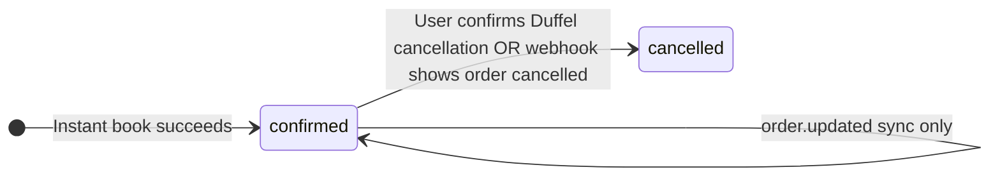

# Duffel keys, webhooks, and checkout (TravelTourUp)

**Implementation guides:** [Flight payment flow (recommended)](./FLIGHT_PAYMENT_FLOW_GUIDE.md) · [Stays payment flow (recommended)](./STAYS_PAYMENT_FLOW_GUIDE.md) · [Hold, cancel, exchanges & refunds (flights + stays)](./FLIGHTS_STAYS_HOLD_CANCEL_REFUND_GUIDE.md)

## Access token (API key)

1. Create or sign in to your organisation at [Duffel](https://duffel.com/docs).
2. Open **Dashboard → Developers → Access tokens** (wording may vary slightly).
3. Create a **test** token first (`duffel_test_…`). Put it in `.env.local` as `DUFFEL_API_KEY`.
4. Use **live** tokens only after UAT. **Rotate** any key that was committed or leaked.

Related env vars: see [`.env.example`](../../.env.example) (`DUFFEL_API_URL`, optional timeouts).

## Webhook signing secret

1. Dashboard → **Webhooks** → add endpoint: `https://<your-domain>/api/v1/webhooks/duffel`.
2. Copy the **signing secret** into `DUFFEL_WEBHOOK_SECRET`.

## Duffel Payments (card checkout)

Official guide: [Collecting customer card payments](https://duffel.com/docs/guides/collecting-customer-card-payments).

- **No Stripe secret keys** are required in this app for the Duffel card flow; Duffel issues a **PaymentIntent** and the **`@duffel/components`** `DuffelPayments` UI uses the **`client_token`** from your backend.
- **Eligibility**: Duffel Payments is limited to certain regions; confirm in the dashboard if `/payments/payment_intents` errors.
- **Test card** (from Duffel docs): `4242 4242 4242 4242`, any future expiry, any CVC.

## App routes (reference)

| Step | Endpoint / page |
|------|------------------|
| Create PaymentIntent | `POST /api/v1/flights/payment-intents` `{ "offer_id" }` |
| Collect card | `/flights/payment?offer_id=…` (Duffel component) |
| Confirm intent | `POST /api/v1/flights/payment-intents/pit_…/confirm` |
| Create order + local booking | `POST /api/v1/flights/bookings` (auth + `bookings:create`) |
| Cancel flight (Duffel quote / confirm) | `POST /api/v1/flights/bookings/:bookingId/cancel` (auth + `bookings:cancel_own` or `bookings:manage`) |

### Commission / pricing env

See `FLIGHT_COMMISSION_PERCENT`, `FLIGHT_MARKUP_FIXED`, `DUFFEL_PAYMENTS_FEE_RATE`, `FLIGHT_PAYMENT_FX_RATE`, `FLIGHT_PRICE_TOLERANCE_MAJOR` in `.env.example`.

## Troubleshooting

| Symptom | Check |
|---------|--------|
| `FLIGHTS_NOT_CONFIGURED` | `DUFFEL_API_KEY` set, server restarted |
| `UPSTREAM_ERROR` on payment intents | Test vs live key, Payments enabled, offer still valid |
| `BOOKING_FAILED_AFTER_PAYMENT` | Rare: payment topped up Balance but `POST /air/orders` failed — API returns `support_reference` and `payment_intent_id` (Duffel `pit_…`) for support; see **Ops / reconciliation** below |
| `PRICE_CHANGED` | Offer total moved beyond `FLIGHT_PRICE_TOLERANCE_MAJOR`; user should refresh search |

## Ops / reconciliation (P2)

**`BOOKING_FAILED_AFTER_PAYMENT`:** The customer’s card was charged via Duffel Payments (Balance topped up) but creating the air order failed. The JSON error body includes `payment_intent_id` / `support_reference` (the same Duffel PaymentIntent id).

1. **Support:** Ask the customer for that `pit_…` id; locate the row in `flight_payment_intent_records` by `duffel_intent_id`.
2. **Check Duffel:** In the Duffel dashboard, confirm PaymentIntent status and whether an order exists for that payment. If needed, use Duffel’s API `GET /air/orders` / support to correlate PaymentIntent metadata (we store `payment_intent_id` in order `metadata` when booking succeeds).
3. **Retry vs manual:** If no local `bookings` row is linked (`booking_id` is null on the intent record) but payment succeeded, decide whether to **safely retry** `POST /air/orders` with the same passenger and ancillary payload (only if offer and services are still valid) or to **refund / manual reconcile** per your finance process and Duffel guidance.
4. **Orphan intents:** Periodically list `flight_payment_intent_records` where `status` indicates success but `booking_id` is still null; reconcile against Duffel before treating as lost revenue or initiating refund.

**Ancillary checkout (P4):** Order creation with seats or bags is treated as **atomic** — if Duffel rejects the combined service set, no local booking is created and the customer should not proceed with a mismatched PaymentIntent. If selections change after a PaymentIntent was created, start checkout again with a new PaymentIntent (new idempotency key).

See also [DUFFEL_ENTERPRISE_IMPLEMENTATION_PLAN.md](./DUFFEL_ENTERPRISE_IMPLEMENTATION_PLAN.md) §0.4 / failure tables.

## Post-booking cancel & webhooks (P3)

Official guide: [Cancelling an order](https://duffel.com/docs/guides/cancelling-an-order).

**Cancel API body (JSON):**

1. **Quote:** `{ "action": "quote" }` — calls Duffel `POST /air/order_cancellations`, stores a row in `flight_order_cancellations` (`pending` until confirm). Reuses an existing non-expired pending quote for the same flight booking.
2. **Confirm:** `{ "action": "confirm", "order_cancellation_id": "ore_…" }` — calls Duffel `POST /air/order_cancellations/{id}/actions/confirm`, sets parent `bookings.status` to `cancelled` and adjusts `payment_status` (`refunded` vs `partially_refunded` from refund vs booking total).

**Webhooks:** Subscribe in the Duffel dashboard to `order.updated`, `order.created`, and `order.airline_initiated_change_detected` (plus `ping.triggered` for health). Events are stored in `duffel_webhook_events` (deduped by event `id`). After insert, the app refreshes `flight_bookings.order_raw` when the payload includes an order; if the order looks cancelled (`cancellation.confirmed_at` or `cancelled_at`), the parent booking is set to `cancelled`. Failed handling sets `duffel_webhook_events.error` and returns HTTP 500 so Duffel can retry.

### Flight booking state (high level)

Refund to the **customer’s card** is your responsibility after Duffel credits your Balance; see Duffel’s cancellation guide.
