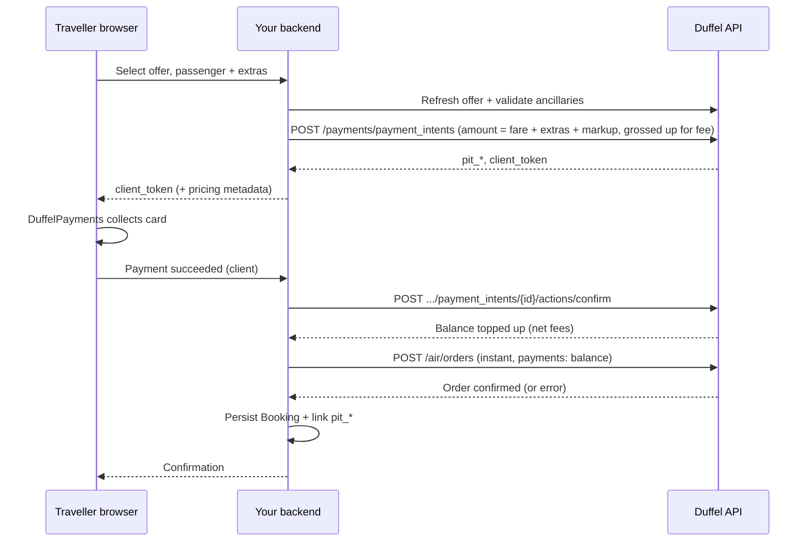

# Flight payment flow — recommended Duffel pattern (starting platform)

This document is the **authoritative implementation guide** for a **consumer-facing flight booking** product on **Duffel**, aligned with Duffel’s documented **Duffel Payments** model. Use it when you are at **MVP / early scale** and want **pay-now instant bookings** without handling raw card data on your servers.

**Official references (read alongside this guide):**

- [Choosing a payment method](https://duffel.com/docs/guides/choosing-a-payment-method)
- [Collecting customer card payments](https://duffel.com/docs/guides/collecting-customer-card-payments) (PaymentIntent → confirm → balance → order)
- [Create a Payment Intent (API)](https://duffel.com/docs/api/payment-intents/create-payment-intent)
- [Confirm a Payment Intent](https://duffel.com/docs/api/payment-intents/confirm-payment-intent)
- [Create an order](https://duffel.com/docs/api/orders/create-order)

**Related repo docs:** [DUFFEL_KEYS_AND_CHECKOUT.md](./DUFFEL_KEYS_AND_CHECKOUT.md) (env vars, routes, troubleshooting). **Post-booking:** [Hold, cancel, exchanges & refunds](./FLIGHTS_STAYS_HOLD_CANCEL_REFUND_GUIDE.md).

---

## 1. Why this flow (decision summary)

| Goal | This pattern |
|------|----------------|
| Traveller pays **at checkout** | Yes — card collected via Duffel’s PCI-safe UI tied to a **PaymentIntent**. |
| Avoid pre-funding **every** ticket from your own bank | Yes — customer payment **tops up** your **Duffel Balance** (net of Duffel Payments fees), then you **debit balance** on the air order. |
| Align with Duffel’s **documented** B2C path | Yes — PaymentIntent → collect → **confirm** → `POST /air/orders` with `payments: [{ type: "balance", ... }]`. |

**Not covered here:** IATA ARC/BSP cash, airline-specific payment types, or large-agency-only setups — speak with Duffel if those apply.

---

## 2. End-to-end sequence

High-level order of operations (must stay in this order for instant pay-now):

**Invariants:**

1. **One PaymentIntent per offer** you intend to book (Duffel recommendation).
2. **Confirm** the PaymentIntent **only after** successful client-side collection.
3. **Create the air order only after** the intent is in a **success** state in **your** records (and ideally re-fetch intent status if you retry).
4. **Refresh the offer** (or rely on a fresh snapshot) immediately before order creation; **reject** if price or ancillary totals drift beyond policy.

---

## 3. Pricing and PaymentIntent amount

Duffel documents the charge amount as:

> `((offer and services total + markup) × FX) / (1 − Duffel Payments fee)`

**Best practices:**

- **Fare base:** Use **current** `total_amount` from the offer in the **offer currency** (after `GET /air/offers/:id` or equivalent refresh).
- **Services:** Sum priced ancillaries **in the same currency** as the offer total used for the order; keep **one coherent snapshot** tied to the PaymentIntent (idempotency + DB row).
- **Markup:** Percent of (fare + services) and/or fixed major-unit fee — explicit in config, versioned, auditable.
- **FX:** If the customer-facing logical currency differs, apply **one** FX policy (avoid silent double conversion).
- **Fee gross-up:** Use a **documented** Duffel Payments fee assumption (domestic vs international may differ — refine with Duffel as you scale).
- **Rounding:** Major units, **two decimals**, consistent rounding rule (e.g. half-up) everywhere.

Store on the server for each intent: `pit_*` id, offer id, offer amount snapshot, services subtotal, calculated `charge_amount`, `charge_currency`, idempotency key, ancillary payload hash.

---

## 4. API surface (recommended backend contract)

Typical route split (matches a solid BFF pattern):

| Step | Method | Responsibility |
|------|--------|----------------|
| Prepare checkout | `POST .../payment-intents` | Auth optional or required per risk; rate limit; validate body; refresh offer; validate ancillaries; compute breakdown; `POST` Duffel PaymentIntent; persist intent row. |
| Collect card | Browser | `DuffelPayments` with `paymentIntentClientToken` from step 1. |
| Confirm | `POST .../payment-intents/:id/confirm` | Rate limit; `confirm` on Duffel; update intent `status`. |
| Book | `POST .../bookings` | **Require authenticated user** (or your chosen policy); enforce authz (`bookings:create`); verify intent **succeeded**, offer id + ancillaries **match** snapshot; refresh offer + price tolerance; `POST /air/orders` with `type: instant`, `payments: [{ type: balance, amount, currency }]`, passengers, services; persist booking; link intent → booking. |

**Idempotency:** Use **`Idempotency-Key`** headers on **booking** (and optionally PaymentIntent creation) so safe retries do not create duplicate tickets.

**Rate limiting:** Apply per IP and/or per user on intent + confirm + booking to reduce abuse.

---

## 5. Security and compliance

- **Never** send full card numbers to your origin server; use **Duffel’s** embedded flow (`@duffel/components`).
- Protect **access tokens**; use **test** keys only in non-production.
- Log **payment_intent_id** (`pit_*`) in support tooling, not card data.
- Align checkout **copy** with your commercial terms and Duffel’s guidance on **who appears on statements** and **liability** (see “Choosing a payment method”).

---

## 6. Failure handling (distributed checkout)

You **cannot** wrap “Duffel confirm + Duffel order + your DB” in a **single ACID transaction** across systems. Treat checkout as a **saga**:

| Failure | Practice |
|---------|----------|
| Order fails **after** PaymentIntent **confirmed** | Return a **stable error code** (e.g. `BOOKING_FAILED_AFTER_PAYMENT`) and include **`payment_intent_id`** for support. **Do not** promise automatic refund in-app unless you implement Duffel’s refund/compensation path. |
| Offer expired / price changed | Block order with **`PRICE_CHANGED`** (or 409); user must restart from search. **Do not** confirm a new intent for stale totals. |
| Transient network errors on order | **Idempotent retry** of booking **only** when safe (same idempotency key, verify no order already exists for that intent). |

**Operational:** Periodically reconcile **succeeded intents** with **no linked booking**; follow your finance runbook (manual order retry vs refund). See [DUFFEL_KEYS_AND_CHECKOUT.md § Ops / reconciliation](./DUFFEL_KEYS_AND_CHECKOUT.md).

---

## 7. Hold orders (optional product lane)

If you expose **hold**:

- Create a **hold** order per Duffel **without** the instant pay path, then complete payment before `payment_required_by`.
- Do **not** mix hold and the wrong payment endpoint — follow Duffel’s hold + **air/payments** documentation for your account type.

Gate with feature flags in **both** server and client.

---

## 8. Balance and treasury

For **this** pay-now flight path, you do **not** need to pre-load the **full** ticket amount **before** each sale: the **customer’s** confirmed PaymentIntent **funds** the balance used on the order.

You **may** still maintain a **small operational balance** for edge cases, refunds, holds, other products, or Duffel account minimums — separate from “fund every seat in advance.”

---

## 9. Testing checklist

- [ ] Test PaymentIntent creation with valid/invalid offer ids.
- [ ] Test ancillary-only and seat+bag combinations; confirm mismatch with intent **rejects** booking.
- [ ] Duffel test card flow end-to-end; confirm **confirm** then **order**.
- [ ] Simulate **order** failure after **confirm**; verify error payload includes **`pit_...`**.
- [ ] Idempotent **double POST** on booking returns **same** booking.
- [ ] Price drift beyond tolerance returns **PRICE_CHANGED**.

---

## 10. Mapping to this repository (reference)

Current implementation follows this guide for **instant pay-now** flights:

- Client: `src/components/flights/FlightCheckoutDuffel.tsx` (DuffelPayments, confirm, book).
- PaymentIntent: `app/api/v1/flights/payment-intents/route.ts`, `src/lib/services/flights/flight-payment-intent.service.ts`.
- Confirm: `app/api/v1/flights/payment-intents/[id]/confirm/route.ts`.
- Booking + balance order: `app/api/v1/flights/bookings/route.ts`, `src/lib/services/flights/flights-booking.service.ts`.
- Pricing: `src/lib/payments/duffel-intent-pricing.ts`, `src/config/flight-payments.config.ts`.
- Post-payment failure type: `BookingFailedAfterPaymentError` in `src/lib/api/errors.ts`.

When you extend behaviour, **update this document** if the sequence or invariants change.

---

## 11. Launch readiness checklist (starting platform)

- [ ] Duffel Payments **enabled** on organisation; test vs live keys separated.
- [ ] Env: `FLIGHT_COMMISSION_PERCENT` / `FLIGHT_MARKUP_FIXED` / `DUFFEL_PAYMENTS_FEE_RATE` / `FLIGHT_PRICE_TOLERANCE_MAJOR` set with **documented** rationale.
- [ ] Support runbook for **`BOOKING_FAILED_AFTER_PAYMENT`** and orphan `pit_*` rows.
- [ ] Monitoring: alert on spikes in that error code.
- [ ] Legal/checkout disclosure reviewed.

This file is the **recommended baseline** for flight payments on Duffel at early stage; evolve it as your contract and volume grow.
