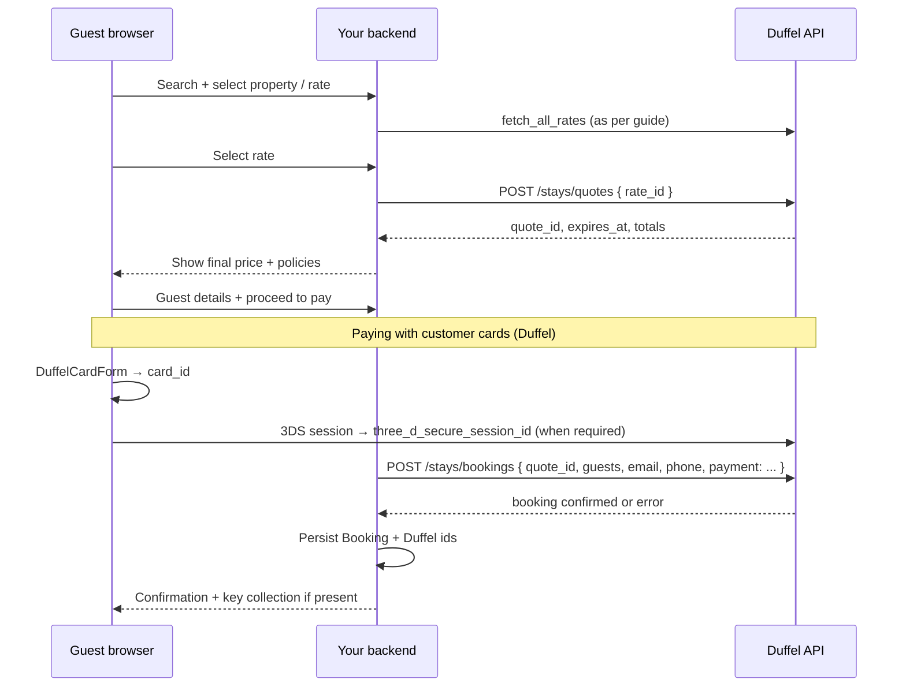

# Stays (hotels) payment flow — recommended Duffel pattern (starting platform)

This document defines **best-practice payment architecture** for **Duffel Stays** when you are building a **booking platform from MVP upward**. It complements [Getting started with Stays](https://duffel.com/docs/guides/getting-started-with-stays) and Duffel’s payment-specific guides.

**Official references (read alongside this guide):**

- [Getting started with Stays](https://duffel.com/docs/guides/getting-started-with-stays) — search → rates → **quote** → booking
- [Searching for stays](https://duffel.com/docs/guides/searching-for-stays)
- [Choosing a payment method](https://duffel.com/docs/guides/choosing-a-payment-method) — **Card** vs **Cash (Balance)**
- [Paying with customer cards](https://duffel.com/docs/guides/paying-with-customer-cards) — **DuffelCardForm**, **3DS**, card + session on **Stays** booking
- [Booking payment instructions](https://duffel.com/docs/api/booking-payment-instructions/create-booking-payment-instruction) — some rates / pay-at-property scenarios
- Stays booking API: create booking (see current Duffel API reference for `POST /stays/bookings` body, including **`payment`** when required)

**Related repo docs:** [DUFFEL_STAYS_PHASED_IMPLEMENTATION.md](./DUFFEL_STAYS_PHASED_IMPLEMENTATION.md) (what is built today), [DUFFEL_KEYS_AND_CHECKOUT.md](./DUFFEL_KEYS_AND_CHECKOUT.md). **Post-booking:** [Hold, cancel, exchanges & refunds](./FLIGHTS_STAYS_HOLD_CANCEL_REFUND_GUIDE.md).

---

## 1. Stays vs flights — different payment products on Duffel

**Flights (B2C pay-now):** The primary documented path for “collect money then book” in-product is often **Duffel Payments** — **PaymentIntent** → **confirm** → **Duffel Balance** → **`POST /air/orders`** with `payments: [{ type: "balance" }]`. See [Flight payment flow guide](./FLIGHT_PAYMENT_FLOW_GUIDE.md).

**Stays:** Rates vary by **supplier**, **cancel policy**, and **how** money is collected:

- **Prepay / pay online** (full or partial): You typically need a **customer payment** story — commonly **[Paying with customer cards](https://duffel.com/docs/guides/paying-with-customer-cards)** (card vault + **3DS** + pass **`three_d_secure_session_id`** / card details per **Stays** booking API), **or** pay from **organisation Balance** if the rate allows **balance** checkout and you are funded.
- **Pay at hotel / guarantee**: May still need a **card** or **payment instruction**; some flows use **booking payment instructions** after a booking exists.

**Rule:** Do **not** assume the **flight** PaymentIntent-only sequence automatically applies to **every** stays rate. Read each **quote**/rate for payment expectations and Duffel flags (e.g. whether payment instructions are allowed).

---

## 2. Target B2C flow (recommended mental model)

For a **retail** site where the **guest pays at your checkout**:

**Invariants:**

1. **Always create a quote** before charging or booking — confirms availability and locks terms for a bounded time (**respect `expires_at`**).
2. **Never** book on a **stale** quote; on expiry, **re-quote** and re-display price.
3. Collect **guest**, **contact**, and **special requests** per Duffel and local law; surface **cancellation timeline** and **key collection** copy as required.

---

## 3. Implementation lanes (pick explicitly)

### Lane A — Organisation **Duffel Balance** (agency / B2B / internal treasury)

**When:** You **pre-fund** balance (bank transfer) and accept that **your** float pays the supplier for prepay rates.

**Flow:** `POST /stays/bookings` with **`quote_id`** and guest/contact fields; **omit** traveller card if the rate is **balance-eligible** and your account is configured accordingly.

**Pros:** Simpler backend, no 3DS in app.  
**Cons:** **B2C** guests do not “pay the card” on your checkout unless you charge them **separately** (another PSP, invoice, wallet). Cash flow and reconciliation are **your** responsibility.

**Today in this repo:** Stays booking follows this lane (no `payment` in body) — suitable for **balance-funded** operation, not a full **consumer card** story by itself.

---

### Lane B — **Customer card** (B2C retail, supplier charges per Duffel card rail)

**When:** Guests must **authorize card** at checkout for prepay or guarantee per rate.

**Flow (Align with [Paying with customer cards](https://duffel.com/docs/guides/paying-with-customer-cards)):**

1. **Client key** / components setup as in Duffel’s guide.
2. **`DuffelCardForm`** (or equivalent) → obtain **card** resource id from Duffel’s card API (handled via components; **no** PAN on your server).
3. **`createThreeDSecureSession`** with resource context (Stays quote / booking requirements per guide) → **`three_d_secure_session_id`** when state is ready.
4. **`POST /stays/bookings`** including **`payment`** (shape per **current** Duffel Stays API reference — **card id + 3DS session** where required).

**Pros:** Matches **consumer** expectations; supplier settlement follows Duffel **card** model (see “Choosing a payment method” for merchant-of-record nuances).  
**Cons:** More moving parts (3DS, decline handling); must **test** with Duffel’s test hotel scenarios (e.g. decline paths documented by Duffel).

---

### Lane C — **Booking payment instructions** (post-booking, allowed rates)

**When:** Rate / booking supports **`payment_instruction_allowed`** (or equivalent) — e.g. conveying **lodged** card limits for property charges.

**Flow:** Create booking first per eligibility, then **`POST /stays/bookings/{id}/payment_instructions`** with **multi-use lodged card**, **limit_amount**, **approved_charges**, **invoice** details — see [Booking payment instructions](https://duffel.com/docs/api/booking-payment-instructions/create-booking-payment-instruction).

**Use:** Targeted scenarios; **not** a substitute for quote-time prepay when the rate requires payment at booking.

---

## 4. Duffel Payments (balance top-up) and Stays

**Duffel Payments** (PaymentIntent) is **central** to the **flight** guide in this repo. For **Stays**, confirm with **Duffel documentation and your account** whether a **PaymentIntent-first** path is supported for your target rates, or whether **lane B (Cards + 3DS)** is required. Do **not** assume parity across products without checking the latest API.

**Pragmatic strategy:**  
- **Short term:** **Lane A** if you are balance-funded; **Lane B** when you need guest card at checkout for prepay rates.  
- **Unified treasury:** If you use PaymentIntent for flights, your **Balance** still helps fund **lane A** stays or retries; it does not remove the need for **lane B** on rates that require direct card authorization.

---

## 5. Backend design best practices

| Topic | Practice |
|-------|-----------|
| **Quote** | Single **`quote_id`** per checkout attempt; store expiry server-side or in signed session; reject booking if expired. |
| **Idempotency** | **`Idempotency-Key`** on `POST /stays/bookings` to prevent duplicate stays on retries. |
| **Authz** | Require authenticated user (or explicit guest policy), permission **`bookings:create`**, consistent with flights. |
| **Rate limits** | Per IP/user on quote + book, analogous to flight BFF. |
| **Persistence** | Store `duffel_quote_id`, `duffel_booking_id`, raw payload snapshots for support; link to parent **Booking** row. |
| **Webhooks** | Subscribe to Stays events (e.g. `stays.booking_creation_failed`, cancellations); reconcile DB vs Duffel. |

---

## 6. Failure and edge cases

| Scenario | Practice |
|----------|----------|
| **Quote expired** | 409 / clear message; **new quote** required. |
| **Booking failed after card auth** | Same **saga** mindset as flights: do **not** assume automatic rollback; log **Duffel booking id** / correlation ids; support runbook + Duffel dashboard. |
| **Partial inventory** | Handle API errors; never show “confirmed” without successful Duffel response + DB commit. |
| **Payment declined** | User message + no local **confirmed** booking; optional telemetry for decline reasons (without storing sensitive data). |

---

## 7. UX and compliance

- Show **total**, **currency**, **taxes/fees** as returned by quote/booking.
- **Cancellation** timeline and **refundability** — follow [Displaying the cancellation timeline](https://duffel.com/docs/guides/displaying-the-cancellation-timeline).
- **Key collection** and **special access** — you must pass instructions to the guest when Duffel returns them.
- **Negotiated / loyalty** rates — follow Duffel’s dedicated guides if you enable them.

---

## 8. Testing checklist (Stays payments)

- [ ] Happy path: search → rates → quote → book (**lane A** and/or **lane B** as implemented).
- [ ] **Quote expiry**: booking rejected; new quote succeeds.
- [ ] **Idempotent** duplicate `POST` bookings with same key returns same booking.
- [ ] **Lane B**: 3DS challenge path (if applicable in test environment).
- [ ] Decline / failure scenarios using Duffel test hotel/rate variants documented by Duffel.
- [ ] Webhook: `booking_creation_failed` updates local state.

---

## 9. Migration path for this codebase

**Current state:** Stays checkout collects guest details and calls `POST /api/v1/stays/bookings` **without** a traveller **`payment`** payload — **lane A** (balance).

**To align with B2C best practice:**

1. Add server + client flow for **[Paying with customer cards](https://duffel.com/docs/guides/paying-with-customer-cards)** for quotes that require card at booking.
2. Extend validation (`stays.schema`) and `stays-booking.service` to pass **`payment`** when required; keep **lane A** as fallback only when rate + account allow **balance**-only book.
3. Add reconciliation jobs for **paid in Duffel / no local booking** edge cases, symmetric to flight orphan intents.
4. Document per-environment **treasury** policy (minimum balance for mixed catalogue).

---

## 10. Launch readiness checklist (Stays + payments)

- [ ] Product decision recorded: **lane A**, **B**, or **mixed** by rate type.
- [ ] Duffel dashboard: Cards / 3DS / Stays access verified for **live**.
- [ ] Quote expiry handling in UI and API.
- [ ] Webhooks + retry policy for failed events.
- [ ] Support playbook for payment/booking mismatches.
- [ ] Legal: cancellation, MOR/disclosure per chosen lane.

---

**Summary:** For a **starting platform**, **quotes before pay**, **idempotent bookings**, and **explicit choice** between **balance (agency)** and **customer card (B2C)** are non-negotiable. Implement **lane B** when retail guests must pay at checkout; keep **lane A** only when your **Balance** and business model support it. Revisit Duffel’s API reference whenever Stays **payment** schemas change.
