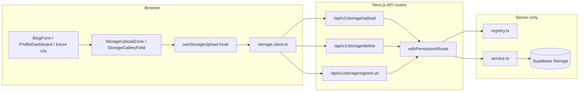

# Unified storage system

This document describes the **variant-based** upload/delete/signed-URL flow for Supabase Storage. A single set of API routes, one server service, one client HTTP module, and two generic UI components handle **all** file types — public blog images, private user avatars, and any future entity — distinguished only by a `variantId`.

## Goals

- **Single API surface** — `POST /api/v1/storage/upload` (multipart), `POST /api/v1/storage/delete` (JSON), `GET /api/v1/storage/signed-url` (query params).
- **Per-variant config** in one module — bucket, visibility (public / private), max size, MIME allow-list, upsert flag, path builder, path validation, URL parser, and `writePermission`.
- **Service role** on the server for all storage I/O (bypass RLS), after session + permission checks.
- **Client helpers** that only need a `variantId` — no duplicated fetch logic per feature.
- **Generic UI components** — `StorageUploadZone` (single-file: avatars, covers) and `StorageGalleryField` (multi-file gallery: blog images), both driven by `variantId`.

## Architecture



## Folder map

| Area | Path |
|------|------|
| Variant type + `StorageVariantId` union | `src/lib/storage/types.ts` |
| Registry + Zod schema + lookup helpers | `src/lib/storage/registry.ts` |
| One file per variant | `src/lib/storage/variants/*.variant.ts` |
| Client-safe URL parsing + UI defaults | `src/lib/storage/client.ts` |
| Unified upload / delete / signed-URL service | `src/lib/storage/service.ts` |
| API routes | `app/api/v1/storage/{upload,delete,signed-url}/route.ts` |
| Browser HTTP client | `src/lib/http/storage.client.ts` |
| Generic upload hook | `src/components/storage/use-storage-upload.ts` |
| Single-file upload zone component | `src/components/storage/StorageUploadZone.tsx` |
| Multi-file gallery component | `src/components/storage/StorageGalleryField.tsx` |

## Registered variants

| Variant id | Bucket | Visibility | Upsert | Permission | Use case |
|------------|--------|------------|--------|------------|----------|
| `blog-images` | `blogs_images` | public | no | `admin.blogs:write` | Blog post gallery images |
| `user-avatar` | `user-uploads` | private | yes | `profile:update` | User profile avatar |

## Variant config shape

```typescript
type StorageVariantConfig = {
  id: StorageVariantId;
  resourceLabel: string;
  bucket: string;
  visibility: "public" | "private";
  maxBytes: number;
  allowedMimeTypes: readonly string[];
  writePermission: PermissionId;
  upsert: boolean;
  signedUrlExpirySeconds?: number;       // private variants only
  buildObjectPath(filename: string, context?: Record<string, string>): string;
  isValidStoragePath(path: string): boolean;
  parsePathFromUrl(url: string): string | null;
};
```

Key fields:

- **`visibility`** — `"public"` returns a `publicUrl` after upload; `"private"` returns a `signedUrl`.
- **`upsert`** — `true` overwrites the existing object at the same path (avatars); `false` creates a new UUID-based key each time (blog images).
- **`buildObjectPath`** — receives `context` with caller metadata. The upload route auto-injects `userId` from the session, so private variants like `user-avatar` can derive the path without the client passing sensitive data.

## Request shapes

**Upload** — `POST /api/v1/storage/upload` (`multipart/form-data`):

| Field | Type | Required | Description |
|-------|------|----------|-------------|
| `file` | `File` | yes | The file to upload |
| `variant` | `string` | yes | Registered variant id |
| `context` | `string` (JSON) | no | Extra metadata for `buildObjectPath` |

The server auto-injects `userId` into context from the authenticated session.

Response: `{ success: true, data: { bucket, path, publicUrl, signedUrl, mime, size } }`

**Delete** — `POST /api/v1/storage/delete` (JSON):

| Field | Type | Required | Description |
|-------|------|----------|-------------|
| `variant` | `string` | yes | Registered variant id |
| `path` | `string` | yes | Object path validated by the variant |

**Signed URL** — `GET /api/v1/storage/signed-url?variant=...&path=...`:

Returns a fresh time-limited download URL for private-bucket objects. Only available for variants with `visibility: "private"`.

All responses follow `{ success: true, data: ... }` like other v1 APIs.

## Security

1. **Authentication** — All three routes use `withPermissionRoute(variant.writePermission, ...)`.
2. **Authorization** — The client sends only a `variantId`; the bucket name comes from server config — never from the client.
3. **Context injection** — The upload route injects `userId` from the session into context server-side. Clients do not need to (and should not) pass `userId` themselves.
4. **Path safety** — Each variant implements strict `isValidStoragePath` (no `..`, no absolute paths, predictable key shape).
5. **Secrets** — Only the service uses `SUPABASE_SERVICE_ROLE_KEY`; the client never sees it.

## Client components

### `StorageUploadZone` — single-file upload

For avatars, cover images, documents, or any single-file scenario.

```tsx
<StorageUploadZone
  variantId="user-avatar"
  value={avatarUrl}
  storagePath={profile.avatar_path}
  accept="image/jpeg,image/png,image/webp,image/gif"
  shape="circle"
  onUploadComplete={(result) => { /* PATCH profile */ }}
  onDeleteComplete={() => { /* clear avatar_path */ }}
/>
```

Key props: `variantId`, `value`, `storagePath`, `shape` (`"rectangle"` | `"circle"`), `onUploadComplete`, `onDeleteComplete`, `context`, `accept`, `disabled`, `placeholder`.

### `StorageGalleryField` — multi-file gallery

For blog images or any ordered collection with optional featured/alt/reorder features.

```tsx
<StorageGalleryField
  variantId="blog-images"
  value={galleryItems}
  onApply={(updater) => setItems(normalizeGallery(updater(items)))}
  showFeatured
  showAltText
  showReorder
/>
```

Key props: `variantId`, `value`, `onApply`, `maxItems`, `showFeatured`, `showAltText`, `showReorder`, `accept`, `storageBucketLabel`, `resourceLabel`.

Exported helpers: `galleryItemsFromDto()`, `normalizeGallery()`, `galleryToApiPayload()`.

### `useStorageUpload` hook

Low-level hook for custom UIs that need upload/delete state management without a pre-built component.

```tsx
const { upload, remove, uploadPending, deletePending, busy, error, clearError } =
  useStorageUpload({ variantId: "blog-images", onUploadSuccess, onDeleteSuccess, onError });
```

## Adding a new variant (checklist)

1. **Supabase** — Create the bucket and set policies (public read for marketing content; private + RLS for user data).
2. **Variant file** — Create `src/lib/storage/variants/<name>.variant.ts` implementing `StorageVariantConfig`.
3. **Types** — Add the id string to `STORAGE_VARIANT_IDS` in `src/lib/storage/types.ts`.
4. **Registry** — Import and register it in `src/lib/storage/registry.ts`.
5. **Client registry** — Add it to `CLIENT_REGISTRY` in `src/lib/storage/client.ts`.
6. **Feature UI** — Use `StorageUploadZone` or `StorageGalleryField` with the new `variantId`, or call `uploadStorageFile` / `deleteStorageFile` / `getStorageSignedUrl` from `storage.client.ts` directly.
7. **Test** — Upload, replace, delete, and confirm RBAC denial for users without the required permission.

No new API routes, HTTP modules, or hooks are needed.

## Avatar integration

The `user-avatar` variant uses the unified storage system with these specifics:

- **Upload**: goes through `/api/v1/storage/upload` with `variant=user-avatar`. The server injects `userId` from the session into context; `buildObjectPath` produces `{userId}/avatar`.
- **DB update**: After upload, the client PATCHes `/api/v1/users/me` with `{ avatar_path: result.path }` to persist the storage path in the profile.
- **Display**: The avatar GET endpoint (`/api/v1/users/me/avatar`) still exists for `` usage — it reads `avatar_path` from the DB and redirects to a signed URL via the unified `getSignedDownloadUrl` service.
- **Delete**: Goes through `/api/v1/storage/delete`, then the client PATCHes the profile to clear `avatar_path`.

`ProfileDashboard` uses the `useStorageUpload` hook with `variantId: "user-avatar"` to manage upload/delete transitions, then calls `updateMyProfile()` in the success callbacks.

## Blog integration

`BlogPostForm` renders `StorageGalleryField` with `variantId="blog-images"`, `showFeatured`, `showAltText`, and `showReorder`. The gallery component handles upload/delete/replace internally via the unified `storage.client.ts` module.

Helper functions `galleryItemsFromDto()` and `galleryToApiPayload()` convert between the generic `GalleryItem` shape and the blog API payload.

## Best practices

- Keep **variant ids** as stable URL-safe strings; treat them as part of your API contract.
- Prefer **immutable object keys** (`posts/{uuid}.ext`) so "replace" is upload-new + delete-old. Use `upsert: true` only when a single object per entity is desired (e.g. one avatar per user).
- When validation rules change, **version** paths or variant ids rather than breaking existing objects.
- Run **`npm run build`** after registry changes to ensure client/server imports stay valid.
- For private variants, always go through the `signed-url` route or the service's `getSignedDownloadUrl` to access files — never embed bucket URLs directly.
