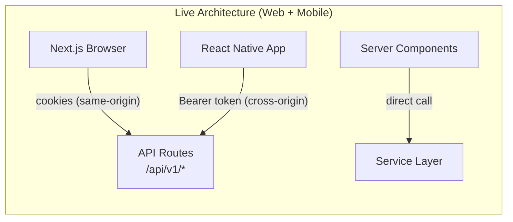
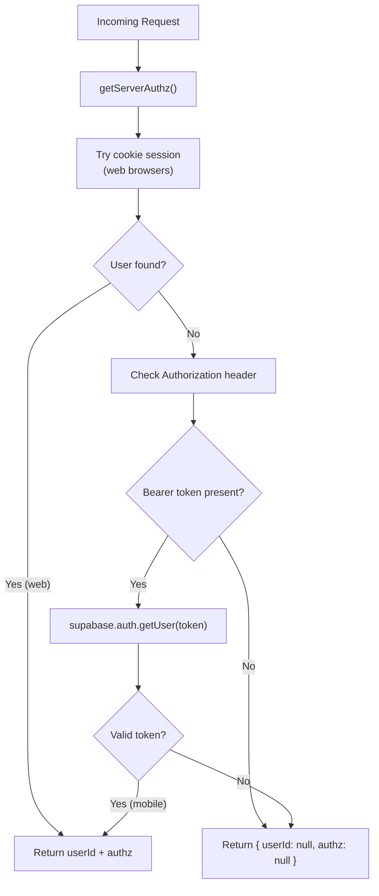
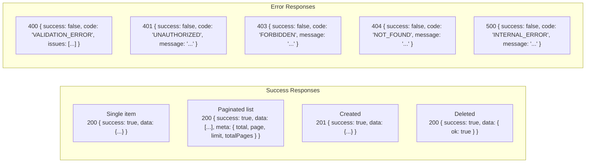
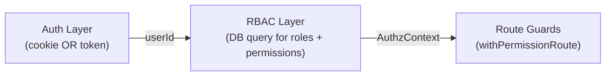
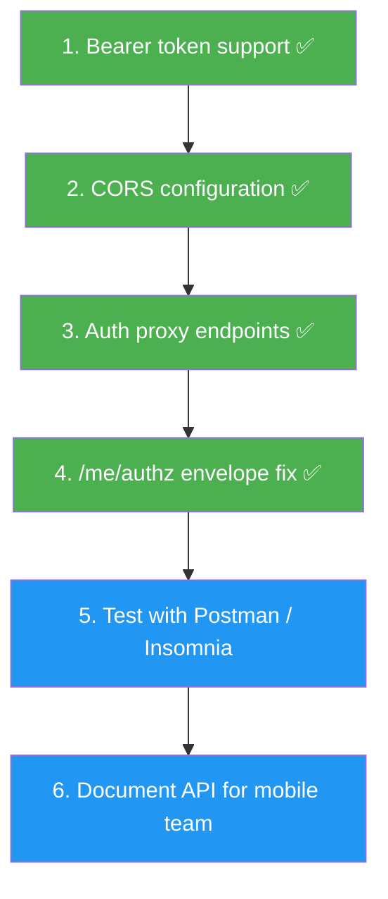
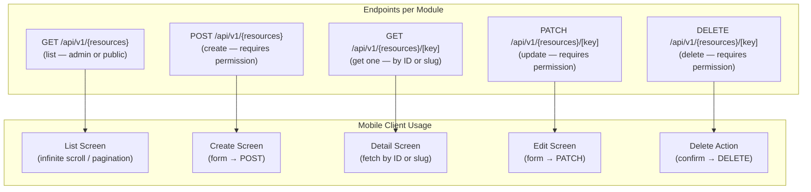
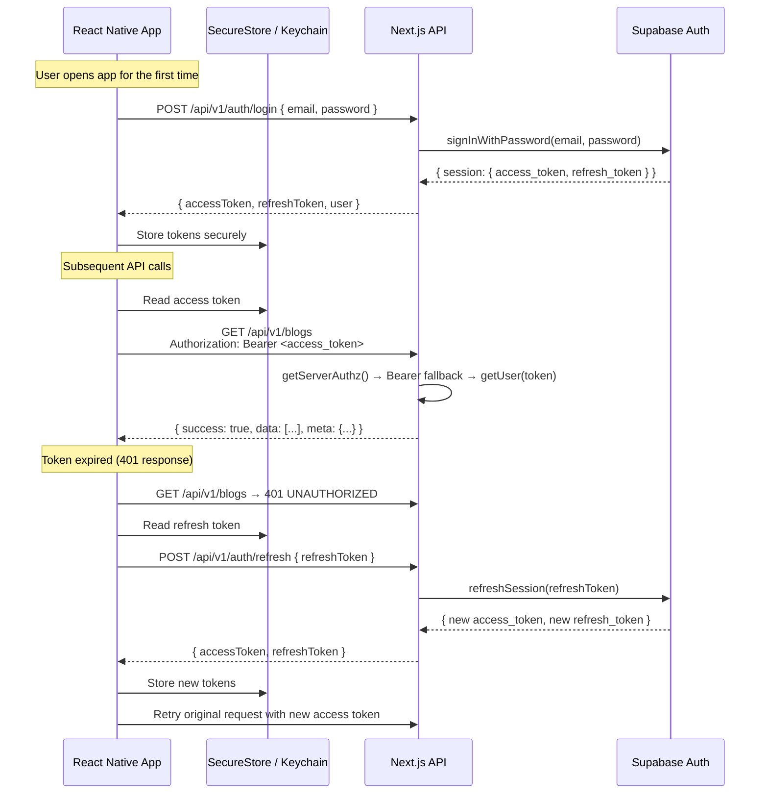

# Mobile API Compatibility Requirements

> **Purpose:** This document analyzes the current Next.js backend and API layer to determine what must be considered — and what must change — to share the same API endpoints with a React Native cross-platform mobile application. Every finding references actual code from the live codebase.
>
> **Last updated:** 2026-03-31

---

## 1. Executive Summary




| Area                    | State                                                   | Mobile Ready?  | Notes                                              |
| ----------------------- | ------------------------------------------------------- | -------------- | -------------------------------------------------- |
| **Authentication**      | Cookie-first + Bearer token fallback in `getServerAuthz()` | **Yes** | Implemented in `src/lib/authz/session.ts`          |
| **CORS**                | Headers via `next.config.ts` + preflight in `middleware.ts` | **Yes** | `CORS_ALLOWED_ORIGIN` env var for production       |
| **Auth proxy endpoints** | Login, signup, refresh, logout, forgot-password          | **Yes** | `app/api/v1/auth/*` — keeps Supabase keys server-side |
| **API response format** | Consistent `{ success, data }` envelope                 | **Yes**        | All endpoints including `/me/authz`                |
| **Error handling**      | Centralized with typed error codes                      | **Yes**        | No changes needed                                  |
| **RBAC / permissions**  | Permission-first route guards                           | **Yes**        | Works with any auth mechanism                      |
| **Validation**          | Zod schemas on all inputs                               | **Yes**        | No changes needed                                  |
| **Storage / uploads**   | Generic variant-based upload API                        | **Yes**        | Works with Bearer token after auth change          |
| **Date serialization**  | `Date` objects auto-serialize to ISO 8601               | **Yes**        | `NextResponse.json()` handles this automatically   |
| **Pagination**          | Standard `{ data, meta }` envelope                      | **Yes**        | No changes needed                                  |


**Bottom line:** The backend is fully mobile-ready. All blockers (authentication, CORS, auth proxy endpoints) have been implemented. New modules built following the unified module pattern work for mobile automatically.

---

## 2. Detailed Analysis

### 2.1 Authentication — IMPLEMENTED



**Implementation:** `src/lib/authz/session.ts` — `getServerAuthz()` uses a cookie-first strategy with Bearer token fallback. Once a `userId` is resolved from either method, the RBAC pipeline is identical.

**Impact:** Every existing and future route handler automatically works for mobile with zero changes, because they all call `getServerAuthz()` internally.

---

### 2.2 CORS — IMPLEMENTED

**Two-layer approach:**

1. **`next.config.ts` `headers()`** — adds CORS response headers to all `/api/v1/:path*` responses
2. **`middleware.ts`** — intercepts `OPTIONS` preflight requests and returns `204` with CORS headers; skips session refresh for API routes (performance optimization)

**Production config:** Set the `CORS_ALLOWED_ORIGIN` environment variable to restrict origins (defaults to `*` in development).

---

### 2.3 API Response Format — ALREADY MOBILE-READY

The entire API uses a consistent JSON envelope. No changes needed.




**Mobile client can use a simple wrapper:**

```typescript
// React Native API client
async function apiRequest<T>(path: string, init?: RequestInit): Promise<T> {
  const res = await fetch(`${API_BASE_URL}${path}`, {
    ...init,
    headers: {
      'Authorization': `Bearer ${accessToken}`,
      'Content-Type': 'application/json',
      'Accept': 'application/json',
      ...init?.headers,
    },
  });
  const json = await res.json();
  if (!json.success) {
    throw new ApiError(json.code, json.message, json.issues, res.status);
  }
  return json.data;
}
```

---

### 2.4 Error Handling — ALREADY MOBILE-READY

All errors are mapped through `handleApiError()` in `src/lib/api/error-handler.ts`. This produces consistent typed error responses that a mobile client can easily parse.


| Error Type          | HTTP Status | Response `code`    | Thrown By                    |
| ------------------- | ----------- | ------------------ | ---------------------------- |
| `ZodError`          | 400         | `VALIDATION_ERROR` | Schema validation failures   |
| `ValidationError`   | 400         | `VALIDATION_ERROR` | Custom validation in service |
| `UnauthorizedError` | 401         | `UNAUTHORIZED`     | No valid session             |
| `ForbiddenError`    | 403         | `FORBIDDEN`        | Missing permission           |
| `NotFoundError`     | 404         | `NOT_FOUND`        | Resource doesn't exist       |
| `AppError`          | varies      | custom             | Domain-specific errors       |
| Unknown             | 500         | `INTERNAL_ERROR`   | Unexpected server errors     |


The `issues` array from Zod validation errors contains field-level details that the mobile app can map to form fields — same as the web form components do.

---

### 2.5 RBAC / Permissions — ALREADY MOBILE-READY

The permission system is decoupled from the auth mechanism:




Once `getServerAuthz()` produces a `userId` from either a cookie or Bearer token, the entire RBAC chain works identically. No changes needed to:

- `src/lib/authz/server.ts` — loads permissions from DB by userId
- `src/lib/authz/guards.ts` — checks if permission exists in context
- `src/lib/api/with-route-auth.ts` — wraps routes with permission checks
- `src/lib/authz/registry.ts` — permission definitions

---

### 2.6 Storage / File Uploads — MINOR CHANGES NEEDED

**Upload endpoint:** `POST /api/v1/storage/upload` accepts `multipart/form-data` with fields `file` and `variant`.

**Current web client** (`storage-upload.client.ts`) uses `credentials: "include"` for cookie auth. The mobile client would use:

```typescript
// React Native upload
const formData = new FormData();
formData.append('file', { uri: fileUri, name: fileName, type: mimeType });
formData.append('variant', 'blog-images');

const res = await fetch(`${API_BASE_URL}/api/v1/storage/upload`, {
  method: 'POST',
  headers: { 'Authorization': `Bearer ${token}` },
  body: formData,
});
```

**The upload route** (`app/api/v1/storage/upload/route.ts`) uses `withPermissionRoute`, which calls `getServerAuthz()`. Once Bearer token support is added to `getServerAuthz()`, uploads work for mobile with no route changes.

**Delete endpoint:** `POST /api/v1/storage/delete` accepts JSON body `{ variant, path }`. Same auth story — works once Bearer is supported.

---

### 2.7 Date Serialization — NEEDS REVIEW

**Current DTOs** use `Date` objects:

```typescript
// src/lib/blog/blog.types.ts
export type BlogPostDto = {
  publishedAt: Date;
  updatedAt: Date;
  // ...
};
```

When Next.js serializes these via `NextResponse.json()`, JavaScript `Date` objects are automatically converted to ISO 8601 strings (e.g., `"2026-03-31T10:30:00.000Z"`). This is correct and mobile-friendly.

**However**, there is a consideration:

- The web RSC pages receive actual `Date` objects (because they call the service directly, no JSON serialization)
- API consumers (web `adminApiJson` and mobile) receive ISO strings

When creating new modules, make sure the DTO types reflect this:

- Service return types can use `Date`
- API response types should document that dates arrive as ISO strings over HTTP

**Recommendation:** Add a `// Serialized as ISO 8601 string over HTTP` comment to date fields in DTO types, or create a separate `BlogPostApiResponse` type with `string` dates for API consumers.

---

### 2.8 Pagination — ALREADY MOBILE-READY

The `paginatedResponse()` helper produces:

```json
{
  "success": true,
  "data": [...],
  "meta": {
    "total": 42,
    "page": 1,
    "limit": 20,
    "totalPages": 3
  }
}
```

This is a standard pagination contract. The mobile app can implement infinite scroll or page-based pagination using the `meta` object.

---

### 2.9 Endpoint Inventory — What Mobile Needs

#### Existing endpoints that mobile will consume:


| Method             | Endpoint                  | Auth              | Purpose                                         |
| ------------------ | ------------------------- | ----------------- | ----------------------------------------------- |
| `GET`              | `/api/v1/me/authz`        | Required          | Load user roles + permissions (for UI gating)   |
| `GET/PATCH`        | `/api/v1/users/me`        | Required          | User profile read/update                        |
| `POST/DELETE`      | `/api/v1/users/me/avatar` | Required          | Avatar upload/delete                            |
| `GET`              | `/api/v1/blogs`           | Optional          | List blog posts (admin or public based on auth) |
| `POST`             | `/api/v1/blogs`           | Required (write)  | Create blog post                                |
| `GET`              | `/api/v1/blogs/[key]`     | Optional          | Get single blog post (by id or slug)            |
| `PATCH`            | `/api/v1/blogs/[key]`     | Required (write)  | Update blog post                                |
| `DELETE`           | `/api/v1/blogs/[key]`     | Required (delete) | Delete blog post                                |
| `POST`             | `/api/v1/storage/upload`  | Required (write)  | Upload file to storage                          |
| `POST`             | `/api/v1/storage/delete`  | Required (write)  | Delete file from storage                        |
| `GET/POST`         | `/api/v1/bookings`        | Required          | Booking operations                              |
| `GET/PATCH/DELETE` | `/api/v1/bookings/[id]`   | Required          | Single booking operations                       |
| `GET`              | `/api/v1/health`          | None              | Health check                                    |


#### Auth proxy endpoints (IMPLEMENTED):


| Endpoint                            | Method | Controller Handler      | Purpose                                                     |
| ----------------------------------- | ------ | ----------------------- | ----------------------------------------------------------- |
| `/api/v1/auth/login`                | POST   | `handleLogin`           | `{ email, password }` → access + refresh tokens             |
| `/api/v1/auth/signup`               | POST   | `handleSignup`          | `{ email, password, first_name, last_name }` → tokens + profile |
| `/api/v1/auth/refresh`              | POST   | `handleRefresh`         | `{ refresh_token }` → new access + refresh tokens           |
| `/api/v1/auth/logout`               | POST   | `handleLogout`          | Bearer token → revoke session via GoTrue API                |
| `/api/v1/auth/forgot-password`      | POST   | `handleForgotPassword`  | `{ email }` → send reset email (no email enumeration)       |

All handlers live in `src/lib/api/auth/auth.controller.ts` and use a stateless Supabase client (`persistSession: false`) — no cookie management. Input validation via `src/lib/validations/auth.schema.ts`.

#### Future auth endpoints (not yet implemented):


| Endpoint                              | Purpose                                     | Notes                                   |
| ------------------------------------- | ------------------------------------------- | --------------------------------------- |
| `POST /api/v1/auth/social/{provider}` | OAuth login (Google, Apple)                 | Deep link callback handling for mobile  |
| `POST /api/v1/auth/reset-password`    | Update password with recovery token         | Depends on app deep linking setup       |


---

## 3. Implementation Status

All critical backend changes for mobile compatibility are complete.




### Completed changes:

| #   | Change                                         | File(s)                                                  |
| --- | ---------------------------------------------- | -------------------------------------------------------- |
| 1   | Bearer token support in `getServerAuthz()`     | `src/lib/authz/session.ts`                               |
| 2   | CORS response headers for API routes           | `next.config.ts` `headers()`                             |
| 3   | CORS preflight (OPTIONS) handling              | `middleware.ts`                                          |
| 4   | Auth proxy endpoints (login, signup, etc.)     | `src/lib/api/auth/auth.controller.ts`, `app/api/v1/auth/*` |
| 5   | Auth input validation schemas                 | `src/lib/validations/auth.schema.ts`                     |
| 6   | `/me/authz` standardized to `successResponse()` | `app/api/v1/me/authz/route.ts`                          |

### Remaining tasks:

- Test all endpoints with Bearer token in Postman / Insomnia
- Document complete API reference for mobile team
- Implement social OAuth proxy (if needed)

---

## 4. Module Development Considerations

When creating new modules going forward, follow these rules to ensure both web and mobile compatibility:

### 4.1 Rules for New Modules


| Rule                                                                   | Why                                                                                                                                     |
| ---------------------------------------------------------------------- | --------------------------------------------------------------------------------------------------------------------------------------- |
| **Never put auth logic in route files**                                | Route files delegate to `withPermissionRoute` which calls `getServerAuthz()` — this automatically works for both cookie and Bearer auth |
| **Always use `successResponse` / `paginatedResponse`**                 | Consistent envelope that mobile client can parse generically                                                                            |
| **Always use `handleApiError`**                                        | Consistent error codes that mobile can map to UI                                                                                        |
| **Never return `NextResponse.json()` directly** in controllers         | Bypass the standard envelope — mobile client can't parse it                                                                             |
| **Document all query parameters**                                      | Mobile developers need to know what filters/pagination params are available                                                             |
| **Validate all inputs with Zod**                                       | Mobile may send slightly different payloads — Zod catches issues with clear error messages                                              |
| **Use ISO 8601 for dates in API**                                      | `NextResponse.json()` does this automatically, but be aware of the serialization                                                        |
| **Include `export const dynamic = "force-dynamic"` on all API routes** | Prevents Next.js from caching authenticated responses                                                                                   |


### 4.2 The `/me/authz` Endpoint — FIXED

The `/api/v1/me/authz` endpoint now uses the standard `successResponse()` envelope, consistent with all other API endpoints.

### 4.3 Dual-Use GET Pattern — Important for Mobile

The blog module's GET endpoint uses **permission-first branching** — the same URL returns different data depending on auth:

```
GET /api/v1/blogs (with admin permission) → all posts (drafts, archived, published)
GET /api/v1/blogs (without permission)   → only published posts
```

This is powerful for mobile because:

- **Admin mobile app** → sends Bearer token with admin permissions → gets full data
- **Public mobile app** → sends no token → gets published data only
- **Same endpoint, same backend, zero additional routes**

When building new modules, always implement this pattern in the controller rather than creating separate admin/public routes.

---

## 5. What the Mobile App Needs from Each Module

For every module created using the blueprint, the mobile app gets these endpoints automatically:




**The mobile developer's job per module:**

1. Build list/detail/form screens in React Native
2. Call the API endpoints using the shared Bearer-auth HTTP client
3. Map validation errors (`issues` array) to form field errors
4. Handle pagination using `meta.totalPages`

**The backend developer's job:**

1. Follow the module blueprint (same as for web)
2. No mobile-specific code needed
3. Test with Bearer token in Postman after creating each module

---

## 6. React Native Auth Flow




---

## 7. Summary

### All blockers resolved:

| #   | Change                                         | Status         | File(s)                                                        |
| --- | ---------------------------------------------- | -------------- | -------------------------------------------------------------- |
| 1   | Bearer token support in `getServerAuthz()`     | **Done** | `src/lib/authz/session.ts`                                     |
| 2   | CORS headers + preflight handling              | **Done** | `next.config.ts`, `middleware.ts`                              |
| 3   | Auth proxy endpoints                           | **Done** | `src/lib/api/auth/auth.controller.ts`, `app/api/v1/auth/*`    |
| 4   | `/me/authz` standardized envelope              | **Done** | `app/api/v1/me/authz/route.ts`                                |

### Already compatible (no changes needed):

- All service files, repository files, validation schemas
- All controller files, all route files
- Response format (`successResponse`, `paginatedResponse`)
- Error handling (`handleApiError`)
- RBAC system, Storage upload/delete, Pagination contract

### Remaining optional improvements:

| #   | Item                                    | Priority | Notes                                        |
| --- | --------------------------------------- | -------- | -------------------------------------------- |
| 1   | Social OAuth proxy (`/auth/social/*`)   | Low      | Depends on mobile deep linking setup         |
| 2   | Password reset endpoint                 | Low      | Depends on recovery flow design              |
| 3   | API reference documentation for mobile  | Medium   | Postman collection or OpenAPI spec           |

**The backend is fully mobile-ready.** Every current and future module built with the unified module pattern works for mobile automatically — no additional mobile-specific code required.


template lists:

https://codecanyon.net/item/gohotel-hotel-booking-motel-booking-trivago-oyo-airbnb-trip-car-booking-flutter-ui-app/39971697


https://codecanyon.net/item/autocare-car-service-full-app-in-flutter-with-nodejs-backend-service-booking-app-template/53988247


all
https://codecanyon.net/category/mobile?term=car%20booking%20flutter

https://codecanyon.net/category/mobile?term=travel%20booking