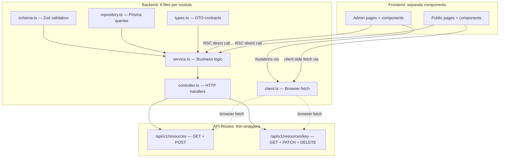
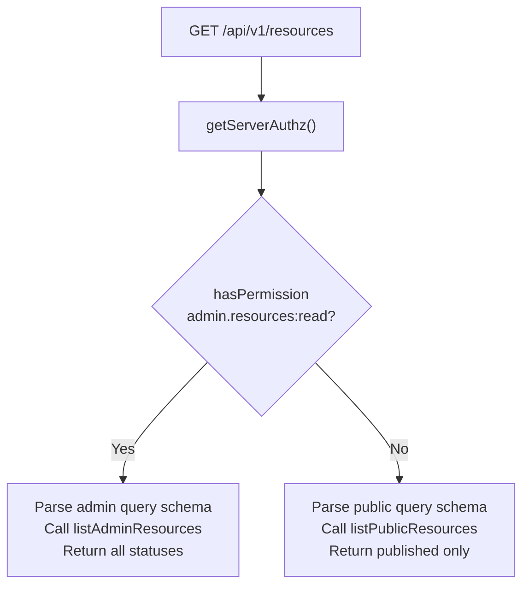

# Module Blueprint

> **The definitive guide for creating new modules.** Every module follows the same unified pattern — one set of backend files handles admin, public, and self-service access. The server decides what to return based on the caller's permissions.

---

## 1. Architecture



**Core rule:** Backend files and client files are unified per module. Only frontend components are split between admin and public.

---

## 2. File Checklist (per module)

Replace `{module}` with your module name (e.g., `blog`, `tour`, `package`).

| # | File | Location | Purpose |
|---|------|----------|---------|
| 1 | `{module}.schema.ts` | `src/lib/validations/` | Zod schemas for admin + public queries, create, update |
| 2 | `{module}.repository.ts` | `src/lib/db/repositories/` | Prisma queries for admin + public data access |
| 3 | `{module}.types.ts` | `src/lib/{module}/` | DTO types shared across API, RSC, and client |
| 4 | `{module}.service.ts` | `src/lib/services/{module}/` | Business logic, mappers, sanitizers for admin + public |
| 5 | `{module}.controller.ts` | `src/lib/api/{module}/` | HTTP handlers with permission-based branching |
| 6 | `{module}.client.ts` | `src/lib/http/` | Browser-side fetch for admin + public operations |
| 7 | `route.ts` (collection) | `app/api/v1/{resources}/` | GET (list) + POST (create) |
| 8 | `route.ts` (item) | `app/api/v1/{resources}/[key]/` | GET + PATCH + DELETE |
| 9 | Admin pages | `app/(admin)/admin/{resources}/` | RSC pages: list, new, [id]/edit |
| 10 | Admin components | `src/components/admin/{resources}/` | Client components: list, form |
| 11 | Public pages | `app/(marketing)/{resource}/` | RSC pages: list, [slug] |
| 12 | Public components | `src/components/{resource}/` | Client components if needed |

---

## 3. File-by-File Guide

### 3.1 Schema — `src/lib/validations/{module}.schema.ts`

Contains ALL Zod schemas for the module: admin list query, public list query, create body, update body, and route param schemas.

```typescript
import { z } from "zod";
import { paginationQuerySchema } from "./pagination.schema";

// Admin list: extends base pagination with filters + sorting
export const {module}AdminListQuerySchema = paginationQuerySchema.extend({
  q: z.string().optional(),
  status: z.enum(["draft", "published", "archived"]).optional(),
  sort: z.enum(["title", "updated"]).optional(),
  order: z.enum(["asc", "desc"]).default("desc"),
});

// Public list: different defaults/limits
export const {module}PublicListQuerySchema = paginationQuerySchema.extend({
  q: z.string().optional(),
});

// Create body
export const create{Resource}Schema = z.object({ /* fields */ });

// Update body (partial create with at-least-one-field refinement)
export const update{Resource}Schema = create{Resource}Schema.partial()
  .refine((v) => Object.keys(v).length > 0, { message: "At least one field required" });

// Route params
export const {module}KeyParamSchema = z.object({ key: z.string().min(1) });
```

### 3.2 Repository — `src/lib/db/repositories/{module}.repository.ts`

Prisma data access. Both admin and public queries live here. No permission logic — that belongs in the service/controller.

```typescript
import "server-only";
import { prisma } from "@/lib/prisma";

export const {module}Repository = {
  // Public
  findManyPublished(args) { /* WHERE status = published */ },
  findPublishedBySlug(slug) { /* WHERE slug AND published */ },

  // Admin (unrestricted by status)
  findManyPaginatedAdmin(args) { /* paginated with filters */ },
  findByIdAdmin(id) { /* by primary key */ },

  // Mutations
  create(data) { /* ... */ },
  update(id, data) { /* ... */ },
  delete(id) { /* ... */ },
};
```

### 3.3 Types — `src/lib/{module}/{module}.types.ts`

Shared DTO types. One shape for both admin and public — the service maps DB rows to these.

```typescript
export type {Resource}Dto = {
  id: string;
  title: string;
  slug: string;
  // ... all camelCase fields
  publishedAt: Date;   // serialized as ISO 8601 string over HTTP
  updatedAt: Date;
  status: string;
};
```

### 3.4 Service — `src/lib/services/{module}/{module}.service.ts`

The module brain. Contains admin CRUD, public reads, and RSC loaders — all in one file.

```typescript
import "server-only";

// ---- Admin CRUD ----
export async function listAdmin{Resources}(query) { /* ... */ }
export async function getAdmin{Resource}(id) { /* ... */ }
export async function createAdmin{Resource}(body) { /* ... */ }
export async function updateAdmin{Resource}(id, body) { /* ... */ }
export async function deleteAdmin{Resource}(id) { /* ... */ }

// ---- Public reads ----
export async function listPublic{Resources}(query) { /* ... */ }
export async function getPublic{Resource}BySlug(slug) { /* ... */ }

// ---- RSC loaders (React cache) ----
export const load{Resource}BySlug = cache(async (slug) => { /* ... */ });
```

### 3.5 Controller — `src/lib/api/{module}/{module}.controller.ts`

HTTP handlers. GET endpoints use **permission-based branching** — same endpoint, different data based on auth.

```typescript
import "server-only";

// GET /api/v1/{resources} — admin list OR public list
export async function handle{Resource}CollectionGET(req) {
  const { authz } = await getServerAuthz();
  if (hasPermission(authz, "admin.{resources}:read")) {
    // Parse admin query, call admin service, return paginatedResponse
  }
  // Parse public query, call public service, return paginatedResponse
}

// POST /api/v1/{resources} — create (permission enforced at route level)
export async function handle{Resource}CollectionPOST(req) { /* ... */ }

// GET /api/v1/{resources}/[key] — admin by ID or public by slug
export async function handle{Resource}ItemGET(req, params) { /* ... */ }

// PATCH, DELETE — admin only (permission enforced at route level)
export async function handle{Resource}ItemPATCH(req, params) { /* ... */ }
export async function handle{Resource}ItemDELETE(req, params) { /* ... */ }
```

### 3.6 Client — `src/lib/http/{module}.client.ts`

Browser-side fetch. Both admin mutations AND public reads live here.

```typescript
"use client";
import { apiJson, apiPaginatedJson } from "@/lib/http/api-client";

const BASE = "/api/v1/{resources}";

// ---- Read (server decides admin vs public by auth) ----
export async function list{Resources}(params?) { return apiPaginatedJson(BASE, params); }
export async function get{Resource}(key) { return apiJson(`${BASE}/${key}`); }

// ---- Write (requires admin permission) ----
export async function create{Resource}(body) { return apiJson(BASE, { method: "POST", body }); }
export async function update{Resource}(id, body) { return apiJson(`${BASE}/${id}`, { method: "PATCH", body }); }
export async function delete{Resource}(id) { return apiJson(`${BASE}/${id}`, { method: "DELETE" }); }
```

### 3.7 Routes — `app/api/v1/{resources}/route.ts`

Thin wrappers. GET is open (controller handles auth branching). Mutations use `withPermissionRoute`.

```typescript
import { handle{Resource}CollectionGET, handle{Resource}CollectionPOST } from "@/lib/api/{module}/{module}.controller";
import { withPermissionRoute } from "@/lib/api/with-route-auth";

export const dynamic = "force-dynamic";

export function GET(req) { return handle{Resource}CollectionGET(req); }
export function POST(req) { return withPermissionRoute("admin.{resources}:write", () => handle{Resource}CollectionPOST(req)); }
```

### 3.8 Admin Pages — `app/(admin)/admin/{resources}/page.tsx`

Server Components that call the service directly (no API round-trip).

```typescript
import { listAdmin{Resources} } from "@/lib/services/{module}/{module}.service";
import { {Resource}List } from "@/components/admin/{resources}/{resource}-list";

export default async function Admin{Resources}Page({ searchParams }) {
  const { items, total } = await listAdmin{Resources}(query);
  return <{Resource}List rows={items} total={total} />;
}
```

### 3.9 Public Pages — `app/(marketing)/{resource}/page.tsx`

Server Components that call public service functions or RSC loaders directly.

```typescript
import { loadPublished{Resources} } from "@/lib/services/{module}/{module}.service";
import { {Resource}Explorer } from "@/components/{resource}/{resource}-explorer";

export default async function {Resource}IndexPage() {
  const items = await loadPublished{Resources}();
  return <{Resource}Explorer items={items} />;
}
```

---

## 4. Step-by-Step: Creating a New Module

| Phase | What to do | Files created |
|-------|------------|---------------|
| A | Define Prisma models in `prisma/schema.prisma`, run `npx prisma migrate dev` | schema.prisma |
| B | Register permissions in `src/lib/authz/registry.ts` | registry.ts |
| C | Create Zod schemas | `src/lib/validations/{module}.schema.ts` |
| D | Create repository | `src/lib/db/repositories/{module}.repository.ts` |
| E | Create DTO types | `src/lib/{module}/{module}.types.ts` |
| F | Create service (admin CRUD + public reads + mappers) | `src/lib/services/{module}/{module}.service.ts` |
| G | Create controller (permission-branched GET, guarded mutations) | `src/lib/api/{module}/{module}.controller.ts` |
| H | Create API routes (thin wrappers) | `app/api/v1/{resources}/route.ts`, `[key]/route.ts` |
| I | Create browser client (read + write) | `src/lib/http/{module}.client.ts` |
| J | Create admin pages (RSC list, new, edit) | `app/(admin)/admin/{resources}/*.tsx` |
| K | Create admin components (list, form) | `src/components/admin/{resources}/*.tsx` |
| L | Add sidebar entry | `src/components/admin_ui/layout/sidebar.tsx` |
| M | Create public pages (if applicable) | `app/(marketing)/{resource}/*.tsx` |
| N | Create public components (if applicable) | `src/components/{resource}/*.tsx` |

---

## 5. Permission-Based GET Pattern

The key differentiator of this architecture. One endpoint, multiple access levels:



**Why this matters:**
- Admin panel, public website, and mobile app hit the same endpoint
- Zero duplicate routes or controllers
- Server decides access — clients don't need to know which "version" to call

---

## 6. Shared Infrastructure

These files are already built and shared by all modules:

| File | Purpose |
|------|---------|
| `src/lib/http/api-client.ts` | `apiJson()` and `apiPaginatedJson()` — browser fetch helpers |
| `src/lib/api/response.ts` | `successResponse()`, `paginatedResponse()` — standard envelope |
| `src/lib/api/error-handler.ts` | `handleApiError()` — maps errors to HTTP responses |
| `src/lib/api/errors.ts` | `AppError`, `NotFoundError`, `ValidationError` |
| `src/lib/api/with-route-auth.ts` | `withPermissionRoute()`, `withAuthedRoute()` — route guards |
| `src/lib/authz/session.ts` | `getServerAuthz()` — cookie + Bearer token auth |
| `src/lib/authz/guards.ts` | `hasPermission()`, `hasAnyRole()` — permission checks |
| `src/lib/validations/pagination.schema.ts` | Base pagination schema (page, limit) |

---

## 7. Naming Conventions

| Item | Convention | Example |
|------|-----------|---------|
| Module name | singular lowercase | `blog`, `tour`, `package` |
| API URL segment | plural kebab-case | `/api/v1/blogs`, `/api/v1/tour-packages` |
| File prefix | module name | `blog.schema.ts`, `blog.service.ts` |
| Zod schema | `camelCase + Schema` | `blogAdminListQuerySchema`, `createBlogPostSchema` |
| Service function | `verbContext{Resource}` | `listAdminBlogPosts`, `getPublicBlogPostBySlug` |
| Controller handler | `handle{Resource}{Action}` | `handleBlogCollectionGET`, `handleBlogItemPATCH` |
| Client function | `verb{Resource}` | `listBlogPosts`, `createBlogPost`, `getBlogPost` |
| DTO type | `{Resource}Dto` | `BlogPostDto`, `UserProfileDto` |
| Permission ID | `admin.{resources}:{action}` | `admin.blogs:read`, `admin.blogs:write` |
| Admin page dir | `app/(admin)/admin/{resources}/` | `app/(admin)/admin/blogs/` |
| Admin component dir | `src/components/admin/{resources}/` | `src/components/admin/blogs/` |

---

## 8. Anti-Patterns

| Do NOT | Do instead |
|--------|-----------|
| Create separate `admin-blog.service.ts` and `blog.service.ts` | One `blog.service.ts` with admin + public sections |
| Create separate `/api/v1/admin/blogs` and `/api/v1/blogs` routes | One `/api/v1/blogs` with permission-based branching in the controller |
| Create separate `admin-blog.client.ts` and `blog.client.ts` | One `blog.client.ts` with read + write sections |
| Put permission checks in route files | Use `withPermissionRoute()` wrapper or check in controller |
| Return `NextResponse.json()` directly in controllers | Use `successResponse()` / `paginatedResponse()` |
| Call API from Server Components | Call the service directly — API is for browser/mobile clients |
| Put business logic in controllers | Controllers parse input and call service — logic lives in service |
| Use `adminApiJson` in new code | Use `apiJson` from `src/lib/http/api-client.ts` |

---

## 9. Reference: Blog Module Files

| File | Lines | Handles |
|------|------:|---------|
| `src/lib/validations/blog.schema.ts` | 93 | Admin + public query schemas, create/update body |
| `src/lib/db/repositories/blog.repository.ts` | 133 | Admin + public Prisma queries |
| `src/lib/blog/blog.types.ts` | 45 | Shared `BlogPostDto` |
| `src/lib/services/blog/blog.service.ts` | 363 | Admin CRUD + public reads + RSC loaders |
| `src/lib/api/blog/blog.controller.ts` | 128 | Permission-branched GET + guarded mutations |
| `src/lib/http/blog.client.ts` | 39 | Read (admin+public) + write (admin) |
| `app/api/v1/blogs/route.ts` | 17 | Collection GET + POST |
| `app/api/v1/blogs/[key]/route.ts` | 24 | Item GET + PATCH + DELETE |

## 10. Reference: User Module Files

| File | Lines | Handles |
|------|------:|---------|
| `src/lib/validations/user.schema.ts` | 58 | Admin + self-service schemas |
| `src/lib/db/repositories/user.repository.ts` | 107 | Admin + self-service Prisma queries |
| `src/lib/user/user.types.ts` | 30 | Shared `UserProfileDto`, `UserListItemDto` |
| `src/lib/services/user/user.service.ts` | 277 | Admin CRUD + self-service profile + role management |
| `src/lib/api/user/user.controller.ts` | 174 | Admin handlers + self-service `/me` handlers |
| `src/lib/http/user.client.ts` | 63 | Self-service + admin CRUD + role management |
| `app/api/v1/users/route.ts` | 16 | Admin collection GET + POST |
| `app/api/v1/users/[id]/route.ts` | 23 | Admin item GET + PATCH + DELETE |
| `app/api/v1/users/me/route.ts` | 16 | Self-service GET + PATCH |

---

## 11. Request Flow Examples

### Admin creates a blog post (browser)

```
Admin clicks "Save" in blog form
  → blog-form.tsx calls createBlogPost(body) from blog.client.ts
    → apiJson() sends POST /api/v1/blogs with cookie
      → route.ts calls withPermissionRoute("admin.blogs:write", handler)
        → controller parses body with createBlogPostSchema
          → service calls blogRepository.create()
            → returns BlogPostDto via successResponse(post, 201)
```

### Public user views blog list (SSR)

```
Browser navigates to /blog
  → app/(marketing)/blog/page.tsx (RSC)
    → calls loadPublishedBlogPostsForMarketing() from service directly
      → service calls blogRepository.findManyPublished()
        → maps rows to BlogPostDto[]
          → renders BlogPostsExplorer component with posts
```

### Mobile app lists blogs (Bearer token)

```
React Native sends GET /api/v1/blogs
  Authorization: Bearer <token>
    → proxy.ts adds CORS headers, passes through
      → route.ts calls handleBlogCollectionGET(req)
        → controller calls getServerAuthz()
          → session.ts checks Bearer header first → validates token
            → No admin permission → public query path
              → returns published posts via paginatedResponse()
```
